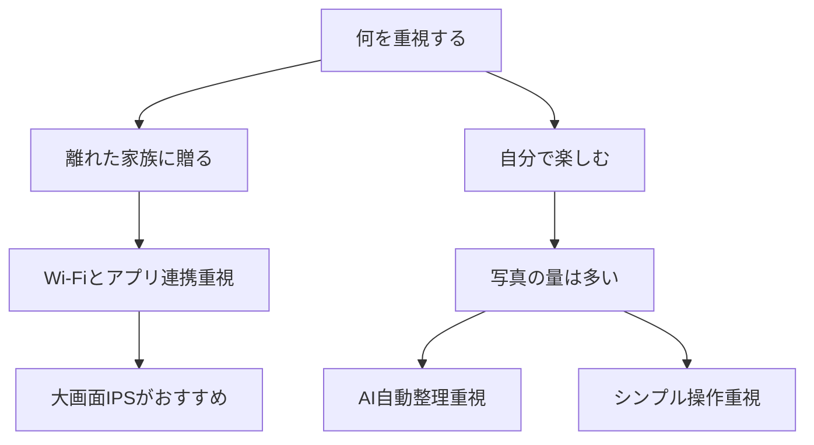

※本記事はアフィリエイト広告(PR)を含みます。

## この記事でわかること

「撮った写真がスマホの中に眠ったまま」――そんな悩みを解決してくれるのが**AIフォトフレーム**です。この記事では、AIフォトフレームのおすすめの選び方を2026年の最新事情にあわせて比較しながら解説します。読み終えるころには、次のことがわかります。

- AIフォトフレームとは何か、普通のデジタルフォトフレームとの違い
- 選ぶときにチェックすべき5つのポイント
- 用途別のおすすめタイプと、失敗しないための注意点
- 「無料で使えるの?」といったよくある疑問への答え

遠く離れた家族に写真を届けたい方、大量の思い出を自動で楽しみたい方は、ぜひ参考にしてください。

## AIフォトフレームとは?

AIフォトフレームとは、**AI(人工知能=コンピューターが人間のように判断する技術)を使って写真を自動で整理・表示してくれるデジタル写真立て**のことです。

従来のデジタルフォトフレームは、SDカードに入れた写真を順番に表示するだけのシンプルなものでした。一方、AIフォトフレームには次のような賢い機能が加わっています。

- **顔認識**:写っている人物を自動で判別し、「おばあちゃんが写った写真だけ」といった表示ができる
- **自動レイアウト調整**:縦・横の写真を画面サイズに合わせてきれいに配置
- **クラウド連携**:スマホで撮った写真がWi-Fi経由で自動的にフレームに届く
- **おすすめ表示**:ブレ写真や重複写真を避け、見栄えのよい1枚を優先して表示

つまり「送るだけ」「置くだけ」で、面倒な写真整理をAIに任せられるのが最大の魅力です。

## AIフォトフレームの選び方5つのポイント

購入前に確認しておきたいポイントを、優先度の高い順に紹介します。

### 1. 写真の送り方(Wi-Fiとアプリ連携)

最も重要なのが、写真をどうやって送るかです。離れた家族にプレゼントするなら、**Wi-Fi対応＋専用アプリ**のモデルが便利です。スマホのアプリから送信すれば、相手が操作しなくても自動で新しい写真が表示されます。

SDカードやUSBメモリだけのモデルは安価ですが、写真を追加するたびに本体を操作する必要があります。

### 2. 画面サイズと解像度

一般的には7〜10インチが人気です。リビングに置くなら10インチ以上、机やベッドサイドなら7インチ前後が扱いやすいでしょう。

解像度は数字が大きいほど写真がくっきり見えます。IPS液晶(横から見ても色が変わりにくい液晶)を選ぶと、家族みんなで見るときにも快適です。

### 3. AI機能の充実度

顔認識やおすすめ表示など、どこまでAIに任せられるかはモデルによって差があります。「大量の写真を自動でいい感じに見せてほしい」という方はAI機能重視、「シンプルでいい」という方は基本機能重視で選びましょう。

### 4. ストレージ(保存容量)とクラウド

本体に保存できる写真の枚数や、クラウド(インターネット上の保管場所)の容量も確認しましょう。無料枠が少ないと、後から追加料金が必要になる場合があります。

### 5. 操作のしやすさ

タッチ操作対応や、シンプルな画面構成かどうかも大切です。特に高齢の家族に贈る場合は、「電源を入れるだけで自動再生」できるモデルが安心です。

## タイプ別の選び方フローチャート

迷ったときは、下の流れで考えると選びやすくなります。

## 用途別おすすめのタイプ

### 離れた家族へのプレゼントに

祖父母へのプレゼントなら、**Wi-Fi対応＋スマホアプリで送信できるモデル**が定番です。孫の写真をスマホから送るだけで、実家のフレームに自動で表示されます。設定が簡単なモデルを選べば、機械が苦手な方でも安心です。

👉 [Amazonで「AIフォトフレーム wifi 10インチ」を見る](https://af.moshimo.com/af/c/click?a_id=5632371&p_id=170&pc_id=185&pl_id=38594&url=https%3A%2F%2Fwww.amazon.co.jp%2Fs%3Fk%3DAI%25E3%2583%2595%25E3%2582%25A9%25E3%2583%2588%25E3%2583%2595%25E3%2583%25AC%25E3%2583%25BC%25E3%2583%25A0%2520wifi%252010%25E3%2582%25A4%25E3%2583%25B3%25E3%2583%2581)

### 自分の思い出を大量に楽しみたい人に

スマホに何千枚も写真が眠っている方は、**AI自動整理機能が強いモデル**がおすすめです。ブレ写真を避け、見栄えのよい1枚を選んで表示してくれるので、アルバムを開く感覚で日々の思い出を振り返れます。

👉 [楽天市場で「デジタルフォトフレーム 大容量 クラウド」を探す](https://af.moshimo.com/af/c/click?a_id=5632328&p_id=54&pc_id=54&pl_id=616&url=https%3A%2F%2Fsearch.rakuten.co.jp%2Fsearch%2Fmall%2F%25E3%2583%2587%25E3%2582%25B8%25E3%2582%25BF%25E3%2583%25AB%25E3%2583%2595%25E3%2582%25A9%25E3%2583%2588%25E3%2583%2595%25E3%2583%25AC%25E3%2583%25BC%25E3%2583%25A0%2520%25E5%25A4%25A7%25E5%25AE%25B9%25E9%2587%258F%2520%25E3%2582%25AF%25E3%2583%25A9%25E3%2582%25A6%25E3%2583%2589%2F)

### スマートホームと連携させたい人に

最近は、スマートスピーカーや音声アシスタントと連携できるモデルも増えています。「今日の写真を表示して」と話しかけて操作できるものもあります。音声操作の基礎を知りたい方は、[スマートスピーカーはどれを買うべき?Alexa・Google Home徹底比較](/2026/06/12/smart-speaker-comparison/)もあわせてご覧ください。

## よくある質問(Q&A)

### AIフォトフレームは無料で使える?

本体は有料ですが、写真の送信や基本的な表示は無料で使えるモデルが多いです。ただし、**クラウドの大容量プランや複数人での共有機能**は月額料金がかかる場合があります。購入前に「無料でどこまでできるか」を公式サイトで最新情報を確認してください。

### スマホの写真を自動で表示できる?

はい、Wi-Fi対応でアプリ連携できるモデルなら可能です。スマホで撮った写真を選んで送信すると、フレーム側で自動的に表示されます。設定によっては、特定のアルバムを自動同期させることもできます。

### 電気代やつけっぱなしは大丈夫?

消費電力は小さく、多くのモデルに人感センサー(人がいないと自動で画面を消す機能)やタイマー機能が付いています。夜間は自動でオフにできるので、つけっぱなしでも安心なモデルが多いです。

### 他のガジェットと組み合わせると便利?

写真データをたくさん扱うなら、バックアップ用にストレージを用意しておくと安心です。データ保存の選び方は[ポータブルSSDの選び方2026](/2026/07/06/portable-ssd-guide-2026/)が参考になります。また、留守中の家族やペットの様子も残したい方は[AI搭載ペットカメラおすすめ比較](/2026/06/25/ai-pet-camera-comparison/)もチェックしてみてください。

## 購入前のチェックリスト

最後に、失敗しないための確認ポイントをまとめます。

| 項目 | 確認すること |
|---|---|
| 送り方 | Wi-Fi・アプリ連携があるか |
| 画面 | サイズと解像度は用途に合うか |
| AI機能 | 顔認識・自動整理は必要か |
| 容量 | 無料でどこまで使えるか |
| 操作性 | 贈る相手でも扱えるか |

価格やプランはモデルによって差があり、キャンペーンで変わることもあります。最終的な仕様や料金は、必ず各メーカーの公式サイトで最新情報を確認してから購入しましょう。

## まとめ

AIフォトフレームは、「撮ったまま眠っている写真」を毎日の暮らしの中でよみがえらせてくれる便利なガジェットです。選ぶときは、次の順番で考えるとスムーズです。

1. **誰のために使うか**(自分用か、離れた家族へのプレゼントか)を決める
2. **写真の送り方**(Wi-Fi・アプリ連携)を最優先で確認する
3. **画面サイズ・AI機能・容量・操作性**を用途に合わせて比較する

特に離れた家族への贈り物としては、アプリから送るだけで自動表示されるWi-Fiモデルが喜ばれます。まずは自分の使い方を整理し、気になるモデルの機能と料金を公式サイトでチェックすることから始めてみてください。大切な思い出を、もっと身近に楽しめるようになりますよ。
