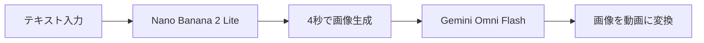

※本記事はアフィリエイト広告(PR)を含みます。

## Nano Banana 2 Liteとは?Googleの新しい画像生成AIをやさしく解説

「画像生成AIを試してみたいけど、待ち時間が長くて面倒」「たくさん作りたいけどコストが気になる」——そんな方に朗報です。Googleが新しい画像生成モデル **「Nano Banana 2 Lite（ナノバナナ2ライト）」** を発表しました。テキストを入力するだけで、なんと **わずか4秒で1枚の画像を生成** し、しかも **1枚あたり約6円** という、これまでにない速さと安さが話題になっています。

この記事を読むと、次のことがわかります。

- Nano Banana 2 Liteが「いつ・誰が・何を」発表したのか
- 私たち一般ユーザーにとって何が嬉しいのか
- Geminiアプリでの使い方と、知っておきたい注意点

専門用語もひとつずつ説明しながら進めるので、AI初心者の方も安心して読み進めてください。

## 何が起きたか:Googleが超高速・低コストな画像生成モデルを発表

Googleは米国時間6月30日、画像生成モデル「Nano Banana 2 Lite」を発表しました。正式名称は **「Gemini 3.1 Flash-Lite Image」** といいます（API上ではこの名前で扱われます）。

このモデルは、Googleの「Nano Banana」ファミリー（画像生成AIのシリーズ）の中でも、**もっとも高速かつコスト効率に優れる**位置づけです。大量に画像を作ったり、大規模なサービスに組み込んだりする「スループット（処理量）重視」の設計になっており、テキストから画像を **4秒で出力** できます。

Googleは、旧モデルの「Nano Banana（Gemini 2.5 Flash Image）」からこの新モデルへの移行を推奨しています。

### 同時に動画生成モデルも登場

あわせて、動画生成モデル **「Gemini Omni Flash」** も開発者向けに提供が始まりました。これは5月の開発者向けイベント「Google I/O」で発表され、GeminiアプリやGoogle Flow（動画制作ツール）で使えていたものですが、今回Gemini API（外部から機能を呼び出す仕組み）やGoogle AI Studioを通じても利用できるようになりました。

Nano Banana 2 Liteで作った画像を、そのままGemini Omni Flashに渡して動画化する、という連携ワークフローも可能です。

## 読者にとって何が嬉しいのか

「モデルが発表された」と言われても、専門的でピンとこないかもしれません。ここでは、私たち一般ユーザーにとっての「嬉しいポイント」を整理します。

### 1. 今すぐ、特別な知識なしに試せる

Nano Banana 2 Liteは、リリースにあわせて **Geminiアプリ（gemini.google.com）** にも展開されています。GoogleアカウントさえあればWebのチャット画面から、文章（プロンプト）を入力して画像生成を依頼するだけ。アプリ内で **「Flash-Lite」モード** を選ぶと利用できます。プログラミングなどの専門知識は不要です。

そもそも「画像生成AIってどんなものがあるの?」という方は、[無料で使える画像生成AIおすすめ5選\|商用利用の注意点も解説](/2026/06/11/free-image-ai-tools/)もあわせて読むと全体像がつかめます。

### 2. 待ち時間のストレスが激減

生成速度の「4秒」とは、プロンプトを入力してから **1K解像度（約1024×1024ピクセル）の画像** が返ってくるまでの時間です。競合モデルの多くが10〜30秒程度かかる中で、業界トップクラスの速さといえます。

### 3. 試行錯誤にとても向いている

待ち時間が短いと、「ちょっとイメージが違うな」と思ったらすぐに作り直せます。生成と確認を何度も繰り返しながら方向性を固めていく制作工程では、この速さが大きな武器になります。

### 4. 大量生成のコストが安い

価格は1K解像度の画像1枚あたり **0.034ドル**。1ドル=155円で換算すると **約5.3円/枚** です。仮に1,000枚生成しても5,300円程度という計算になり、大量に画像が必要な用途では高いコストパフォーマンスが期待できます。

## 重要な事実・数字を表で整理

| 項目 | 内容 |
| --- | --- |
| 正式名称 | Gemini 3.1 Flash-Lite Image |
| 生成速度 | テキストから画像を約4秒 |
| 価格 | 1K解像度1枚あたり0.034ドル（約6円） |
| 解像度 | 1Kのみ（最高画質用途には不向き） |
| 提供形態 | Google AI Studio、Gemini API、Geminiアプリ、検索のAIモード、NotebookLM、Googleフォト、Google広告など |
| 電子透かし | SynthID（AI生成を示す技術）を付与 |

### 価格の「よくある誤解」に注意

検索でときどき見かける「1,000枚で0.034ドル」という情報は **誤り** です。正しくは **「1枚あたり約0.034ドル」**。1,000枚生成すればおよそ34ドル（約5,300〜6,000円）かかります。

なお日本円換算は各メディアが1ドル≈155〜176円で計算したもので、為替によって変動します。正確な金額は公式の料金表を確認してください。

## 使い方と注意点

### 使い方はシンプル

基本の流れはとてもかんたんです。

1. Geminiアプリ（gemini.google.com）にGoogleアカウントでログイン
2. モードから「Flash-Lite」を選ぶ
3. 作りたい画像の内容を文章で入力
4. 数秒待つと画像が生成される

生成画像には **SynthID** というAI作成を示す電子透かし（見た目にはわかりにくい印）が付きます。これはAIで作られた画像であることを明示するための仕組みです。

### 商用利用時の注意点

生成した画像は基本的に商用利用が可能です。ただし、**IP補償（知的財産権に関する補償）** を受けられるのは、Google CloudやGoogle Workspace経由で利用した場合に限られます。Google AI Studioや無料版のGeminiアプリは補償の対象サービスには含まれません。仕事で本格的に使う場合は、この点を意識しておくと安心です。

商用利用のルールは各ツールで異なるので、詳しい考え方は[無料で使える画像生成AIおすすめ5選](/2026/06/11/free-image-ai-tools/)の商用利用の解説部分も参考になります。

### 日本から使えるかは慎重に確認を

「日本から問題なく使えるのか」については、断定できる一次情報は確認できていません。国内メディアでも「現時点では使えると見られるが、一部機能に地域制限がある可能性がある」という慎重な表現にとどまっています。実際に利用する際は、必ず **公式サイトで最新情報を確認してください**。

### 動画モデル「Gemini Omni Flash」もチェック

同時発表のGemini Omni Flashは、テキスト・画像・動画を組み合わせて動画を生成でき、自然言語による対話型編集にも対応します。価格は動画出力1秒あたり0.1ドル（約16円）。現時点では10秒の動画に対応し、より長い動画の生成機能も近日提供予定とされています。

## まとめ:まず気軽に触ってみる価値あり

今回発表されたNano Banana 2 Liteのポイントを振り返ります。

- Googleが発表した **超高速・低コスト** な画像生成モデル
- **4秒で1枚**、価格は **1枚約6円**（解像度は1Kのみ）
- Geminiアプリの「Flash-Lite」モードで **今すぐ試せる**
- 商用利用は可能だが、**IP補償は特定サービス経由が条件**
- 日本での利用可否や地域制限は **公式サイトで最新情報を確認**

速さと安さで「気軽に試せる」のが最大の魅力です。画像生成AIの入り口としてぴったりなので、まずはGeminiアプリで一度触ってみてはいかがでしょうか。GoogleのGeminiそのものについて知りたい方は、[ChatGPTとClaudeとGeminiを徹底比較!初心者におすすめのAIチャットはどれ?](/2026/06/09/ai-chat-comparison/)もあわせてどうぞ。

## 参考リンク

- [Google公式ブログ（発表記事）](https://blog.google/innovation-and-ai/models-and-research/gemini-models/gemini-omni-flash-nano-banana-2-lite/)
- [Gemini公式（画像生成の使い方）](https://gemini.google/jp/overview/image-generation/?hl=ja-JP)
- [ITmedia NEWS](https://www.itmedia.co.jp/news/articles/2607/01/news060.html)
- [Impress Watch](https://www.watch.impress.co.jp/docs/news/2121482.html)
- [窓の杜（Impress）](https://forest.watch.impress.co.jp/docs/news/2121489.html)
- [gihyo.jp](https://gihyo.jp/article/2026/07/nanobanana2-lite)
