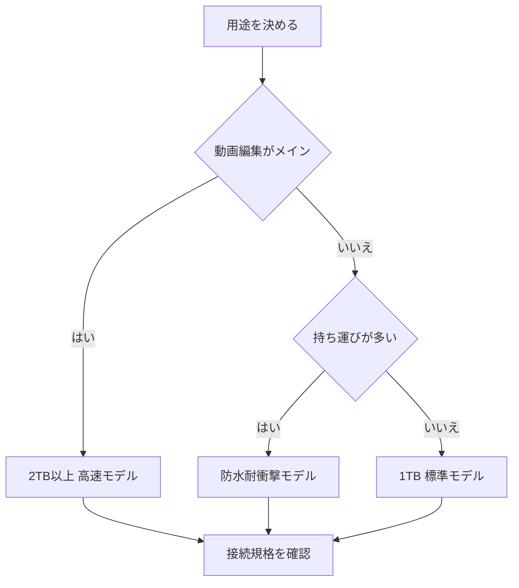

※本記事はアフィリエイト広告(PR)を含みます。

## この記事でわかること

「AIで作った動画データが増えてパソコンの容量が足りない」「編集中の書き出しが遅くてイライラする」——そんな悩みを解決してくれるのが**ポータブルSSD**です。この記事では、2026年に**ポータブルSSDの選び方**で迷っている方に向けて、AI動画編集や大容量データ保存に最適なモデルを見極めるためのポイントを、初心者にもわかりやすく解説します。

読み終えるころには、「自分に必要な容量はどれくらいか」「速度はどこを見ればいいのか」「どんな製品を選べば失敗しないか」がスッキリわかるようになります。

## そもそもポータブルSSDとは?

SSDとは「ソリッドステートドライブ」の略で、データを記録する装置のことです。従来のHDD(ハードディスク)が中で円盤を回転させて読み書きするのに対し、SSDは電子的な部品(フラッシュメモリ)でデータを扱うため、**とても高速で衝撃にも強い**のが特徴です。

その中でも「ポータブルSSD」は、ケーブル1本でパソコンやスマホにつなげる、持ち運びできる外付けタイプを指します。手のひらに乗るサイズで数百GB〜数TBのデータを保存でき、AIで生成した動画や写真の保管先としても人気が高まっています。

### HDDとの違いを簡単に比較

| 項目 | ポータブルSSD | ポータブルHDD |
|---|---|---|
| 速度 | 非常に速い | 遅め |
| 衝撃への強さ | 強い | 弱い(落下に注意) |
| サイズ・重さ | 小型軽量 | やや大きい |
| 価格(同容量) | 高め | 安い |
| 向いている用途 | 動画編集・持ち運び | 長期バックアップ |

動画をサクサク編集したい、外に持ち出したいという方にはポータブルSSDがおすすめです。

## ポータブルSSDを選ぶ5つのポイント

### 1. 容量:用途に合わせて選ぶ

容量選びは最も重要です。目安は次の通りです。

- **500GB前後**:写真中心、ちょっとしたバックアップ用
- **1TB**:一般的な動画編集、日常のデータ保存に最適なバランス
- **2TB以上**:4K動画やAIで大量生成した素材を扱う本格編集者向け

AIで動画やショート動画を量産している方は、素材と書き出しファイルの両方が積み重なるため、**最低でも1TB、できれば2TB**を選んでおくと安心です。AI動画制作の全体像は[AI動画編集ツール比較\|YouTube初心者におすすめの自動編集ソフト5選](/2026/06/16/ai-video-editing-tools/)も参考にしてください。

### 2. 速度:数字の見方を覚える

SSDの速度は「MB/s(メガバイト毎秒)」という単位で表され、この数字が大きいほど転送が速くなります。

- **読み込み・書き込み1000MB/s前後**:一般的な用途で快適
- **2000MB/s以上**:4K・8K動画の編集や大容量ファイルの移動が快適

AI編集ソフトで大きな動画ファイルを扱うなら、速度が速いほど書き出しや読み込みの待ち時間が減り、作業効率が上がります。

### 3. 接続規格:USB-Cとバージョンを確認

いくら本体が速くても、つなぐ端子(接続規格)が古いと速度が出ません。ここは意外な落とし穴です。

- **USB 3.2 Gen2**:最大10Gbps、1000MB/s前後まで対応
- **USB 3.2 Gen2x2**:最大20Gbps
- **USB4 / Thunderbolt**:最大40Gbpsで最速クラス

自分のパソコンがどの規格に対応しているかも合わせて確認しましょう。使用するノートパソコンの選び方は[AIノートパソコンの選び方2026\|快適に使うための7つのポイント](/2026/06/11/ai-laptop-guide-2026/)で詳しく解説しています。

### 4. 耐久性・防塵防水

外に持ち出すなら、落下や水濡れへの強さも大切です。「IP規格」という防塵・防水の等級が表示されている製品なら、屋外撮影の現場でも安心して使えます。

### 5. 価格と保証

同じ容量でも速度やブランドによって価格は幅があります。長く使うものなので、**メーカー保証が3年以上**あるものを選ぶと安心です。なお具体的な価格は変動が大きいため、購入前に必ず公式サイトや販売ページで最新情報を確認してください。

## 選び方フローチャート

## 用途別のおすすめタイプ

### AI動画編集をする人向け

4K動画やAIで生成した高解像度素材を扱うなら、**2TB以上・2000MB/s以上・USB4対応**のハイエンドモデルが理想です。編集ソフトの動作もスムーズになり、書き出し待ちのストレスが減ります。

👉 [Amazonで「ポータブルSSD 2TB 高速」を見る](https://af.moshimo.com/af/c/click?a_id=5632371&p_id=170&pc_id=185&pl_id=38594&url=https%3A%2F%2Fwww.amazon.co.jp%2Fs%3Fk%3D%25E3%2583%259D%25E3%2583%25BC%25E3%2582%25BF%25E3%2583%2596%25E3%2583%25ABSSD%25202TB%2520%25E9%25AB%2598%25E9%2580%259F)

### 写真やデータのバックアップ向け

毎日のバックアップや書類保存が中心なら、1TBの標準モデルで十分です。コストを抑えつつ、必要な速度と容量を確保できます。

👉 [楽天市場で「ポータブルSSD 1TB」を探す](https://af.moshimo.com/af/c/click?a_id=5632328&p_id=54&pc_id=54&pl_id=616&url=https%3A%2F%2Fsearch.rakuten.co.jp%2Fsearch%2Fmall%2F%25E3%2583%259D%25E3%2583%25BC%25E3%2582%25BF%25E3%2583%2596%25E3%2583%25ABSSD%25201TB%2F)

### 外出先・撮影現場で使う人向け

屋外撮影が多い方は、防塵防水・耐衝撃仕様のタフなモデルがおすすめです。ショート動画をどんどん作る方は[AI切り抜きでショート動画を量産する方法](/2026/07/01/ai-short-clip-tools/)と合わせて、保存環境を整えておくと制作がはかどります。

## よくある質問(Q&A)

### Q. ポータブルSSDはスマホでも使えますか?

はい、USB-C端子を備えたスマホやタブレットなら、多くのポータブルSSDをそのまま接続して使えます。ただし機種によって対応状況が異なるため、購入前にメーカーの対応情報を確認しましょう。

### Q. SSDにデータを入れっぱなしにしても大丈夫?

SSDは長期間まったく通電しないとデータが少しずつ劣化する性質があります。長期保存する場合は、数か月に一度パソコンに接続して通電するのがおすすめです。大切なデータは、別の場所にもコピーを取る「二重バックアップ」を心がけると安心です。

### Q. 容量が大きいほうがお得ですか?

多くの場合、容量あたりの単価は大容量モデルのほうが割安になります。ただし使い切れない容量にお金をかけても無駄になるので、今後1〜2年で必要な量を見積もって選ぶのが賢い方法です。

## まとめ

ポータブルSSDを選ぶときは、次の5つを押さえておけば失敗しません。

- **容量**:動画編集なら2TB以上、一般用途は1TBが目安
- **速度**:1000MB/s以上、本格編集は2000MB/s以上
- **接続規格**:パソコンの対応規格と合わせて確認
- **耐久性**:持ち運ぶなら防水・耐衝撃
- **保証**:3年以上あると安心

AIで動画や画像を作る機会が増えるほど、保存環境の重要性は高まります。まずは自分の用途と必要な容量を整理し、この記事のフローチャートを参考に最適な1台を選んでみてください。具体的な価格や在庫は変動するため、購入前には必ず公式サイトや販売ページで最新情報をチェックしましょう。
