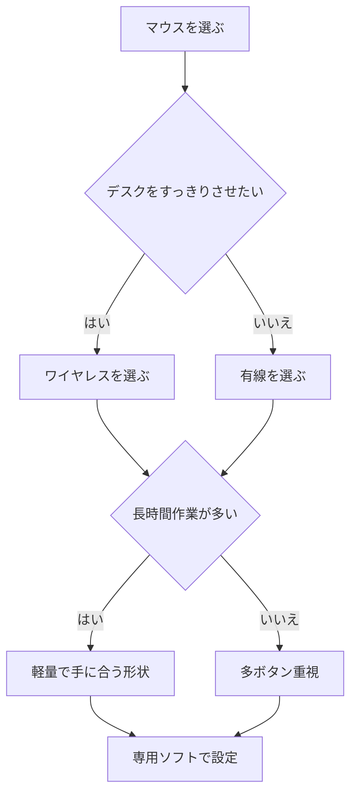

※本記事はアフィリエイト広告(PR)を含みます。

## ゲーミングマウスの選び方2026｜この記事でわかること

「ゲーミングマウスの選び方2026を知りたいけれど、種類が多すぎてどれを選べばいいかわからない」——そんな方に向けた記事です。この記事を読むと、ゲーミングマウスの基本的なスペックの見方、在宅作業でも快適に使えるモデルの特徴、そして最近増えてきた「AI対応」機能の中身までまとめて理解できます。

結論から言うと、ゲーミングマウスはゲームだけでなく在宅ワークのマウスとしても非常に優秀です。高精度なセンサー、たくさんのボタン、握りやすい形状は、そのまま作業効率アップにつながります。初心者の方でも失敗しない選び方を、丁寧に解説していきます。

## そもそもゲーミングマウスとは?

ゲーミングマウスとは、ゲームプレイでの快適な操作を目的に設計された高性能なマウスのことです。一般的なマウスと比べて、次のような特徴があります。

- **センサーの精度が高い**：狙った場所に正確にカーソルを動かせます
- **反応が速い**：クリックやカーソル移動の遅れが少ないです
- **ボタンが多い**：よく使う操作をボタンに割り当てられます
- **カスタマイズ性が高い**：専用ソフトで細かく設定できます

これらの特徴は、Excelでの作業やブラウザ操作、動画編集など、在宅ワークのあらゆる場面でも役立ちます。「ゲームはしないけれど作業用に」という理由で選ぶ人も増えています。

## ゲーミングマウス選びで見るべき6つのポイント

### 1. 接続方式（有線 or ワイヤレス）

マウスの接続には大きく分けて「有線」と「ワイヤレス」があります。

| 接続方式 | メリット | デメリット |
|---|---|---|
| 有線 | 遅延がほぼなく充電不要 | ケーブルが邪魔になりやすい |
| ワイヤレス | デスクがすっきり自由に動かせる | 充電が必要・やや高価 |

2026年現在、ワイヤレスの技術は大きく進化しており、遅延（操作の遅れ）はほとんど気にならないレベルになっています。デスク周りをすっきりさせたい在宅ワーカーには、ワイヤレスが特におすすめです。

### 2. DPI（センサー感度）

DPI（ディーピーアイ）とは、マウスをどれだけ動かすとカーソルがどれだけ移動するかを示す数値です。数字が大きいほど、少しの動きで大きくカーソルが動きます。

高DPIが必ずしも良いわけではなく、**自分で切り替えられるモデル**を選ぶのがポイントです。細かい作業では低めに、素早くカーソルを動かしたいときは高めに、といった使い分けができます。

### 3. 重量

マウスの重さは操作感に大きく影響します。軽いマウスは長時間使っても疲れにくく、素早い操作に向いています。一方、ある程度重い方が安定感を好む人もいます。最近は60g前後の超軽量モデルも人気です。

### 4. ボタンの数と割り当て

ゲーミングマウスは、左右クリック以外に「サイドボタン」などが付いていることが多いです。ここに「コピー」「貼り付け」「戻る」などの操作を割り当てると、在宅作業が驚くほど快適になります。

### 5. 形状とサイズ（手に合うか）

どんなに高性能でも、手に合わないマウスは疲れの原因になります。持ち方には主に3タイプあります。

- **かぶせ持ち**：手全体をかぶせる。安定感重視
- **つかみ持ち**：指先と手のひらの後ろで持つ。バランス型
- **つまみ持ち**：指先だけで持つ。素早い操作向き

自分の持ち方に合ったサイズと形状を選びましょう。

### 6. AI対応・専用ソフトの機能

最近のゲーミングマウスは、専用ソフトにAI的な機能を搭載するモデルが増えています。具体的には次のようなものです。

- 使い方を学習して最適な設定を提案する
- アプリごとに自動でボタン設定を切り替える
- クリックの傾向を分析してカスタマイズを助ける

こうした機能は、設定が苦手な初心者ほど恩恵を受けやすいです。

## 選び方フローチャート

迷ったときは、次の流れで考えると選びやすくなります。

## 用途別のおすすめタイプ

### 在宅ワーク中心の人

作業効率を最優先するなら、サイドボタンが多くカスタマイズしやすいワイヤレスモデルがおすすめです。ボタンにショートカットを割り当てることで、キーボードとの往復が減ります。デスク環境全体を整えたい方は、[在宅ワークが捗るデスク周りガジェット10選](/2026/06/11/home-office-gadgets/)もあわせてチェックすると快適な環境が作りやすくなります。

👉 [Amazonで「ゲーミングマウス ワイヤレス 多ボタン」を見る](https://af.moshimo.com/af/c/click?a_id=5632371&p_id=170&pc_id=185&pl_id=38594&url=https%3A%2F%2Fwww.amazon.co.jp%2Fs%3Fk%3D%25E3%2582%25B2%25E3%2583%25BC%25E3%2583%259F%25E3%2583%25B3%25E3%2582%25B0%25E3%2583%259E%25E3%2582%25A6%25E3%2582%25B9%2520%25E3%2583%25AF%25E3%2582%25A4%25E3%2583%25A4%25E3%2583%25AC%25E3%2582%25B9%2520%25E5%25A4%259A%25E3%2583%259C%25E3%2582%25BF%25E3%2583%25B3)

### ゲームも作業も両立したい人

軽量かつ高DPIで、汎用性の高いモデルが向いています。まずは定番メーカーの人気モデルから選ぶと失敗しにくいです。

👉 [楽天市場で「ゲーミングマウス 軽量 ワイヤレス」を探す](https://af.moshimo.com/af/c/click?a_id=5632328&p_id=54&pc_id=54&pl_id=616&url=https%3A%2F%2Fsearch.rakuten.co.jp%2Fsearch%2Fmall%2F%25E3%2582%25B2%25E3%2583%25BC%25E3%2583%259F%25E3%2583%25B3%25E3%2582%25B0%25E3%2583%259E%25E3%2582%25A6%25E3%2582%25B9%2520%25E8%25BB%25BD%25E9%2587%258F%2520%25E3%2583%25AF%25E3%2582%25A4%25E3%2583%25A4%25E3%2583%25AC%25E3%2582%25B9%2F)

### コスパ重視の初心者

最初から高額なモデルを狙う必要はありません。有線タイプなら比較的手頃な価格で高性能なものが見つかります。まずは使ってみて、自分に必要な機能を見極めるのが賢い方法です。

なお、具体的な価格やスペックはモデルや時期によって変動します。購入前に必ず各メーカーの公式サイトや販売ページで最新情報を確認してください。

## よくある質問（Q&A）

### Q. ゲーミングマウスは普通のマウスより疲れますか?

いいえ、むしろ逆のことが多いです。手に合った形状を選べば、長時間の作業でも疲れにくく設計されています。重量やサイズを自分の手に合わせることが大切です。

### Q. AI対応の専用ソフトは無料で使えますか?

多くのメーカーの専用ソフトは無料でダウンロードして使えます。ただし機能はメーカーによって異なるため、購入前に対応ソフトの内容を確認しておくと安心です。

### Q. マウスパッドは必要ですか?

センサーの精度を最大限に活かすなら、マウスパッドの使用をおすすめします。特に光沢のあるデスクではカーソルが安定しないことがあるため、一枚あると快適さが変わります。

### Q. キーボードや他の周辺機器も揃えるべき?

マウスと一緒に作業環境を見直すと効率が大きく上がります。作業の自動化に興味がある方は[左手デバイス・マクロパッドの選び方2026](/2026/07/02/macropad-guide-2026/)、長時間の作業姿勢が気になる方は[ゲーミングチェアの選び方2026](/2026/06/18/gaming-chair-guide-2026/)も参考になります。

## まとめ

ゲーミングマウスの選び方2026を、初心者向けに整理してきました。最後にポイントを振り返りましょう。

- **接続方式**：デスクをすっきりさせたいならワイヤレスが快適
- **DPI・重量**：切り替えられるものと自分に合う重さを選ぶ
- **ボタン**：ショートカット割り当てで在宅作業が効率化
- **形状**：持ち方に合ったサイズが疲れにくさの決め手
- **AI対応ソフト**：設定が苦手な人ほど恩恵が大きい

ゲーミングマウスはゲーム専用ではなく、在宅ワークの強い味方でもあります。まずは自分の用途と手のサイズを意識して、気になるモデルを比較してみてください。具体的な価格や最新スペックは公式サイトで確認しつつ、自分にぴったりの一台を見つけましょう。
