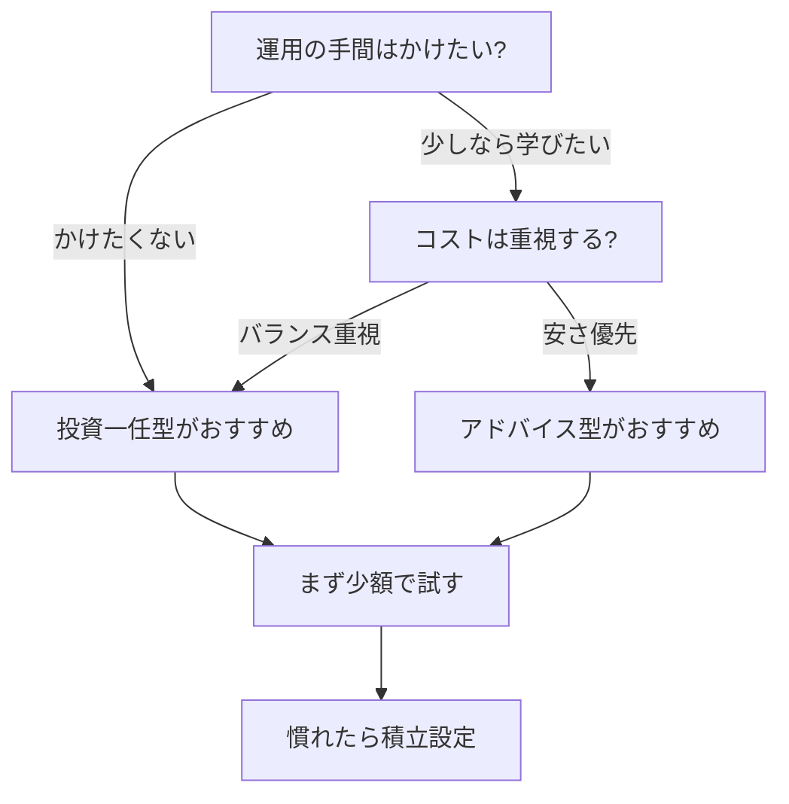

※本記事はアフィリエイト広告(PR)を含みます。

## この記事でわかること

「投資は気になるけれど、何を買えばいいのか分からない」「忙しくて相場を見ている時間がない」——そんな方に人気なのが、**ロボアドバイザー**（AIが自動で資産運用を代行してくれるサービス）です。この記事では、2026年最新のロボアドバイザーおすすめ比較として、仕組み・選び方・手数料の目安・始め方までを初心者にもわかりやすく解説します。

読み終えるころには、「自分にどのタイプが合うのか」「まず何から試せばいいのか」がはっきりイメージできるはずです。

## ロボアドバイザーとは?

ロボアドバイザーとは、いくつかの質問に答えるだけで、AIがあなたに合った投資プラン（資産の組み合わせ）を提案し、実際の運用まで自動で行ってくれるサービスです。専門用語では、この資産の組み合わせを「ポートフォリオ」と呼びます。

従来は投資アドバイザーに相談したり、自分で銘柄を選んだりする必要がありましたが、ロボアドバイザーなら次のような作業をすべて任せられます。

- リスク許容度（どれくらいの値動きに耐えられるか）の診断
- 世界中の株式・債券などへの分散投資
- 定期的な「リバランス」（値動きで崩れた資産バランスの自動調整）
- 積立や再投資の自動化

家計の見える化から一歩進んで、「余ったお金を働かせる」段階に進みたい人に向いた仕組みです。支出の把握がまだの方は、先に[家計簿アプリ×AIで支出を見える化する方法](/2026/06/15/ai-household-budget-app/)を読んでおくと、投資に回せる金額が把握しやすくなります。

## ロボアドバイザーの2つのタイプ

ロボアドバイザーは大きく2種類に分かれます。

### 投資一任型（おまかせ型）

入金するだけで、AIが銘柄選びから運用・調整まですべて自動で行います。手間はほぼゼロですが、その分の手数料（年率で預けた資産の1%前後が目安）がかかります。

**向いている人**: とにかく手間をかけたくない人、投資判断に自信がない人

### アドバイス型（助言型）

AIが最適なプランを提案してくれますが、実際の購入や管理は自分で行います。手数料が安い、または無料のことが多いのが特徴です。

**向いている人**: 少しでもコストを抑えたい人、自分でも学びながら運用したい人

## タイプ別・選び方フローチャート

自分に合うタイプがわからないときは、次の流れで考えてみましょう。

## ロボアドバイザー選びの5つのチェックポイント

各サービスを比較するときは、次の5点を確認しましょう。

| チェック項目 | 見るポイント |
|---|---|
| 手数料 | 年率でいくらか。一任型は1%前後が目安 |
| 最低投資額 | 1万円程度から始められるか |
| NISA対応 | 非課税制度に対応しているか |
| 積立設定 | 毎月自動で積み立てられるか |
| 実績・運用歴 | サービスの運用年数や利用者数 |

特に「NISA（少額投資非課税制度）」への対応は要チェックです。NISAは、一定の枠内での利益に税金がかからない国の制度で、対応しているロボアドバイザーを選ぶと手取りが増えやすくなります。

> 手数料や最低投資額、NISA対応の詳細はサービスごとに変わり、改定されることもあります。契約前に必ず各社の公式サイトで最新情報を確認してください。

## 代表的なロボアドバイザーの傾向

具体的な数値は変動するため断定は避けますが、2026年時点で知られている主なサービスには次のような特徴があります。

- **一任型の大手サービス**: 全自動運用と豊富な実績が強み。手間を最小化したい人向け
- **証券会社系のサービス**: 既存の証券口座と連携しやすく、NISA対応も進んでいる
- **アドバイス型・無料診断サービス**: コストを抑えつつ、提案だけ受けて自分で運用したい人向け

どれも公式サイトで無料の診断（リスク許容度チェック）を体験できることが多いので、いくつか試して提案内容を見比べるのがおすすめです。

## よくある質問(Q&A)

### Q. ロボアドバイザーは無料で使える?

アドバイス型（提案だけを受けるタイプ）には無料のものもあります。一方、実際に運用まで任せる一任型は、預けた資産に対して年率1%前後の手数料がかかるのが一般的です。まずは無料の診断だけ試して、提案内容を確認してから判断すると失敗しにくいでしょう。

### Q. 元本割れのリスクはある?

あります。ロボアドバイザーは分散投資でリスクを抑える仕組みですが、投資である以上、相場によっては預けた金額を下回る可能性があります。生活費とは別の「当面使わないお金」で、少額から始めるのが安心です。

### Q. 家計のどこから投資資金を作ればいい?

まずは固定費の見直しが近道です。通信費やサブスクを整理するだけで、毎月の積立原資が生まれます。詳しくは[AIで固定費を見直す方法](/2026/07/03/ai-fixed-cost-saving/)も参考にしてみてください。

## 始める前に基礎知識を身につけよう

ロボアドバイザーは手軽ですが、「なぜ分散投資が大事なのか」「NISAをどう活用するか」といった基礎を知っておくと、判断に迷いにくくなります。入門書を1冊読んでおくと、AIの提案内容もぐっと理解しやすくなります。

👉 [Amazonで「投資信託 NISA 初心者 入門書」を見る](https://af.moshimo.com/af/c/click?a_id=5632371&p_id=170&pc_id=185&pl_id=38594&url=https%3A%2F%2Fwww.amazon.co.jp%2Fs%3Fk%3D%25E6%258A%2595%25E8%25B3%2587%25E4%25BF%25A1%25E8%25A8%2597%2520NISA%2520%25E5%2588%259D%25E5%25BF%2583%25E8%2580%2585%2520%25E5%2585%25A5%25E9%2596%2580%25E6%259B%25B8)

## 始め方の3ステップ

1. **無料診断を受ける**: 気になるサービスで質問に答え、提案プランを確認する
2. **少額で口座開設・入金**: まずは無理のない金額（例:1万円程度）でスタート
3. **自動積立を設定する**: 慣れてきたら毎月の積立を設定し、あとはほったらかしで継続

ポイントは「小さく始めて、続けながら慣れる」ことです。最初から大きな金額を入れる必要はありません。

## まとめ

ロボアドバイザーは、AIが資産運用の面倒な作業を肩代わりしてくれる、投資初心者の心強い味方です。最後にポイントを整理します。

- 全自動の「一任型」と、提案だけの「アドバイス型」がある
- 選ぶときは手数料・最低投資額・NISA対応・積立・実績をチェック
- 投資である以上、元本割れのリスクはある。少額から始める
- 具体的な手数料や条件は公式サイトで最新情報を確認する

まずは無料診断でAIの提案を体験し、家計の中で「使わないお金」を少しずつ働かせるところから始めてみましょう。固定費の見直しや[AI×ふるさと納税](/2026/07/03/ai-furusato-tax/)などと組み合わせれば、家計全体のお金の流れをより効率よく整えられます。
