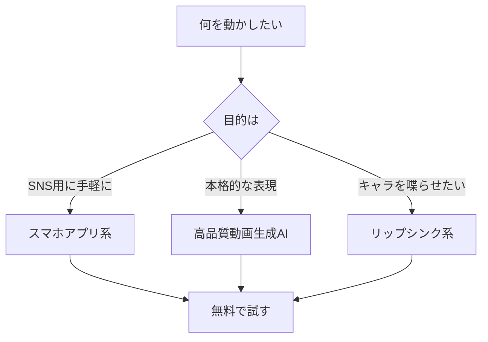

※本記事はアフィリエイト広告(PR)を含みます。

「描いたイラストや手持ちの1枚の絵を、AIで動かしてみたい」——そんな方が増えています。この記事では、**AIでイラストを動かす方法**を初心者向けにやさしく解説し、静止画をアニメ化できるおすすめツールを比較していきます。

この記事を読むと、次のことがわかります。

- そもそも「静止画を動かすAI」がどういう仕組みなのか
- 目的別のおすすめツールと、その特徴の違い
- 無料で試せるかどうか、商用利用の注意点
- 実際に動かすまでの具体的な手順

専門知識がなくても大丈夫です。順番に読んでいけば、今日中に自分の1枚のイラストを動かし始められますよ。

## AIで静止画を動かすとは?仕組みをざっくり理解

まずは全体像から。ここでいう「イラストを動かす」とは、**1枚の静止画(動かない絵)をもとに、AIが動きのある短い動画を自動生成する**技術のことです。

近年主流なのは「Image to Video(画像から動画)」と呼ばれる機能です。これは、アップロードした画像を出発点にして、AIが「この後どう動くか」を予測しながら数秒間の動画フレームを作り出す仕組みです。

動かし方には大きく2つのタイプがあります。

- **自動生成タイプ**:画像を入れると、AIが自然な揺れ・カメラの動きなどを自動で付ける
- **指示(プロンプト)タイプ**:「髪が風になびく」「ゆっくりズームする」など、文章で動きを指定する

> プロンプトとは、AIへの指示文のこと。思い通りの動きを出すには、この書き方がポイントになります。指示のコツは[AIプロンプトのコツ\|思い通りの回答を引き出す書き方を初心者向けに解説](/2026/06/22/ai-prompt-tips/)も参考になりますよ。

## タイプ別・自分に合ったツールの選び方

ツールは数多くありますが、「何を動かしたいか」で選ぶと迷いません。下のフローチャートを参考にしてください。

### 手軽さ重視ならスマホアプリ系

とにかく簡単に試したいなら、スマホアプリがおすすめです。画像を選んで数タップするだけで、AIが自動で動きを付けてくれます。SNS投稿用の短い動画をサッと作りたい人に向いています。

### クオリティ重視なら高品質動画生成AI

より自然で美しい動きを求めるなら、GoogleやOpenAIなどが提供する高性能な動画生成AIが有力です。プロンプトで細かく動きを指定でき、アニメ調のイラストとの相性も年々向上しています。

### キャラを喋らせたいならリップシンク系

イラストのキャラクターに口パク(リップシンク)をさせて喋らせたいなら、音声と連動して口や表情を動かす専用ツールが便利です。VTuber風の動画やキャラ紹介に活躍します。

## 静止画アニメ化おすすめツール比較2026

代表的なツールのタイプと特徴を表にまとめました。料金やプラン内容は頻繁に変わるため、**必ず公式サイトで最新情報を確認してください**。

| ツール系統 | 特徴 | 向いている人 |
|---|---|---|
| 高品質動画生成AI(Veo系・Sora系など) | 自然で滑らかな動き。プロンプト対応 | 表現の質を追求したい人 |
| Runway・Pika系 | 画像から動画の定番。編集機能も豊富 | クリエイティブに作り込みたい人 |
| スマホアプリ系 | ワンタップで手軽。SNS向け | 初心者・気軽に試したい人 |
| リップシンク特化系 | 顔・口の動きに強い | キャラを喋らせたい人 |

静止画そのものを生成するところから始めたい方は、まず素材づくりのツールを押さえておくと便利です。無料で使える画像生成AIについては[無料で使える画像生成AIおすすめ5選\|商用利用の注意点も解説](/2026/06/11/free-image-ai-tools/)で詳しく紹介しています。

### 高速・低コスト化が進む2026年のトレンド

2026年は画像・動画生成AIの高速化と低価格化が一気に進んでいます。たとえば1枚を数秒・低コストで生成できるモデルも登場しており、動画生成のハードルも下がってきました。最新動向は[Nano Banana 2 Liteとは?Googleの画像生成AIが4秒・1枚6円で衝撃](/2026/07/06/nano-banana-2-lite/)もあわせてご覧ください。

## 実際にイラストを動かす手順

初めての方向けに、基本的な流れを紹介します。ツールが違っても大枠は共通です。

1. **素材のイラストを用意する**:手描きでもAI生成でもOK。背景がすっきりした画像だと動かしやすいです
2. **ツールに画像をアップロードする**:対応フォーマット(JPG・PNGなど)を確認
3. **動きを指定する**:自動生成に任せるか、プロンプトで「ゆっくりズーム」などと指示
4. **生成・プレビュー**:数秒〜数分で動画が完成。気に入らなければ再生成
5. **書き出して保存**:MP4などで出力し、SNSや動画編集に活用

出来上がった動画に字幕やBGMを付けると一気に完成度が上がります。字幕付けは[AIで動画に自動字幕を付ける方法｜YouTube・SNS向けおすすめツール比較](/2026/07/07/ai-video-auto-subtitles/)が参考になります。

### 作業にはタブレットやペンタブがあると快適

元のイラストを自分で描く場合や、細かい修正をする場合は、描きやすい環境があると作業がぐっと楽になります。

👉 [Amazonで「液晶タブレット ペンタブ イラスト」を見る](https://af.moshimo.com/af/c/click?a_id=5632371&p_id=170&pc_id=185&pl_id=38594&url=https%3A%2F%2Fwww.amazon.co.jp%2Fs%3Fk%3D%25E6%25B6%25B2%25E6%2599%25B6%25E3%2582%25BF%25E3%2583%2596%25E3%2583%25AC%25E3%2583%2583%25E3%2583%2588%2520%25E3%2583%259A%25E3%2583%25B3%25E3%2582%25BF%25E3%2583%2596%2520%25E3%2582%25A4%25E3%2583%25A9%25E3%2582%25B9%25E3%2583%2588)

タブレット選びで迷う方は[タブレットの選び方2026\|AIお絵描き・電子書籍に最適なモデル比較](/2026/06/22/tablet-guide-2026/)も参考にしてみてください。

👉 [楽天市場で「ペンタブレット お絵描き」を探す](https://af.moshimo.com/af/c/click?a_id=5632328&p_id=54&pc_id=54&pl_id=616&url=https%3A%2F%2Fsearch.rakuten.co.jp%2Fsearch%2Fmall%2F%25E3%2583%259A%25E3%2583%25B3%25E3%2582%25BF%25E3%2583%2596%25E3%2583%25AC%25E3%2583%2583%25E3%2583%2588%2520%25E3%2581%258A%25E7%25B5%25B5%25E6%258F%258F%25E3%2581%258D%2F)

## よくある疑問Q&A

### Q. AIで静止画を動かすのは無料でできる?

多くのツールに無料プランやお試し枠があり、**基本的な機能なら無料で体験可能**です。ただし無料枠では生成回数・秒数・解像度に制限があったり、透かし(ウォーターマーク)が入ったりすることが一般的です。本格的に使うなら有料プランが必要になるケースが多いので、まずは無料で試して相性を確かめるのがおすすめです。

### Q. 生成した動画は商用利用できる?

ツールやプランによってルールが異なります。**商用利用が可能かどうか、生成物の権利がどうなるかは、必ず各サービスの利用規約で確認**してください。特に他人のイラストや著作権のある素材を無断で動かすのはトラブルのもとになります。自分で描いた絵や、権利がクリアな素材を使いましょう。

### Q. アニメっぽい絵でもきれいに動く?

以前はアニメ調のイラストは動かすと崩れやすかったのですが、2026年時点ではアニメ・イラスト特化の学習が進み、かなり自然に動かせるようになっています。ただし、複雑なポーズや細かい指などは崩れることがあるため、動きは控えめに指定するのがコツです。

## まとめ

AIでイラストを動かす方法と、静止画アニメ化のおすすめツールを比較してきました。ポイントを振り返りましょう。

- 「Image to Video(画像から動画)」機能で1枚の絵を動画にできる
- 目的別に、手軽なスマホアプリ・高品質な動画生成AI・リップシンク特化系から選ぶ
- まずは無料枠で試し、透かしや回数制限を確認する
- 商用利用や著作権のルールは必ず公式の利用規約でチェックする
- 価格・機能は変わりやすいので、最新情報は公式サイトで確認する

まずは手持ちのイラストを1枚、無料で試せるツールにアップロードしてみるのが最短の第一歩です。動かしてみると、静止画とはまったく違う魅力に驚くはずですよ。素材づくりから動画化、字幕付けまで、AIツールを組み合わせて自分だけの作品づくりを楽しんでください。
