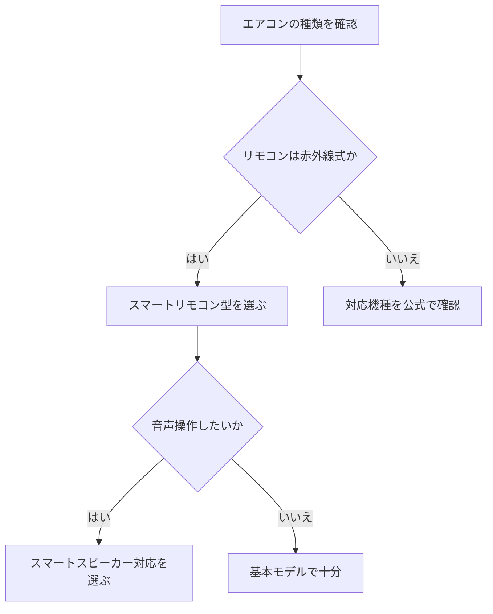

※本記事はアフィリエイト広告(PR)を含みます。

## AI搭載スマートサーモスタットとは?電気代を自動節約できる仕組み

「エアコンの電気代が高い」「消し忘れが多い」とお悩みではありませんか?この記事では、**AI搭載スマートサーモスタットを使ってエアコンを自動制御し、電気代を自動で節約する方法**を、初心者の方にもわかりやすく解説します。

この記事を読むと、次のことがわかります。

- スマートサーモスタットがどんな仕組みで節電してくれるのか
- 自宅のエアコンに合った製品の選び方
- 電気代を賢く抑える具体的な設定術
- 「無料で使えるの?」という疑問への答え

まずは結論からお伝えすると、スマートサーモスタットは「人の在室や外気温をAIが判断し、無駄な運転を自動で減らしてくれる」機器です。手動でこまめに調整するのが面倒な方ほど、効果を実感しやすいのが特長です。

### そもそもサーモスタットって何?

サーモスタット(温度調節器)とは、室温を感知して冷暖房のオン・オフや強弱を自動で切り替える装置のことです。日本の家庭用エアコンには本体にこの機能が内蔵されていますが、**スマートサーモスタットは外付けのリモコン操作機器やアプリと連携し、より賢く制御できる**点が違います。

日本では壁付けの温度調節器を交換するタイプよりも、**赤外線でエアコンのリモコン信号を送る「スマートリモコン」型**が主流です。これなら工事不要で、既存のエアコンにそのまま追加できます。

## AIによる自動節約の3つの仕組み

AI搭載モデルが電気代を抑えてくれる主な仕組みを整理してみましょう。

| 仕組み | 内容 | 節電効果の例 |
|---|---|---|
| 在室検知 | センサーやスマホの位置情報で人の有無を判断し、不在時に自動オフ | 消し忘れによる無駄をカット |
| 学習制御 | 生活パターンや温度変化をAIが学習し、先回りして運転を調整 | 過度な冷やしすぎ・暖めすぎを防止 |
| 外気温連動 | 天気予報や外気温データと連動して設定温度を最適化 | 気候に合わせた効率運転 |

これらが組み合わさることで、「快適さはできるだけ保ちつつ、無駄な電力だけを削る」という理想的な運転に近づけてくれます。

### スマホから外出先でも操作できる

スマートサーモスタットの多くはスマホアプリと連携します。外出先から「帰宅30分前にエアコンをオン」といった操作ができるため、真夏や真冬でも快適な室温で帰宅できます。逆に「消し忘れた!」というときも、スマホからすぐオフにできて安心です。

## 自宅に合った製品の選び方

どれを選べばいいか迷ったら、次のフローチャートを参考にしてみてください。

選ぶときにチェックしたいポイントは次の通りです。

- **手持ちのエアコンに対応しているか**:多くのスマートリモコンは主要メーカーに対応していますが、念のため対応リストを確認しましょう。
- **温度・湿度センサー搭載か**:室内環境を細かく検知できると、AI制御の精度が上がります。
- **スマートスピーカー連携**:AlexaやGoogleアシスタントに対応していれば、声だけで操作できます。連携について詳しくは[スマートスピーカーはどれを買うべき?Alexa・Google Home徹底比較](/2026/06/12/smart-speaker-comparison/)もあわせてご覧ください。
- **位置情報(ジオフェンス)機能**:自宅を出ると自動オフ、近づくと自動オンといった制御ができます。

具体的な製品は各社から出ています。まずはどんなモデルがあるか、以下から探してみるとイメージがつかみやすいでしょう。

👉 [Amazonで「スマートリモコン エアコン AI」を見る](https://af.moshimo.com/af/c/click?a_id=5632371&p_id=170&pc_id=185&pl_id=38594&url=https%3A%2F%2Fwww.amazon.co.jp%2Fs%3Fk%3D%25E3%2582%25B9%25E3%2583%259E%25E3%2583%25BC%25E3%2583%2588%25E3%2583%25AA%25E3%2583%25A2%25E3%2582%25B3%25E3%2583%25B3%2520%25E3%2582%25A8%25E3%2582%25A2%25E3%2582%25B3%25E3%2583%25B3%2520AI)

👉 [楽天市場で「スマートリモコン 温度センサー」を探す](https://af.moshimo.com/af/c/click?a_id=5632328&p_id=54&pc_id=54&pl_id=616&url=https%3A%2F%2Fsearch.rakuten.co.jp%2Fsearch%2Fmall%2F%25E3%2582%25B9%25E3%2583%259E%25E3%2583%25BC%25E3%2583%2588%25E3%2583%25AA%25E3%2583%25A2%25E3%2582%25B3%25E3%2583%25B3%2520%25E6%25B8%25A9%25E5%25BA%25A6%25E3%2582%25BB%25E3%2583%25B3%25E3%2582%25B5%25E3%2583%25BC%2F)

## 電気代を賢く抑える具体的な設定術

機器を導入したら、次の設定を意識するとさらに節電効果が高まります。

### 1. 設定温度は控えめを基本にする

冷房は下げすぎ、暖房は上げすぎが電気代増加の大きな原因です。一般的に冷房は高め、暖房は低めの設定が省エネにつながるとされます。スマートサーモスタットのスケジュール機能で、時間帯ごとに無理のない温度をあらかじめ登録しておきましょう。

### 2. 就寝時間・外出時間を自動化する

「23時に少し温度を上げる」「平日9時に自動オフ」など、生活リズムに合わせた自動化ルールを作ると、切り忘れや無駄運転がなくなります。AIが学習するタイプなら、使い続けるほど自分の生活に合った制御になっていきます。

### 3. 家計簿アプリと組み合わせて効果を見える化

節電の効果は「見える化」するとモチベーションが続きます。電気代の変化を記録して確認したい方は、[家計簿アプリ×AIで節約\|自動で支出を見える化する方法](/2026/06/15/ai-household-budget-app/)も参考になります。固定費全体を見直したい方は[AIで固定費を見直す方法2026](/2026/07/03/ai-fixed-cost-saving/)もおすすめです。

## よくある疑問Q&A

### Q. スマートサーモスタットは無料で使えるの?

機器本体の購入は必要ですが、**基本的な操作や自動化はアプリで無料**で使えるものがほとんどです。ただし、一部のメーカーでは高度なAI学習機能や複数ユーザー管理などを有料プラン(サブスク)として提供している場合があります。購入前に、無料でどこまでできるかを公式サイトで確認しておくと安心です。

### Q. どのくらい電気代が安くなる?

節約額は住まいの断熱性能・エアコンの使い方・地域の気候によって大きく変わるため、一概に「〇円安くなる」とは言えません。具体的な節電率や価格は各メーカーの公表値や**公式サイトで最新情報を確認してください**。まずは1シーズン使ってみて、前年との電気代を比べてみるのがおすすめです。

### Q. 工事は必要?

スマートリモコン型なら基本的に工事は不要です。コンセントに挿してWi-Fiとエアコンリモコンを設定するだけで使い始められます。賃貸住宅でも安心して導入できるのがメリットです。

### Q. 他のスマート家電と連携できる?

多くの製品は照明やスピーカーなど他のスマート家電と連携できます。部屋全体を快適にしたい方は、[AI搭載スマート電球の選び方](/2026/06/23/smart-bulb-guide/)もチェックすると、より快適なスマートホームづくりのイメージが広がります。

## まとめ

AI搭載スマートサーモスタット(スマートリモコン)は、エアコンの無駄な運転を自動で減らし、電気代の節約と快適さを両立してくれる便利な機器です。

- **在室検知・学習制御・外気温連動**でAIが自動で最適運転
- 赤外線リモコン式のエアコンなら**工事不要**で導入可能
- 設定温度を控えめに、生活リズムに合わせた自動化で効果アップ
- 基本操作は無料が多いが、**高度な機能や価格は公式サイトで最新情報を確認**

まずは自宅のエアコンが対応しているかを確認し、手頃なスマートリモコン型から試してみてはいかがでしょうか。毎日のちょっとした無駄を自動でカットして、賢く節約を始めましょう。
