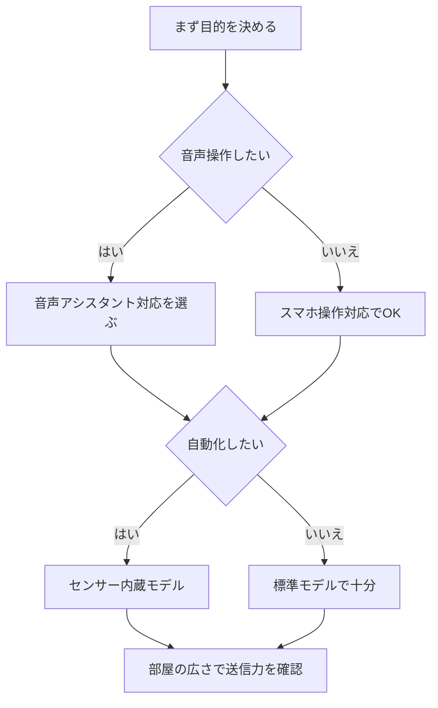

※本記事はアフィリエイト広告(PR)を含みます。

## この記事でわかること

「スマートリモコンの選び方を知りたい」「AI音声で家電をまとめて操作できる便利なモデルが欲しい」——そんな方に向けた記事です。スマートリモコンとは、エアコンやテレビ、照明などの赤外線リモコンをスマホや音声で操作できるようにする小さな機器のこと。1台あれば、リビングのリモコンをまとめて置き換えられます。

この記事を読むと、次のことがわかります。

- スマートリモコンで何ができるのか
- 2026年時点での失敗しない選び方のポイント
- AI音声操作を快適にするための組み合わせ
- よくある疑問(無料で使える?工事は必要?)への答え

難しい専門用語はできるだけかみくだいて説明するので、初めての方も安心して読み進めてください。

## スマートリモコンとは?何ができるの?

スマートリモコンは、家中の赤外線リモコン(テレビやエアコンなどに付属する、光で信号を送るタイプのリモコン)の信号を記憶し、代わりに送信してくれる機器です。本体をWi-Fiにつなぐことで、外出先からでもスマホアプリで家電を操作できるようになります。

主にできることは次のとおりです。

- **スマホでまとめて操作**:複数のリモコンを1つのアプリに集約
- **外出先から操作**:帰宅前にエアコンをオンにして部屋を快適に
- **音声操作**:スマートスピーカーと連携し「エアコンつけて」で操作
- **自動化(オートメーション)**:時間や気温に応じて家電を自動でオン・オフ

つまり、既存の家電を買い替えずに「スマート家電化」できるのが最大の魅力です。

## スマートリモコンの選び方6つのポイント

### 1. 対応する家電・赤外線の範囲

エアコン・テレビ・照明など、手持ちの家電に対応しているかは最重要です。多くの製品は主要メーカーのプリセット(あらかじめ登録された設定)を持っていますが、古い家電や海外製品は手動学習が必要な場合があります。

### 2. AI音声操作に対応しているか

Amazon AlexaやGoogleアシスタント、Appleの新しいSiriなどに対応していれば、声だけで家電を操作できます。どの音声アシスタントを使うか迷っている方は、[スマートスピーカーはどれを買うべき?Alexa・Google Home徹底比較](/2026/06/12/smart-speaker-comparison/)もあわせて読むと選びやすくなります。

### 3. センサー機能の有無

温度・湿度・照度センサーを内蔵したモデルなら、「室温が28度を超えたら自動でエアコンをオン」といった賢い自動化が可能です。夏場の熱中症対策やペットの見守りにも役立ちます。

### 4. アプリの使いやすさ

設定画面が日本語対応か、操作が直感的かは毎日の快適さに直結します。レビューでアプリの評価もチェックしておきましょう。

### 5. 設置場所と電波の届きやすさ

スマートリモコンは赤外線を飛ばすため、操作したい家電から見通せる場所に置く必要があります。広い部屋では送信力の強いモデルを選ぶと安心です。

### 6. 他のスマート家電との連携

スマート電球やスマートロックなど、他の機器とまとめてシーン設定できると便利です。照明も声で操作したい方は[AI搭載スマート電球の選び方](/2026/06/23/smart-bulb-guide/)、エアコンの電気代を自動で抑えたい方は[AI搭載スマートサーモスタットで電気代を自動節約する方法](/2026/07/08/ai-smart-thermostat-guide/)も参考になります。

## 選び方フローチャート

自分に合った1台を、次の流れで絞り込んでみましょう。

## タイプ別おすすめの選び方

| タイプ | 向いている人 | チェックすべき点 |
|--------|--------------|------------------|
| スタンダード型 | 初めて導入する人 | プリセットの豊富さ・価格 |
| センサー内蔵型 | 自動化したい人 | 温湿度センサーの精度 |
| ハブ一体型 | 家中をスマート化 | 対応する連携機器の数 |

価格は製品やセール時期によって変わります。購入前に必ず公式サイトや販売ページで最新情報を確認してください。まずは定番の1台から試してみたい方は、以下から探してみましょう。

👉 [Amazonで「スマートリモコン 赤外線 温湿度センサー」を見る](https://af.moshimo.com/af/c/click?a_id=5632371&p_id=170&pc_id=185&pl_id=38594&url=https%3A%2F%2Fwww.amazon.co.jp%2Fs%3Fk%3D%25E3%2582%25B9%25E3%2583%259E%25E3%2583%25BC%25E3%2583%2588%25E3%2583%25AA%25E3%2583%25A2%25E3%2582%25B3%25E3%2583%25B3%2520%25E8%25B5%25A4%25E5%25A4%2596%25E7%25B7%259A%2520%25E6%25B8%25A9%25E6%25B9%25BF%25E5%25BA%25A6%25E3%2582%25BB%25E3%2583%25B3%25E3%2582%25B5%25E3%2583%25BC)

センサー内蔵の上位モデルや、スマートスピーカーとのセットを検討したい場合はこちらも参考になります。

👉 [楽天市場で「スマートリモコン 学習リモコン」を探す](https://af.moshimo.com/af/c/click?a_id=5632328&p_id=54&pc_id=54&pl_id=616&url=https%3A%2F%2Fsearch.rakuten.co.jp%2Fsearch%2Fmall%2F%25E3%2582%25B9%25E3%2583%259E%25E3%2583%25BC%25E3%2583%2588%25E3%2583%25AA%25E3%2583%25A2%25E3%2582%25B3%25E3%2583%25B3%2520%25E5%25AD%25A6%25E7%25BF%2592%25E3%2583%25AA%25E3%2583%25A2%25E3%2582%25B3%25E3%2583%25B3%2F)

## 導入の手順はかんたん

初めてでも、基本的には次の流れで15分ほどで使い始められます。

1. 本体をコンセントまたはUSBで給電する
2. 専用アプリをスマホにインストールする
3. Wi-Fiに接続する(2.4GHz帯が必要な製品が多い)
4. 家電のメーカーを選んでリモコンを登録する
5. 音声アシスタントと連携する

工事や配線は不要で、賃貸住宅でも問題なく使えます。

## よくある疑問Q&A

### Q. スマートリモコンは無料で使える?

本体の購入費用はかかりますが、多くの製品はアプリの基本機能を追加料金なしで使えます。ただし一部の高度な自動化機能やクラウド連携は、有料プランが必要な場合もあります。購入前にメーカーの料金体系を確認しておくと安心です。

### Q. 電波が5GHzのWi-Fiしかないと使えない?

スマートリモコンの多くは2.4GHz帯のWi-Fiにしか対応していません。ルーターが5GHzのみの設定になっていると接続できないことがあるため、設定を確認しておきましょう。

### Q. 音声で操作するには何が必要?

スマートリモコン本体に加えて、スマートスピーカー(Amazon EchoやGoogle Nestなど)、またはスマホの音声アシスタントが必要です。連携さえ済ませれば、「ただいま」と話すだけで照明とエアコンを同時にオンにする、といった使い方もできます。

## まとめ

スマートリモコンは、家電を買い替えずに「声とスマホで操作できる暮らし」を実現できる、コスパの高いスマートホーム入門アイテムです。選ぶときは次のポイントを押さえましょう。

- 手持ちの家電に対応しているか
- AI音声操作(Alexa・Googleなど)に対応しているか
- 自動化したいならセンサー内蔵モデルを選ぶ
- 部屋の広さに合った送信力か

まずは1台導入して、エアコンや照明の音声操作から始めてみるのがおすすめです。慣れてきたらスマート電球やスマートサーモスタットと組み合わせて、自分だけの快適な自動化環境を作り上げていきましょう。価格や仕様は変わりやすいので、購入前には必ず公式サイトで最新情報を確認してください。
