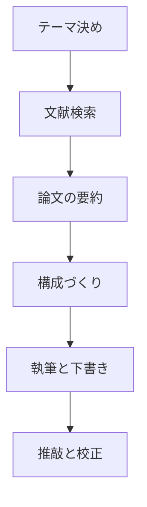

※本記事はアフィリエイト広告(PR)を含みます。

## AIで論文・レポートを効率化する方法とは?

「レポートの締め切りが近いのに全然進まない」「論文を何本も読む時間がない」——大学生なら誰もが一度は感じる悩みですよね。そんなときに頼りになるのが、AI(人工知能)を使った論文・レポートの効率化です。

この記事では、**AIで論文・レポートを効率化する方法**を、初心者の大学生にもわかりやすく解説します。読み終えるころには、次のことがわかります。

- 論文・レポート作成のどの作業をAIに任せられるのか
- 大学生におすすめの具体的なツール5選
- 無料で使えるのか、有料版は必要なのか
- AIを使うときに絶対に守るべき注意点

AIをうまく使えば、面倒な作業を時短しつつ、レポートの質も上げられます。ただし使い方を間違えると「不正」とみなされることもあるので、後半の注意点まで必ず読んでくださいね。

## AIが得意な「論文・レポート作業」はどこ?

まず、論文やレポート作成のどこにAIが役立つのかを整理しましょう。作業の流れごとに見ると、任せられる場所がはっきりします。

この一連の流れのうち、**文献検索・要約・構成づくり・推敲**はAIが特に得意な部分です。逆に、テーマ選びや最終的な考察・主張は、あなた自身の頭で考えるべきところ。AIは「作業の下ごしらえ」をしてくれる有能なアシスタント、とイメージするとちょうどいいでしょう。

## 大学生におすすめのAIツール5選

ここからは、実際に論文・レポート作成で使える具体的なツールを5つ紹介します。それぞれ得意分野が違うので、目的に合わせて組み合わせるのがおすすめです。

### 1. ChatGPT|万能アシスタントとしての基本ツール

ChatGPTは、文章生成AIの代表格です。レポートの構成案づくり、文章のたたき台作成、わかりにくい概念の解説、推敲まで幅広くこなせます。「このテーマでレポートの見出し構成を提案して」と頼めば、章立てを一瞬で作ってくれます。

どのAIチャットを選べばいいか迷う方は、[ChatGPTとClaudeとGeminiを徹底比較!初心者におすすめのAIチャットはどれ?](/2026/06/09/ai-chat-comparison/)も参考にしてみてください。

なお、無料版でも十分使えますが、長文処理や最新モデルを使いたい場合は有料版が便利です。詳しくは[ChatGPT有料版は必要?無料版との違いと元が取れる使い方を解説](/2026/06/20/chatgpt-paid-vs-free/)をご覧ください。

### 2. Perplexity|出典付きで調べられるAI検索

Perplexity(パープレキシティ)は、質問に対して**出典(情報源のURL)付き**で答えてくれるAI検索エンジンです。論文・レポートでは「どこから得た情報か」を示すことがとても重要なので、出典が確認できるのは大きなメリット。「〇〇について最近の研究を教えて」と聞けば、根拠となるページを一緒に示してくれます。

ほかのAI検索と比べたい方は[AI検索エンジンおすすめ徹底比較\|Perplexity・Genspark・Feloはどれが最強?](/2026/06/23/ai-search-engine-comparison/)もチェックしてみましょう。

### 3. PDF要約AI|長い論文を一気に読み解く

英語の論文や数十ページのPDFを全部読むのは大変ですよね。そんなときは、PDFを読み込ませて要点をまとめてくれる要約AIが活躍します。「この論文の目的・方法・結論を3行でまとめて」と指示すれば、全体像を短時間でつかめます。

具体的なツールの選び方は、[AIでPDFを要約・分析する方法｜長文資料を時短で読むツール5選](/2026/06/24/ai-pdf-summary-tools/)で詳しく紹介しています。

### 4. DeepL|英語論文を正確に読む・書く

海外の文献を読むときや、英語でアブストラクト(要旨)を書くときに欠かせないのが翻訳AIです。DeepLは自然で正確な翻訳に定評があり、専門的な英語論文の読解を強力にサポートしてくれます。

翻訳ツールごとの精度の違いは、[AI翻訳ツール比較\|DeepL・Google翻訳・ChatGPTどれが正確?](/2026/06/11/ai-translation-comparison/)で比較しています。

### 5. Notion AI|集めた情報の整理とメモ管理

文献のメモ、引用、アイデアが散らかると執筆が進みません。Notion AIを使えば、集めた情報を整理しながら、要約やアウトラインの生成まで一つのアプリで完結できます。研究ノートをきれいに管理したい人にぴったりです。

使い方の基本は[Notion AIの使い方完全ガイド\|情報整理とタスク管理を効率化する活用法](/2026/06/17/notion-ai-guide/)にまとめています。

## ツール別・得意分野の早見表

どのツールをどの場面で使うか、一覧で整理しておきましょう。

| ツール | 得意な作業 | こんな人におすすめ |
| --- | --- | --- |
| ChatGPT | 構成案・下書き・推敲 | まず1つ試したい人 |
| Perplexity | 出典付きの調べもの | 根拠を重視したい人 |
| PDF要約AI | 長い論文の要点把握 | 読む量が多い人 |
| DeepL | 英語論文の読解・翻訳 | 海外文献を扱う人 |
| Notion AI | メモ・情報整理 | 資料が散らかりがちな人 |

料金はサービスや時期によって変わるため、実際に導入する前に必ず各**公式サイトで最新情報を確認してください**。無料プランと有料プランの違いもあわせてチェックしておくと安心です。

## Q&A|よくある疑問を先回りで解決

### AIツールは無料で使える?

多くのツールに無料プランがあり、まずはお金をかけずに試せます。ただし無料版は「1日の利用回数に制限がある」「使えるモデルが古い」といった制約があることも。レポートを本格的に量産する時期だけ有料版を使う、という切り替えもおすすめです。

### AIで書いたレポートを提出してもいいの?

ここが最も大切なポイントです。**AIが生成した文章をそのままコピペして提出するのは、多くの大学で不正行為とみなされます。** AIはあくまで下書きやアイデア出しの補助として使い、最終的な文章は自分の言葉で書き直し、内容の正しさを自分で確認しましょう。

### AIの情報は信用していいの?

AIは、もっともらしいウソ(ハルシネーションと呼ばれます)を混ぜることがあります。特に引用や統計データは、必ず一次情報(元の論文や公式データ)にあたって裏取りをしてください。Perplexityのように出典を示すツールを使うと確認が楽になります。

## AIを使うときの3つの注意点

1. **提出前に大学のルールを確認する**——AI利用の可否は大学や教員によって違います。
2. **引用・データは必ず自分で検証する**——AIの回答を鵜呑みにしない。
3. **個人情報や未公開データを入力しない**——入力内容が学習に使われる場合があります。

この3つを守れば、AIは強力な味方になってくれます。

## まとめ

AIを使えば、論文・レポート作成の「文献検索・要約・構成づくり・推敲」といった時間のかかる作業を大幅に効率化できます。今回紹介したおすすめツールをおさらいしましょう。

- **ChatGPT**:構成案から推敲まで万能
- **Perplexity**:出典付きで調べられる
- **PDF要約AI**:長い論文を時短で読める
- **DeepL**:英語論文の読解に強い
- **Notion AI**:情報整理とメモ管理に便利

まずは無料プランで1つ試し、自分の作業スタイルに合うものを見つけてみてください。ただし、AIはあくまで補助役。最終的な主張と文章は自分でまとめ、大学のルールを守ることが大前提です。上手に活用して、学びの時間をもっと有意義なものにしていきましょう。
