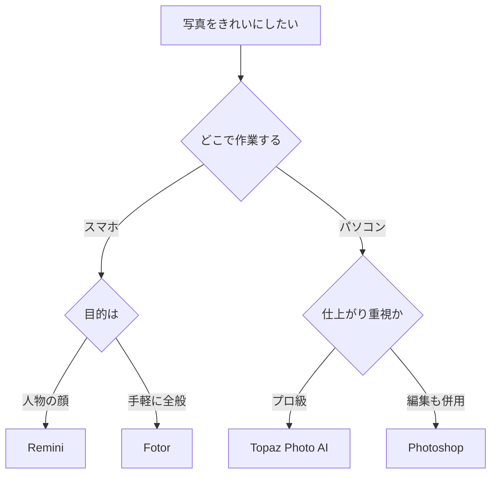

※本記事はアフィリエイト広告(PR)を含みます。

## この記事でわかること

「押し入れから出てきた古い写真をきれいにしたい」「スマホで撮ったぼやけた画像をくっきりさせたい」——そんなときに役立つのが、AIで写真を高画質化・復元するツールです。この記事では、**古い写真をAIできれいにする方法**を、初心者の方にもわかりやすく丁寧に解説します。

読み終わるころには、次のことがわかります。

- AIで写真を高画質化・復元できる仕組み（かんたんに）
- 無料・有料のおすすめツールの違いと比較
- 実際にきれいにする手順
- 自分に合ったツールの選び方

むずかしい専門知識は不要です。順番に読んでいけば、今日からすぐに試せますよ。

## AIで写真を高画質化・復元するとは?

まずは「そもそも何ができるのか」を整理しましょう。

AIによる写真の高画質化・復元とは、**AIが写真の欠けている情報を推測して補い、よりきれいな状態に作り直す技術**のことです。従来の画像編集ソフトが「あるものを加工する」のに対し、AIは「学習した大量の写真データをもとに、足りない部分を自然に描き足す」のが大きな違いです。

代表的にできることは次のとおりです。

| できること | 内容 |
|---|---|
| 高解像度化(アップスケール) | 小さい・粗い画像を大きく鮮明にする |
| ノイズ除去 | ザラつきやモザイク状の乱れを消す |
| ピンボケ・ブレ補正 | ぼやけた輪郭をくっきりさせる |
| 傷・折れの修復 | 古い写真のキズや破れを埋める |
| カラー化 | 白黒写真に自然な色を付ける |
| 顔の復元 | ぼやけた人物の顔をはっきりさせる |

> **用語メモ:アップスケール**とは、解像度(画像の細かさ)を上げて、画像を大きくしても粗く見えないようにする処理のことです。

昔は専門の業者にお願いするような作業でしたが、いまはAIツールを使えば数秒〜数分で自分でできてしまいます。

## 写真高画質化AIツール比較2026

ここからは、初心者にも人気のツールを比較します。価格やプランは変わりやすいため、**最新の料金や無料枠は必ず各公式サイトで確認してください**。

### 主要ツール比較表

| ツール | 特徴 | 無料利用 | こんな人に |
|---|---|---|---|
| Remini | スマホアプリで顔の復元が得意 | 一部無料 | スマホで手軽に人物写真を直したい |
| Topaz Photo AI | プロ級の高精細な仕上がり | 体験版あり | パソコンで本格的に処理したい |
| Adobe Photoshop | AI機能と編集を両立 | 体験版あり | 細かく手直しもしたい |
| Fotor | ブラウザで完結し操作が簡単 | 一部無料 | インストールせず試したい |
| VanceAI | 高画質化・カラー化がまとめてできる | 一部無料 | 白黒写真の色付けもしたい |

### スマホ派ならアプリ、本格派ならPCソフト

ざっくり分けると、**手軽さ重視ならスマホアプリ、仕上がり重視ならパソコンソフト**という選び方になります。

- **スマホアプリ(Reminiなど)**:撮った写真をその場で処理でき、SNS投稿にも便利。ただし無料版は広告や回数制限があることが多いです。
- **PCソフト(Topaz Photo AIなど)**:大きな画像も高精細に処理でき、印刷用にも向きます。買い切り型が多く、長く使うならコスパが良い場合もあります。

背景の削除や合成など、より幅広い加工もしたい方は、[AI画像編集ソフトおすすめ比較｜背景透過・加工を自動化する5選](/2026/06/19/ai-image-editing-tools/)もあわせて読むと選択肢が広がりますよ。

## 自分に合ったツールの選び方

どれを選べばいいか迷ったら、次のフローチャートを参考にしてみてください。

選ぶときのポイントは次の3つです。

1. **作業する場所**:スマホだけで済ませたいか、パソコンでじっくりやりたいか
2. **主な目的**:顔の復元・カラー化・傷の修復など、何を一番したいか
3. **仕上がりの用途**:SNS向けか、印刷や保存用の高精細が必要か

印刷や保存用に高解像度で処理したい場合は、保存先の容量にも注意しましょう。大量の写真データを扱うなら[ポータブルSSDの選び方2026](/2026/07/06/portable-ssd-guide-2026/)も参考になります。

## 実際にAIで写真をきれいにする手順

ここでは、ブラウザ型ツールを例に、基本の流れを紹介します。どのツールもだいたい同じ手順で進みます。

### ステップ1:写真をデジタル化する

紙焼き写真の場合は、まずスキャンするか、スマホで撮影してデータにします。このとき、**なるべく明るい場所で影が入らないように真上から撮る**のがコツです。元データがきれいなほど、AIの仕上がりも良くなります。

### ステップ2:ツールに画像をアップロード

選んだツールのサイトやアプリを開き、写真をアップロードします。多くのツールはドラッグ&ドロップに対応しているので簡単です。

### ステップ3:処理の種類を選ぶ

「高画質化」「ノイズ除去」「カラー化」など、やりたい処理を選びます。複数の機能をまとめて適用できるツールもあります。

### ステップ4:仕上がりを確認して保存

数秒〜数分で処理が完了します。ビフォーアフターを見比べて、問題なければダウンロードして保存しましょう。**不自然に感じたら、処理の強さを調整して再実行**するときれいになることが多いです。

## よくある疑問Q&A

### Q. AIの写真高画質化は無料で使える?

はい、多くのツールに無料プランや無料お試しがあります。ただし無料版は「1日の回数制限」「保存時に画質が下がる」「透かし(ロゴ)が入る」といった制限があることが一般的です。**まずは無料で試して、気に入ったら有料プランを検討する**のがおすすめです。料金や無料枠の内容は変わりやすいので、公式サイトで最新情報を確認してください。

### Q. 復元した写真は勝手にSNSやサイトに使える?

自分で撮った写真なら基本的に問題ありませんが、他人が写っている写真や購入した写真は、利用範囲に注意が必要です。また、ツールによっては商用利用に条件がある場合もあります。この点は画像生成AIとも共通する注意点で、[無料で使える画像生成AIおすすめ5選\|商用利用の注意点も解説](/2026/06/11/free-image-ai-tools/)で詳しく解説していますので、あわせてご覧ください。

### Q. AIで復元すると顔が別人になることはある?

残念ながら「ある」というのが正直な答えです。AIは足りない情報を推測して描き足すため、元がひどくぼやけていると、実際とは違う顔になってしまうことがあります。**大切な写真ほど、処理の強さは控えめから試す**と失敗が少なくなります。

## 思い出をきれいに残すためのひと工夫

せっかく高画質化した写真は、飾って楽しむのもおすすめです。最近はデジタルデータを自動で表示してくれる**AIフォトフレーム**も人気で、復元した思い出の写真をスライドショーで楽しめます。

👉 [Amazonで「デジタルフォトフレーム wifi」を見る](https://af.moshimo.com/af/c/click?a_id=5632371&p_id=170&pc_id=185&pl_id=38594&url=https%3A%2F%2Fwww.amazon.co.jp%2Fs%3Fk%3D%25E3%2583%2587%25E3%2582%25B8%25E3%2582%25BF%25E3%2583%25AB%25E3%2583%2595%25E3%2582%25A9%25E3%2583%2588%25E3%2583%2595%25E3%2583%25AC%25E3%2583%25BC%25E3%2583%25A0%2520wifi)

どんなモデルがあるか知りたい方は、[AIフォトフレームおすすめ比較2026](/2026/07/06/ai-photo-frame-2026/)もチェックしてみてください。プレゼントにも喜ばれますよ。

また、紙焼き写真をまとめてデジタル化したい場合は、専用のフォトスキャナーがあると作業がぐっとラクになります。

👉 [楽天市場で「フォトスキャナー 写真 取り込み」を探す](https://af.moshimo.com/af/c/click?a_id=5632328&p_id=54&pc_id=54&pl_id=616&url=https%3A%2F%2Fsearch.rakuten.co.jp%2Fsearch%2Fmall%2F%25E3%2583%2595%25E3%2582%25A9%25E3%2583%2588%25E3%2582%25B9%25E3%2582%25AD%25E3%2583%25A3%25E3%2583%258A%25E3%2583%25BC%2520%25E5%2586%2599%25E7%259C%259F%2520%25E5%258F%2596%25E3%2582%258A%25E8%25BE%25BC%25E3%2581%25BF%2F)

## まとめ

最後に、この記事のポイントを振り返りましょう。

- **AIの写真高画質化・復元**は、足りない情報をAIが補ってきれいに作り直す技術
- できることは高解像度化・ノイズ除去・傷修復・カラー化・顔の復元など多彩
- **スマホ派はアプリ、本格派はPCソフト**が基本の選び方
- まずは無料プランで試し、用途に合えば有料版を検討するのが安心
- 他人が写る写真や商用利用は、利用規約と権利に注意

AIツールのおかげで、昔は専門業者に頼んでいた写真の復元が、誰でも数分でできる時代になりました。押し入れに眠っている古い写真も、いまなら鮮やかによみがえらせることができます。まずは気になったツールの無料版から、大切な1枚を試してみてくださいね。なお、料金やプランは変わりやすいので、利用前に必ず公式サイトで最新情報を確認しましょう。
