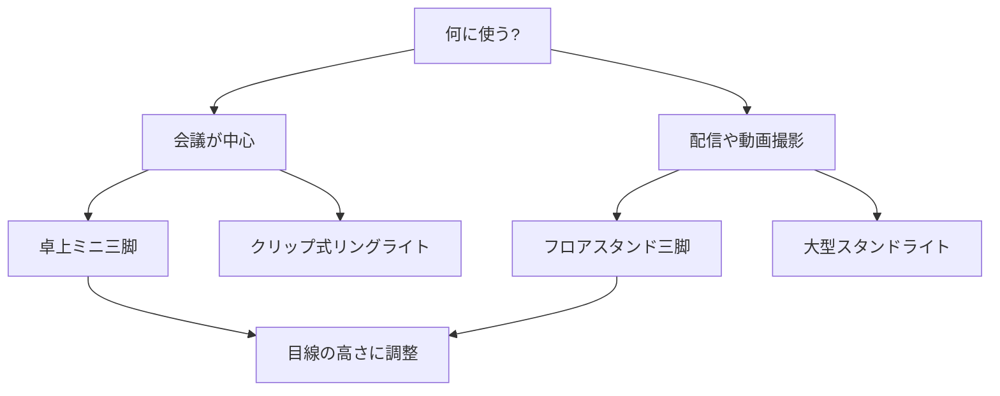

※本記事はアフィリエイト広告(PR)を含みます。

「オンライン会議や配信で、自分の映りがなんだか暗い・カメラの角度がイマイチ…」と感じたことはありませんか?この記事では、**Webカメラ三脚とリングライト（顔まわりを明るく照らす円形の照明）の選び方**を、初心者にもわかりやすく解説します。

読み終えるころには、「自分にはどんな三脚・照明が合うのか」「何を基準に選べばいいのか」がはっきりわかり、映りを改善するための具体的な行動に移せるようになります。高価な機材を買わなくても、選び方さえ押さえれば印象は大きく変わりますよ。

## なぜ三脚とリングライトで映りが変わるのか

カメラ本体の性能ももちろん大切ですが、実は**「角度」と「光」**が映りの印象を大きく左右します。

- **三脚（カメラを固定する台）**：カメラの高さや角度を自由に調整でき、見下ろされる・見上げられるといった不自然な映りを防げます。
- **リングライト**：顔全体を均一に明るく照らし、影を減らして健康的で清潔感のある印象にしてくれます。

ノートパソコン内蔵カメラは、画面を見ると自然と「下から見上げる」角度になりがちで、しかも部屋の照明だけだと顔が暗くなりやすいものです。この2点を機材で補うだけで、相手に与える印象がぐっと良くなります。

なお、カメラやマイク本体の選び方については[Webカメラ・マイクのおすすめ｜オンライン会議の印象を良くする機材選び](/2026/06/15/webcam-mic-online-meeting/)で詳しく解説しているので、あわせて読むと機材選びの全体像がつかめます。

## Webカメラ三脚の選び方

三脚と一口に言っても種類はさまざまです。用途に合わせて選びましょう。

### タイプで選ぶ

| タイプ | 特徴 | 向いている人 |
|--------|------|--------------|
| 卓上ミニ三脚 | 机の上に置ける小型。省スペース | 会議中心・デスクが狭い人 |
| フレキシブル三脚 | 脚が曲がり棚やモニターに巻き付けられる | 設置場所を選びたい人 |
| フロアスタンド型 | 床から立てる高さ調整可能な大型 | 配信・立ち姿も映したい人 |

会議が中心なら卓上ミニ三脚で十分ですが、配信や全身を映したい場合は高さのあるフロアスタンド型が便利です。

### チェックすべきポイント

- **ネジ規格**：多くのWebカメラや三脚は「1/4インチネジ」という共通規格に対応しています。手持ちのカメラが対応しているか確認しましょう。
- **耐荷重**：カメラの重さに耐えられるか。軽いWebカメラなら問題になりにくいですが、一眼カメラを載せるなら要チェックです。
- **高さ調整の幅**：目線と同じ高さにカメラを置けると、最も自然な映りになります。
- **安定性**：脚が細すぎるとぐらつきの原因に。使う場所に合った安定感を選びましょう。

👉 [Amazonで「Webカメラ 三脚 卓上」を見る](https://af.moshimo.com/af/c/click?a_id=5632371&p_id=170&pc_id=185&pl_id=38594&url=https%3A%2F%2Fwww.amazon.co.jp%2Fs%3Fk%3DWeb%25E3%2582%25AB%25E3%2583%25A1%25E3%2583%25A9%2520%25E4%25B8%2589%25E8%2584%259A%2520%25E5%258D%2593%25E4%25B8%258A)

## リングライトの選び方

リングライトは「明るさ」と「光の色」がポイントです。

### 明るさ（調光）

段階的に明るさを変えられる**調光機能**があると、時間帯や部屋の明るさに合わせて調整できて便利です。明るすぎると白飛び（顔が真っ白に映る現象）してしまうので、細かく調整できるモデルがおすすめです。

### 光の色（色温度）

**色温度**とは光の色みのことで、単位はK（ケルビン）で表します。

- **昼白色（約5000K前後）**：自然な白い光。ビジネス会議向き
- **電球色（約3000K前後）**：暖かみのあるオレンジがかった光。リラックスした雰囲気に
- **昼光色（約6500K前後）**：青白くはっきりした光

色温度を切り替えられるモデルなら、シーンに応じて印象を変えられます。

### サイズと設置方法

- **クリップ式**：モニターやデスクに挟むタイプ。省スペース
- **スタンド式**：床置きで高さ調整可能。大きなライトほど光がやわらかくなる
- **カメラ一体型**：ライトの中央にスマホやカメラを設置できる

👉 [楽天市場で「リングライト 卓上 調光」を探す](https://af.moshimo.com/af/c/click?a_id=5632328&p_id=54&pc_id=54&pl_id=616&url=https%3A%2F%2Fsearch.rakuten.co.jp%2Fsearch%2Fmall%2F%25E3%2583%25AA%25E3%2583%25B3%25E3%2582%25B0%25E3%2583%25A9%25E3%2582%25A4%25E3%2583%2588%2520%25E5%258D%2593%25E4%25B8%258A%2520%25E8%25AA%25BF%25E5%2585%2589%2F)

## 選び方フローチャート

自分に合った機材を選ぶ流れを図にまとめました。

まずは「何に使うか」を決めることが、失敗しない機材選びの第一歩です。

## 設置のコツと映りを良くするテクニック

機材を用意したら、置き方にもひと工夫しましょう。

1. **カメラは目線の高さに**：見下ろし・見上げをなくすと最も自然です。
2. **ライトは顔の正面から**：真横からだと片側に影ができます。正面やや上から当てるのが基本です。
3. **背景に光源を作らない**：窓や照明を背にすると逆光で顔が暗くなります。光は「顔の前」に。
4. **メガネの反射に注意**：ライトの角度を少しずらすと反射を抑えられます。

こうした環境づくりは、快適な在宅ワーク全体にもつながります。デスク周りをまるごと見直したい方は[在宅ワークが捗るデスク周りガジェット10選｜快適環境の作り方](/2026/06/11/home-office-gadgets/)も参考になりますよ。

## Q&A：よくある疑問に先回り

### リングライトは会議でも必要?

「配信者だけのもの」と思われがちですが、会議でも効果は大きいです。特に部屋の照明が暗めだったり、逆光になりやすい席では、顔が明るく映るだけで印象が改善します。まずは安価なクリップ式から試すのがおすすめです。

### 無料・お金をかけずに映りを良くする方法は?

あります。**窓からの自然光を正面に取り込む**、**ノートPCの下に本を重ねてカメラの高さを上げる**、といった工夫だけでも映りは変わります。機材を買う前に、まず光と角度を意識してみましょう。それでも足りない場合に、三脚やリングライトを検討すると無駄がありません。

### スマホでも使える?

多くの三脚・リングライトはスマホホルダーが付属しており、スマホをWebカメラ代わりに使う場合にも活用できます。購入前にスマホ対応の記載があるか確認しましょう。

## まとめ

Webカメラ三脚とリングライトは、高価な機材でなくても「映りの印象」を大きく変えてくれるコスパの良いアイテムです。

- **三脚**は用途（会議か配信か）でタイプを選び、ネジ規格・高さ調整・安定性をチェック
- **リングライト**は調光機能と色温度の切り替えがあると便利
- **設置は目線の高さ＋正面からの光**が基本
- まずは自然光と角度の工夫から始め、足りなければ機材を追加

なお、具体的な価格や最新モデルの仕様は変わることがあるため、購入前に公式サイトや販売ページで最新情報を確認してください。まずは手軽なクリップ式ライトや卓上三脚から取り入れて、あなたの会議・配信の映りをワンランクアップさせてみましょう。
