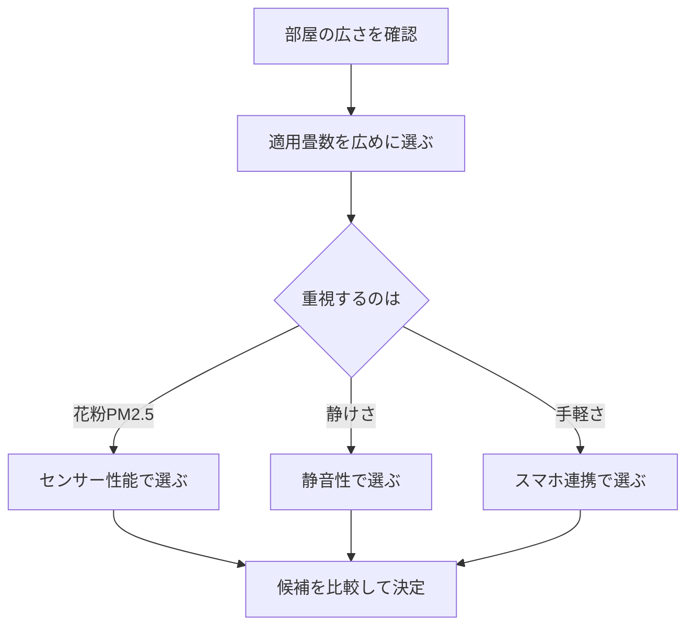

※本記事はアフィリエイト広告(PR)を含みます。

「部屋の空気を自動できれいにしてほしい」「花粉やPM2.5を気にせず快適に過ごしたい」——そんな方に人気なのが、AI搭載空気清浄機です。この記事では、**AI搭載空気清浄機のおすすめの選び方**を2026年の最新事情にあわせてわかりやすく解説します。

この記事を読むと、次のことがわかります。

- AI搭載空気清浄機が普通の空気清浄機と何が違うのか
- 花粉・PM2.5を自動検知する仕組み
- 失敗しないための選び方のポイント
- よくある疑問(電気代・フィルター交換など)への回答

家電に詳しくない方でも、読み終える頃には自分に合った一台を選べるようになります。

## AI搭載空気清浄機とは?普通の空気清浄機との違い

まず、AI搭載空気清浄機の基本を押さえておきましょう。

従来の空気清浄機は、手動で「強・中・弱」を切り替えたり、簡単なセンサーで自動運転したりするものが主流でした。一方、AI搭載モデルは**複数のセンサーで空気の状態を細かく検知し、状況を学習しながら最適な運転に自動調整**してくれます。

AIと聞くと難しそうですが、ここでのAIとは「たくさんのデータをもとに賢く判断する仕組み」くらいに考えれば十分です。具体的には、次のようなことができます。

- 花粉・PM2.5・ハウスダストなどの種類を判別して運転を切り替える
- 生活リズムを学習し、帰宅時間に合わせて先回りで空気をきれいにする
- スマホアプリで外出先から空気の状態を確認・操作する
- 音声アシスタントと連携して声で操作する

つまり、「気づいたら自動できれいにしてくれている」状態を目指せるのがAI搭載モデルの魅力です。

### PM2.5・花粉を「自動検知」する仕組み

「自動検知」の核になるのが**センサー**です。代表的なセンサーには次のような種類があります。

- **ホコリセンサー**:空気中の粒子の量を検知
- **PM2.5センサー**:直径2.5マイクロメートル以下の微小粒子を検知(※髪の毛の約30分の1ほどの小さな粒)
- **ニオイ(ガス)センサー**:料理臭やタバコ臭などを検知
- **温湿度センサー**:快適さや加湿の要否を判断

AI搭載モデルは、これらのセンサーの情報を組み合わせて「今は花粉が多いから急速運転」「夜間で汚れが少ないから静音運転」といった判断を自動で行います。センサーの種類が多いほど、きめ細かい制御が期待できます。

## AI搭載空気清浄機の選び方6つのポイント

ここからは、実際に選ぶときにチェックしたいポイントを解説します。

### 1. 適用畳数は「部屋より広め」を選ぶ

適用畳数とは「この広さまでキレイにできますよ」という目安です。カタログ値ぎりぎりだと能力を使い切ってしまうため、**実際の部屋より1.5〜2倍広い適用畳数**のモデルを選ぶと余裕を持って使えます。

### 2. センサーの種類と精度

前述のとおり、PM2.5・ニオイ・温湿度など、対応するセンサーが多いほど自動制御が賢くなります。花粉症対策を重視するなら、微小粒子をしっかり検知できるモデルがおすすめです。

### 3. フィルター性能とランニングコスト

多くの高性能モデルは**HEPAフィルター**(微小な粒子を高い割合で捕らえるフィルター)を採用しています。フィルターは消耗品なので、交換頻度と交換用フィルターの価格もあわせて確認しておくと安心です。

### 4. 静音性(寝室で使うなら特に重要)

寝室で使う場合は、静音運転時の運転音(dB=デシベル)をチェックしましょう。数値が小さいほど静かです。

### 5. スマホ連携・音声操作の対応

スマホアプリで空気の状態を見える化できたり、スマートスピーカーから声で操作できたりすると、日々の使い勝手が大きく変わります。音声操作に興味がある方は、[スマートスピーカーはどれを買うべき?Alexa・Google Home徹底比較](/2026/06/12/smart-speaker-comparison/)もあわせて参考にしてみてください。

### 6. 加湿機能の有無

乾燥が気になる季節は、加湿機能付きモデルが便利です。ただし加湿タンクの給水やお手入れの手間が増える点は覚えておきましょう。

## タイプ別のおすすめの選び方

用途によって最適なモデルは変わります。代表的な3タイプに分けて整理しました。

| タイプ | 重視すべきポイント | こんな人におすすめ |
|---|---|---|
| 花粉・PM2.5対策重視 | 高精度センサー・HEPAフィルター | 花粉症・アレルギー体質の方 |
| 寝室・書斎向け | 静音性・コンパクトさ | 就寝中や作業中に使いたい方 |
| リビング向け | 大風量・広い適用畳数・加湿対応 | 家族の広い部屋で使いたい方 |

自分の使い方に近いタイプを起点に探すと、迷いにくくなります。まずは主要メーカーのモデルを横断的にチェックしてみましょう。

👉 [Amazonで「AI 空気清浄機 花粉 PM2.5」を見る](https://af.moshimo.com/af/c/click?a_id=5632371&p_id=170&pc_id=185&pl_id=38594&url=https%3A%2F%2Fwww.amazon.co.jp%2Fs%3Fk%3DAI%2520%25E7%25A9%25BA%25E6%25B0%2597%25E6%25B8%2585%25E6%25B5%2584%25E6%25A9%259F%2520%25E8%258A%25B1%25E7%25B2%2589%2520PM2.5)

楽天でポイントを貯めながら購入したい方は、こちらから探せます。

👉 [楽天市場で「空気清浄機 HEPAフィルター 自動運転」を探す](https://af.moshimo.com/af/c/click?a_id=5632328&p_id=54&pc_id=54&pl_id=616&url=https%3A%2F%2Fsearch.rakuten.co.jp%2Fsearch%2Fmall%2F%25E7%25A9%25BA%25E6%25B0%2597%25E6%25B8%2585%25E6%25B5%2584%25E6%25A9%259F%2520HEPA%25E3%2583%2595%25E3%2582%25A3%25E3%2583%25AB%25E3%2582%25BF%25E3%2583%25BC%2520%25E8%2587%25AA%25E5%258B%2595%25E9%2581%258B%25E8%25BB%25A2%2F)

価格や機能は頻繁に更新されるため、購入前に必ず**各メーカーの公式サイトや販売ページで最新情報を確認**してください。

## 部屋全体をスマート化するとさらに快適

AI搭載空気清浄機は、単体でも便利ですが、ほかのスマート家電と組み合わせると効果を実感しやすくなります。

たとえば、床のホコリを自動で取り除く[ロボット掃除機の選び方2026\|AI搭載モデルを価格・機能で徹底比較](/2026/06/16/robot-vacuum-guide-2026/)と併用すれば、舞い上がるハウスダストそのものを減らせます。また、エアコンを賢く制御する[AI搭載スマートサーモスタットで電気代を自動節約する方法](/2026/07/08/ai-smart-thermostat-guide/)を取り入れれば、温度・湿度・空気の質をまとめて快適に保てます。

「家全体を音声や自動化で管理したい」という方は、こうした関連ガジェットもセットで検討すると満足度が高まります。

## よくある質問(Q&A)

### Q1. AI搭載空気清浄機の電気代は高い?

多くのモデルは自動運転で無駄な稼働を抑えるため、常に強運転するより電気代を抑えやすい傾向があります。ただし機種や使用時間によって差が大きいので、具体的な消費電力(W)は商品ページで確認しましょう。省エネ性能を重視するなら、消費電力の数値と自動運転の賢さをあわせてチェックするのがおすすめです。

### Q2. フィルターはどのくらいで交換する?

製品によって異なりますが、集じんフィルターは数年、脱臭フィルターや加湿フィルターはそれより短い周期で交換・お手入れが必要になることが多いです。交換時期の目安と交換費用は、購入前に公式情報で必ず確認しておきましょう。

### Q3. 安いモデルでも花粉対策はできる?

適用畳数とフィルター性能が部屋に合っていれば、手頃なモデルでも一定の効果は期待できます。ただし「センサーで自動判別して先回りする」といった賢さは上位モデルほど充実します。予算と求める快適さのバランスで選びましょう。

### Q4. スマホがなくても使える?

本体だけでも問題なく使えます。スマホ連携はあくまで便利機能なので、「まずはシンプルに使いたい」という方は連携機能にこだわりすぎなくても大丈夫です。

## まとめ

AI搭載空気清浄機は、花粉やPM2.5を自動で検知し、状況に合わせて賢く運転してくれる頼もしい家電です。最後に選び方のポイントを振り返りましょう。

- **適用畳数は部屋より広め**を選んで余裕を持たせる
- **センサーの種類**が多いほど自動制御が賢くなる
- **フィルター性能とランニングコスト**をあわせて確認
- 寝室で使うなら**静音性**、手軽さ重視なら**スマホ・音声連携**
- ロボット掃除機やスマートサーモスタットと**組み合わせるとさらに快適**

まずは自分の部屋の広さと「花粉・静けさ・手軽さ」のどれを重視するかを決めると、候補がぐっと絞れます。価格や機能は変動するため、気になるモデルは公式サイトや販売ページで最新情報を確認したうえで、あなたの暮らしに合った一台を選んでみてください。
