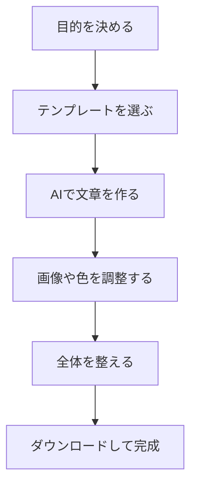

※本記事はアフィリエイト広告(PR)を含みます。

「お店のチラシやイベントの告知を作りたいけれど、デザインの知識がなくて手が出せない…」——そんな悩みを抱えている方は多いのではないでしょうか。この記事では、**Canva AIを使ってチラシやデザインを初心者でも簡単に作る方法**を、手順を追ってわかりやすく解説します。

この記事を読むと、次のことがわかります。

- Canva AIとは何か、どんなことができるのか
- チラシを作る具体的な手順
- 便利なAI機能とおすすめのテンプレートの選び方
- 「無料で使えるの?」という疑問への答え

デザイン経験ゼロの方でも、この記事を読み終えるころには「自分にも作れそう」と思えるはずです。それでは始めましょう。

## Canva AIとは?何ができるのか

Canva(キャンバ)は、ブラウザやアプリ上でチラシ・ポスター・SNS画像・プレゼン資料などを作れる、無料でも使えるデザインツールです。そのCanvaに搭載されたAI機能をまとめて「Canva AI」と呼びます。

専門的なソフトを使わなくても、ドラッグ&ドロップ(要素をつまんで動かす操作)だけでプロっぽいデザインが作れるのが最大の魅力です。さらにAI機能を使えば、次のようなことが自動でできます。

| AI機能 | できること |
|---|---|
| マジック生成(文章→デザイン) | 作りたいチラシの内容を文章で伝えると、たたき台を自動作成 |
| AI画像生成 | 「夏祭りのイラスト」など言葉から画像を作成 |
| 背景除去 | 写真の背景をワンクリックで透明化 |
| マジック文章作成 | キャッチコピーや説明文をAIが提案 |
| マジック拡張 | 画像の足りない部分をAIが自然に描き足す |

つまり、**デザインのセンスや文章力に自信がなくても、AIが下書きを用意してくれる**というわけです。

## Canva AIは無料で使える?

結論から言うと、**Canvaは無料プランでも十分に使えます**。無料でもテンプレートの利用や基本的な編集、一部のAI機能が使えます。

ただし、AI機能には利用回数の制限がある場合が多く、より多く使いたい場合や高機能な素材を使いたい場合は、有料プラン(Canva Proなど)が便利です。

料金やAI機能の利用上限は改定されることがあるため、**最新の内容は必ずCanva公式サイトで確認してください**。まずは無料プランで試してみて、物足りなくなったら有料を検討する、という流れがおすすめです。

## Canva AIでチラシを作る手順

ここからは、実際にチラシを作る流れを見ていきましょう。全体の流れは次のとおりです。

### 手順1:作りたいチラシの目的を決める

まずは「誰に・何を伝えるチラシか」をはっきりさせましょう。たとえば「近所の人にカフェの新メニューを知らせる」「イベントの参加者を集める」などです。目的が明確だと、AIへの指示もわかりやすくなります。

### 手順2:テンプレートを選ぶ

Canvaで「チラシ」と検索すると、大量のテンプレートが表示されます。デザインの土台になるものなので、イメージに近いものを選びましょう。テンプレート選びのポイントは後ほど詳しく紹介します。

### 手順3:AIで文章とデザインのたたき台を作る

CanvaのAI機能に「〇〇カフェの夏の新メニューを告知するチラシを作って」のように文章で伝えると、レイアウトや文章のたたき台を自動で作ってくれます。

このとき、AIへの指示(プロンプト)を具体的にするほど、狙いに近い結果が得られます。指示の出し方のコツは[AIプロンプトのコツ\|思い通りの回答を引き出す書き方を初心者向けに解説](/2026/06/22/ai-prompt-tips/)も参考にしてみてください。

### 手順4:画像・色・文字を調整する

たたき台ができたら、自分好みに調整します。

- 写真を差し替える(自分で撮った写真もアップロード可能)
- 背景除去で商品写真をきれいに切り抜く
- 色やフォントをお店の雰囲気に合わせる
- AI画像生成でオリジナルのイラストを追加する

背景の透過や写真の加工をもっと本格的にやりたい場合は、[AI画像編集ソフトおすすめ比較｜背景透過・加工を自動化する5選](/2026/06/19/ai-image-editing-tools/)で紹介しているツールと組み合わせるのも効果的です。

### 手順5:全体を整えてダウンロード

文字の大きさや余白のバランスを整えたら完成です。PNGやPDF形式でダウンロードして、印刷したりSNSに投稿したりできます。

## テンプレート選びのコツ

テンプレートは仕上がりを大きく左右します。次のポイントを意識すると失敗しにくくなります。

1. **用途に合ったサイズを選ぶ** — 配布用のA4チラシ、SNS投稿用の正方形など、使う場所に合わせる
2. **情報量に合ったレイアウトを選ぶ** — 伝えたい内容が多いなら文字スペースが多いものを
3. **色数が少ないものから始める** — 色が多いと初心者は扱いが難しくなりがち
4. **写真の枠が用意されたものを選ぶ** — 自分の写真を入れるだけで一気に完成度が上がる

迷ったら、まず「シンプルで文字が読みやすい」テンプレートを選ぶのがおすすめです。

## キャッチコピーもAIにおまかせ

チラシで意外と難しいのが、人の目を引くキャッチコピーです。Canvaのマジック文章作成機能を使えば、複数の候補を一瞬で提案してくれます。

さらにこだわりたい場合は、専用のネーミング・コピー生成ツールを併用するのも手です。詳しくは[AIネーミング完全ガイド\|名前・キャッチコピーを自動化するツール5選](/2026/07/02/ai-naming-tools/)をご覧ください。

## こんな場面でも活躍する

Canva AIはチラシ以外にも幅広く使えます。

- SNS投稿画像やサムネイル
- プレゼン資料(スライド)
- 名刺やショップカード
- メニュー表やPOP

プレゼン資料をAIでもっと効率化したい方は、[AIプレゼン資料作成ツール比較\|パワポ作業を時短する5つの方法](/2026/06/13/ai-presentation-tools/)も合わせて読むと、作業時間をぐっと短縮できます。

## タブレットがあると作業がもっと快適に

Canvaはスマホでも使えますが、細かい調整をするなら画面の大きいタブレットがあると格段に作業がしやすくなります。指やペンで直感的に要素を動かせるため、外出先でのデザイン作業にもぴったりです。

👉 [Amazonで「タブレット お絵描き ペン対応」を見る](https://af.moshimo.com/af/c/click?a_id=5632371&p_id=170&pc_id=185&pl_id=38594&url=https%3A%2F%2Fwww.amazon.co.jp%2Fs%3Fk%3D%25E3%2582%25BF%25E3%2583%2596%25E3%2583%25AC%25E3%2583%2583%25E3%2583%2588%2520%25E3%2581%258A%25E7%25B5%25B5%25E6%258F%258F%25E3%2581%258D%2520%25E3%2583%259A%25E3%2583%25B3%25E5%25AF%25BE%25E5%25BF%259C)

どのタブレットを選べばよいか迷う方は、[タブレットの選び方2026\|AIお絵描き・電子書籍に最適なモデル比較](/2026/06/22/tablet-guide-2026/)で用途別に詳しく解説しています。

## よくある質問(Q&A)

**Q. デザインの知識がまったくなくても作れますか?**
A. はい。テンプレートとAI機能を使えば、ゼロから作る必要はありません。まずは既存のデザインを少し変えるところから始めましょう。

**Q. 作ったチラシは商用利用できますか?**
A. Canvaのデザイン自体は基本的に商用利用が可能ですが、素材によっては条件がある場合があります。AI生成画像の扱いも含め、利用前に公式のライセンス規約を確認しておくと安心です。無料の画像生成AI全般の商用利用の注意点は[無料で使える画像生成AIおすすめ5選\|商用利用の注意点も解説](/2026/06/11/free-image-ai-tools/)でも触れています。

**Q. 印刷はどうすればいいですか?**
A. 自宅のプリンターで印刷するほか、Canvaの印刷サービスやコンビニ印刷を利用する方法もあります。配布枚数が多い場合はネット印刷サービスの利用が便利です。

## まとめ

Canva AIを使えば、デザインの経験がない方でも、チラシやSNS画像を手軽に作れます。ポイントを振り返っておきましょう。

- Canvaは無料でも使え、AI機能でたたき台を自動作成できる
- チラシ作りは「目的→テンプレート→AIで文章→調整→ダウンロード」の流れ
- テンプレートはシンプルで用途に合ったものから選ぶ
- キャッチコピーや画像もAIにおまかせできる
- 商用利用や料金は公式サイトで最新情報を確認する

まずは無料プランで、身近なチラシやSNS画像を1つ作ってみるところから始めてみてください。手を動かしてみると、想像以上に簡単に、そして楽しくデザインができることに気づくはずです。
