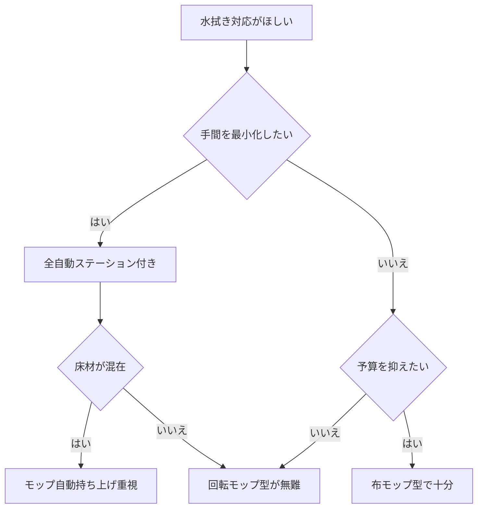

※本記事はアフィリエイト広告(PR)を含みます。

## この記事でわかること

「掃除機がけだけでなく、床の水拭きまで自動でやってほしい」——そんな願いを叶えるのが、**水拭き対応のロボット掃除機**です。この記事では、AI搭載の水拭き対応ロボット掃除機のおすすめの選び方を、2026年最新の傾向をふまえて初心者向けに解説します。

読み終えるころには、次のことがわかります。

- 水拭き対応ロボット掃除機には「どんなタイプ」があるのか
- 自分の家に合ったモデルを選ぶための「チェックポイント」
- 買う前に知っておきたい「注意点」やよくある疑問

ゴシゴシ拭き掃除から解放されたい方は、ぜひ最後までご覧ください。

## 水拭き対応ロボット掃除機とは?

水拭き対応ロボット掃除機とは、**ゴミの吸引(掃除機がけ)と、水を含ませたモップでの拭き掃除を1台でこなせる**ロボット掃除機のことです。フローリングのべたつきや、皮脂汚れ・食べこぼしのあとなど、吸引だけでは取り切れない汚れをきれいにしてくれます。

近年のモデルは「AI」を搭載し、カメラやセンサーで**部屋の間取りや障害物を自動で認識**します。カーペットを検知したら自動でモップを持ち上げたり、汚れのひどい場所を重点的に拭いたりと、賢く動くのが特徴です。

> 💡 用語メモ:「AI搭載」とは、ここではカメラやセンサーの情報をもとに、床の材質や障害物、汚れ具合を判断して動きを最適化する仕組みを指します。

ロボット掃除機全般の選び方や吸引力の見方については、[ロボット掃除機の選び方2026\|AI搭載モデルを価格・機能で徹底比較](/2026/06/16/robot-vacuum-guide-2026/)でも詳しく解説しています。あわせて読むと基礎が固まりますよ。

## 水拭き機能には3つのタイプがある

「水拭き対応」とひとくちに言っても、拭き方の仕組みはモデルによって異なります。大きく分けて次の3タイプです。

| タイプ | 特徴 | 向いている人 |
|---|---|---|
| 布モップ引きずり型 | 濡れた布を床に当てて走行 | 価格を抑えたい人 |
| 回転モップ型 | 円盤状のモップが回転して拭く | しっかり汚れを落としたい人 |
| ローラーモップ型 | ローラーが回転し常に洗いながら拭く | 拭き跡・雑巾臭が気になる人 |

### 布モップ引きずり型

最も基本的なタイプで、水を含ませた布を後方に取り付けて引きずりながら拭きます。構造がシンプルで価格が手頃な一方、こびりついた汚れを落とす力は弱めです。

### 回転モップ型

2枚の円盤モップが高速で回転し、押しつけるように拭くタイプです。皮脂汚れや軽い黒ずみもしっかり落としやすく、現在の主流になりつつあります。

### ローラーモップ型

最新の上位機種に多いタイプで、走行中に常にモップを洗浄・給水しながら拭くため、**汚れた水で床を広げてしまう心配が少ない**のが魅力です。その分、価格は高めになります。

## 選び方の5つのポイント

水拭き対応モデルを選ぶときは、次の5点をチェックしましょう。

### 1. 全自動ステーションの有無

「全自動ステーション(基地)」とは、掃除が終わったあとに**ゴミの自動収集・モップの自動洗浄・自動乾燥・自動給水**まで行ってくれる充電台のことです。ここが充実しているほど手間が減りますが、本体サイズと価格は大きくなります。

### 2. カーペット対応(モップ自動持ち上げ)

カーペットを検知するとモップを自動で持ち上げる機能があると、じゅうたんを濡らす失敗を防げます。フローリングとカーペットが混在する家では必須級の機能です。

### 3. マッピングと障害物回避のAI精度

部屋の間取りを記憶する「マッピング」と、コードやスリッパをよける「障害物回避」の精度は、AI性能によって差が出ます。家具や小物が多い部屋ほど、この賢さが効いてきます。

### 4. 掃除エリアの指定・立ち入り禁止設定

スマホアプリで「キッチンだけ拭く」「この部屋は入らない」といった指定ができると、生活スタイルに合わせやすくなります。スマホやスマートスピーカーからの操作に興味がある方は、[スマートリモコンの選び方2026｜AI音声で家電をまとめて操作するおすすめ比較](/2026/07/08/smart-remote-guide-2026/)も参考になります。

### 5. メンテナンスのしやすさ・ランニングコスト

モップやフィルターは消耗品です。交換のしやすさや部品の入手性、洗浄用の水・洗剤コストも確認しておくと、買ったあとに後悔しにくくなります。

## タイプ別・選び方フローチャート

迷ったときは、下の図を目安にしてみてください。

このように、「手間」「予算」「床材の状況」の3つを順番に考えると、自分に合ったタイプが絞り込めます。

実際の製品は、性能や価格が日々更新されています。気になるモデルは在庫や最新スペックを確認しながら選びましょう。

👉 [Amazonで「ロボット掃除機 水拭き 全自動」を見る](https://af.moshimo.com/af/c/click?a_id=5632371&p_id=170&pc_id=185&pl_id=38594&url=https%3A%2F%2Fwww.amazon.co.jp%2Fs%3Fk%3D%25E3%2583%25AD%25E3%2583%259C%25E3%2583%2583%25E3%2583%2588%25E6%258E%2583%25E9%2599%25A4%25E6%25A9%259F%2520%25E6%25B0%25B4%25E6%258B%25AD%25E3%2581%258D%2520%25E5%2585%25A8%25E8%2587%25AA%25E5%258B%2595)

👉 [楽天市場で「水拭き ロボット掃除機 回転モップ」を探す](https://af.moshimo.com/af/c/click?a_id=5632328&p_id=54&pc_id=54&pl_id=616&url=https%3A%2F%2Fsearch.rakuten.co.jp%2Fsearch%2Fmall%2F%25E6%25B0%25B4%25E6%258B%25AD%25E3%2581%258D%2520%25E3%2583%25AD%25E3%2583%259C%25E3%2583%2583%25E3%2583%2588%25E6%258E%2583%25E9%2599%25A4%25E6%25A9%259F%2520%25E5%259B%259E%25E8%25BB%25A2%25E3%2583%25A2%25E3%2583%2583%25E3%2583%2597%2F)

## よくある疑問(Q&A)

### Q. 水拭き対応でも、フローリング以外に使える?

A. 基本はフローリングやクッションフロアなどの硬い床向けです。カーペットや畳の上での水拭きは、素材を傷めたりカビの原因になったりするため推奨されません。前述の「モップ自動持ち上げ」機能があると安心です。

### Q. 水拭き機能は本当に必要?吸引だけで十分では?

A. 小さなお子さんやペットがいる家庭、裸足で過ごすことが多い家庭では、床のべたつきが気になりやすく、水拭きの満足度が高い傾向です。逆に、床がほぼカーペットという家では吸引特化モデルのほうが向いています。

### Q. 掃除中の音は大きい?在宅ワーク中でも使える?

A. モデルによりますが、静音モードを備えた機種も多くあります。在宅ワークの環境づくり全般は、[在宅ワークが捗るデスク周りガジェット10選\|快適環境の作り方](/2026/06/11/home-office-gadgets/)もあわせてどうぞ。

### Q. 価格の相場はどのくらい?

A. 布モップ型のエントリーモデルから、全自動ステーション付きの高機能モデルまで幅広く、価格帯は大きく異なります。セールで変動することも多いため、具体的な金額は各メーカーの公式サイトや販売ページで最新情報を確認してください。

## 買う前にチェックしたい注意点

- **設置スペース**:全自動ステーションは想像以上に場所を取ることがあります。事前に置き場所を測っておきましょう。
- **段差・敷居**:乗り越えられる段差の高さには限界があります。部屋をまたぐ敷居の高さを確認しておくと安心です。
- **配線・小物の片付け**:AIの障害物回避が優秀でも、床に物が少ないほど掃除の質は上がります。
- **モップの乾燥**:自動乾燥機能がないモデルは、使用後に手動で乾かさないと雑巾臭の原因になります。

## まとめ

水拭き対応ロボット掃除機は、掃除機がけと拭き掃除という2つの家事をまとめて自動化してくれる、心強い時短家電です。選ぶときのポイントを振り返りましょう。

- 水拭きの仕組みは「布モップ型」「回転モップ型」「ローラーモップ型」の3タイプ
- 手間を最小化するなら「全自動ステーション付き」を選ぶ
- 床材が混在する家は「モップ自動持ち上げ」機能が重要
- マッピングや障害物回避などAIの賢さも快適さを左右する
- モップの乾燥やランニングコストなど、買ったあとの手間も要チェック

まずは「手間・予算・床材」の3つで自分の優先順位を決め、フローチャートを参考にタイプを絞り込むのがおすすめです。気になるモデルが見つかったら、最新の価格やスペックを公式サイトや販売ページで確認して、あなたの暮らしに合った一台を見つけてください。床掃除から解放される快適な毎日が、きっと待っていますよ。
