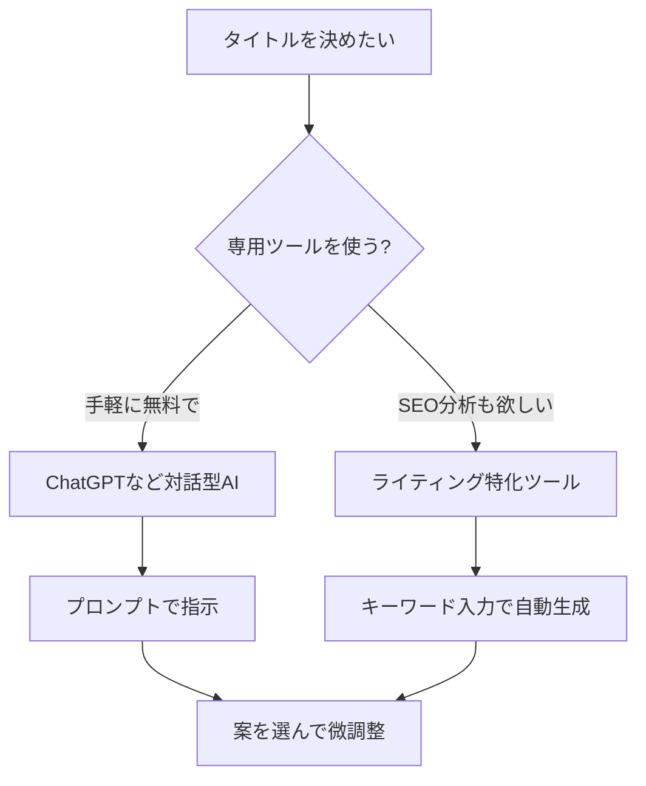

※本記事はアフィリエイト広告(PR)を含みます。

「記事のタイトルがなかなか決まらない」「頑張って書いた記事なのにクリックされない」——そんな悩みはありませんか?実は、記事のタイトルは検索結果でのクリック率(クリックされる割合)を大きく左右する、とても重要な要素です。

この記事では、**AIタイトル生成ツールを使ってSEOに強い記事タイトルや名前を自動で決める方法**を、初心者の方にもわかりやすく解説します。読み終わるころには、どのツールを使えばいいか、どんな指示(プロンプト)を出せば良いタイトルが作れるかがわかり、今日からすぐに実践できるようになります。

## そもそもAIでタイトルを決めるとは?

AIタイトル生成とは、記事のテーマやキーワードを入力するだけで、AIが複数のタイトル案を自動で提案してくれる仕組みのことです。ChatGPTのような対話型AIに指示を出す方法と、タイトル作成に特化した専用ツールを使う方法の2種類があります。

### AIにタイトルを任せる3つのメリット

- **時短になる**:数十秒で10案以上のタイトルを出してくれます
- **アイデアの幅が広がる**:自分では思いつかない切り口が見つかります
- **SEOを意識した構成にしやすい**:キーワードを含めた案を作ってくれます

ここで言う「SEO」とは、検索エンジン最適化(Search Engine Optimization)の略で、GoogleやYahoo!などの検索結果で上位に表示されやすくする工夫のことです。タイトルにユーザーが検索するキーワードを自然に含めることは、SEOの基本の一つです。

## SEOに強いタイトルの3つの条件

AIに任せる前に、「良いタイトルとは何か」を知っておくと、AIの提案を的確に選べるようになります。

| 条件 | ポイント |
|------|----------|
| キーワードを入れる | 読者が検索する言葉を、できれば前半に入れる |
| 数字や具体性を出す | 「5選」「3つのコツ」など具体的だとクリックされやすい |
| 文字数を意識する | 全角28〜35文字程度。長すぎると検索結果で切れる |

この3条件を満たすタイトルをAIに作らせるのが、この記事の目指すゴールです。

## AIタイトル生成ツールの選び方

ツール選びで迷ったら、下のフローチャートを参考にしてみてください。



無料で手軽に始めたいなら対話型AI、SEO分析やキーワード提案までまとめて欲しいなら有料のライティング特化ツール、という選び方が基本になります。

## おすすめのAIタイトル生成ツール比較

代表的なツールを、初心者にも使いやすいものを中心に紹介します。

### 1. ChatGPT / Claude / Gemini(対話型AI)

最も手軽なのが、汎用の対話型AIにタイトルを作らせる方法です。無料版でも十分にタイトル生成に使えます。テーマとキーワードを伝えるだけで、何案でも出してくれる自由度の高さが魅力です。

それぞれの特徴の違いは、[ChatGPTとClaudeとGeminiを徹底比較!初心者におすすめのAIチャットはどれ?](/2026/06/09/ai-chat-comparison/)で詳しく解説しているので、どれを使うか迷ったら参考にしてください。

### 2. ライティング特化ツール(Catchy・Jasperなど)

タイトルだけでなく、キャッチコピーや記事構成まで作れる専用ツールです。日本語のマーケティング表現に強いものも多く、テンプレートに沿って入力するだけで質の高い案が出ます。

各ツールの詳しい比較は[AIライティングツール比較2026\|ChatGPT・Jasper・Catchyどれが使える?](/2026/06/19/ai-writing-tool-comparison-2026/)にまとめています。

### 3. ネーミング・キャッチコピー特化ツール

商品名やサービス名、ブログ名など「タイトル以外の名前」を決めたい場合は、ネーミング特化のツールが便利です。名前づくり全般については[AIネーミング完全ガイド\|名前・キャッチコピーを自動化するツール5選](/2026/07/02/ai-naming-tools/)で紹介しています。

> 各ツールの料金プランは変更されることがあります。最新の価格や無料枠については、必ず公式サイトで最新情報を確認してください。

## AIタイトル生成ツールは無料で使える?

結論から言うと、**基本的な機能なら無料で十分試せます**。

- ChatGPT・Claude・Geminiには無料プランがあり、タイトル生成程度なら無料版でも問題なく使えます
- ライティング特化ツールは、無料トライアルや無料クレジットが用意されていることが多いです

まずは無料で使い勝手を試し、「もっと本格的にSEO分析までしたい」と感じたら有料版を検討する、という流れがおすすめです。

## 良いタイトルを引き出すプロンプトのコツ

AI、特に対話型AIでは「どんな指示を出すか」で結果が大きく変わります。以下のように条件を具体的に伝えるのがコツです。

```
あなたはSEOに詳しい編集者です。
以下の条件で記事タイトルを10案提案してください。

・テーマ:在宅ワークの集中力を上げる方法
・狙うキーワード:在宅ワーク 集中力
・条件:全角32文字以内、キーワードを前半に入れる、数字を1つ含める
```

ポイントは次の3つです。

1. **役割を与える**(例:SEOに詳しい編集者として)
2. **狙うキーワードを明示する**
3. **文字数や数字などの条件を具体的に指定する**

プロンプトの書き方をもっと深く知りたい方は、[AIプロンプトのコツ\|思い通りの回答を引き出す書き方を初心者向けに解説](/2026/06/22/ai-prompt-tips/)もあわせて読むと、タイトル以外の作業にも応用できます。

## タイトルを決めたら記事本文もAIで

タイトルが決まったら、その勢いで記事本文もAIで効率よく書いてしまいましょう。タイトルと本文の内容がしっかり一致していることも、SEOでは大切です(タイトルで期待させた内容が本文にないと、読者はすぐ離れてしまいます)。

記事全体の作り方は[AIでブログ記事を書く方法\|初心者向け完全ガイド](/2026/06/12/ai-blog-writing-guide/)で手順を追って解説しています。ブログで収益化を目指す方は[ブログ×AIで月1万円を目指すロードマップ](/2026/07/04/ai-blog-monthly-10000/)も参考になります。

なお、長時間のブログ作業には、快適な作業環境も欠かせません。集中して執筆したい方は、こうしたアイテムも検討してみてください。

👉 [Amazonで「ノイズキャンセリングヘッドホン」を見る](https://af.moshimo.com/af/c/click?a_id=5632371&p_id=170&pc_id=185&pl_id=38594&url=https%3A%2F%2Fwww.amazon.co.jp%2Fs%3Fk%3D%25E3%2583%258E%25E3%2582%25A4%25E3%2582%25BA%25E3%2582%25AD%25E3%2583%25A3%25E3%2583%25B3%25E3%2582%25BB%25E3%2583%25AA%25E3%2583%25B3%25E3%2582%25B0%25E3%2583%2598%25E3%2583%2583%25E3%2583%2589%25E3%2583%259B%25E3%2583%25B3)

## AIタイトルを使うときの注意点

便利なAIタイトル生成ですが、いくつか気をつけたい点があります。

- **そのまま使わず必ず自分で確認する**:内容と合っているか、日本語が自然かをチェックしましょう
- **誇大な表現を避ける**:「絶対」「100%」など事実と異なる断定はトラブルのもとです
- **キーワードの詰め込みすぎに注意**:不自然に単語を並べると、かえって読みにくくなります

AIはあくまで「案を出してくれるアシスタント」です。最終的にどれを選び、どう磨くかはあなた自身の判断が大切になります。

## まとめ

この記事では、AIタイトル生成ツールでSEOに強い記事タイトルや名前を決める方法を紹介しました。ポイントを振り返りましょう。

- **手軽に始めるなら**ChatGPTなどの対話型AIが無料で使えて便利
- **SEO分析までしたいなら**ライティング特化ツールを検討
- **良いタイトルの条件**はキーワード・具体性(数字)・文字数の3つ
- **プロンプトは具体的に**:役割・キーワード・条件を明確に伝える
- **AIの案はそのまま使わず**、自分で確認・微調整する

まずは無料の対話型AIで、実際に自分の記事タイトルを10案出させてみてください。数十秒で、これまで思いつかなかった切り口のタイトルに出会えるはずです。小さな一歩が、あなたの記事のクリック率を大きく変えるきっかけになりますよ。
