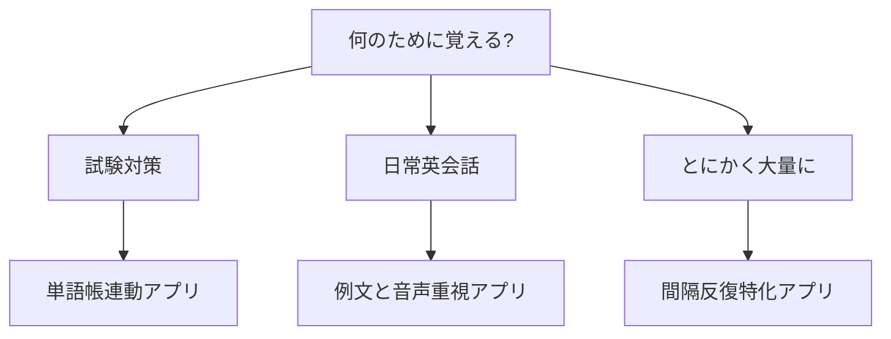

※本記事はアフィリエイト広告(PR)を含みます。

「英単語がなかなか覚えられない」「せっかく覚えてもすぐ忘れてしまう」――そんな悩みを持つ方は多いのではないでしょうか。この記事では、**AIで英単語を暗記する方法**を初心者にもわかりやすく解説します。人間の記憶の仕組みである「忘却曲線」を活用した学習法と、それを自動でサポートしてくれるおすすめアプリの比較まで、読み終えるころには「今日から何をどう使えばいいか」がはっきりわかるようになります。

この記事を読むと、次のことがわかります。

- 忘却曲線とは何か、なぜ英単語暗記に役立つのか
- AIがどのように暗記を効率化してくれるのか
- 目的別のおすすめ学習アプリと選び方
- 無料で始められるのか、といったよくある疑問への答え

## そもそも「忘却曲線」とは?

忘却曲線とは、ドイツの心理学者エビングハウスが発見した「時間が経つほど記憶が薄れていく」様子をグラフにしたものです。人は覚えたことを1日後には多くを忘れてしまう、という研究結果が知られています。

ただし、ここが重要なのですが、**忘れかけたタイミングで復習すると、記憶は定着しやすくなり、忘れるスピードもゆるやかになる**とされています。この性質を利用した学習法を「間隔反復(スペースド・リピティション)」と呼びます。簡単に言えば「復習の間隔をだんだん広げていく暗記法」のことです。

### 間隔反復のイメージ

例えば英単語を1つ覚えたら、次のような間隔で復習します。

- 1回目:覚えた当日
- 2回目:翌日
- 3回目:3日後
- 4回目:1週間後
- 5回目:2週間後

このように「忘れかけた頃」を狙って復習することで、少ない回数で長く記憶を保てるのが特徴です。

## AIを使うと英単語暗記はどう変わる?

間隔反復はとても効果的なのですが、自分で「どの単語をいつ復習するか」を管理するのは大変です。ここでAIの出番になります。

AIを活用した英単語学習では、次のようなサポートが受けられます。

| AIの機能 | 具体的なメリット |
| --- | --- |
| 復習タイミングの自動管理 | 忘れそうな単語だけを最適な間隔で出題してくれる |
| 苦手分析 | 間違えやすい単語を判定し、重点的に出題 |
| 例文の自動生成 | 単語を使った自然な例文をその場で作れる |
| 発音チェック | 音声認識で発音の正誤を判定 |

特に「復習タイミングの自動管理」と「苦手分析」は、まさに忘却曲線をコンピューターが計算して最適化してくれる部分です。自分で管理表を作る必要がなく、アプリを開いて出てきた単語を答えるだけで、自動的に効率のよい復習ができます。

### 生成AIを補助的に使う方法

専用アプリだけでなく、ChatGPTなどの生成AIを暗記の補助として使う方法もあります。例えば「この10個の単語を使った短い英文の物語を作って」と頼めば、単語同士を関連づけて覚えられます。どのAIチャットが自分に合うか迷う方は、[ChatGPTとClaudeとGeminiを徹底比較!初心者におすすめのAIチャットはどれ?](/2026/06/09/ai-chat-comparison/)も参考にしてみてください。

## 自分に合ったアプリの選び方

英単語アプリは数多くありますが、選ぶときのポイントを整理すると迷いにくくなります。下の図を見ながら、自分の目的を確認してみましょう。

### 選ぶときの3つのチェックポイント

1. **目的に合っているか**:TOEICや英検などの試験対策なら、その試験に対応した単語帳が入っているアプリが便利です。
2. **忘却曲線(間隔反復)に対応しているか**:自動で復習タイミングを管理してくれる機能があると、暗記効率が大きく変わります。
3. **続けやすいか**:毎日の目標設定や通知、ゲーム感覚で進められる工夫があると挫折しにくくなります。

## おすすめの英単語学習アプリ比較

ここでは、間隔反復やAIを取り入れた代表的なアプリのタイプを紹介します。料金や機能は変更される場合があるため、詳細は各公式サイトで最新情報を確認してください。

| アプリのタイプ | 特徴 | こんな人におすすめ |
| --- | --- | --- |
| Anki(暗記カード型) | 自分でカードを作り、間隔反復を細かく設定できる | 自分専用の単語帳を作りたい人 |
| Duolingo(ゲーム型) | ゲーム感覚で毎日続けやすい。AIが弱点を分析 | 楽しく習慣化したい初心者 |
| mikan(スピード型) | 4択でサクサク、試験別単語帳が豊富 | 短期間で語彙を増やしたい人 |
| Quizlet(多機能型) | 単語カード作成やAI機能が充実 | 学習方法を自分で選びたい人 |

### Anki:カスタマイズ性で選ぶなら

Ankiは間隔反復の代表的な無料ツールです(スマホ版は一部有料の場合あり)。自分で作った単語カードを、忘却曲線に基づいて自動出題してくれます。生成AIで作った例文をカードに貼り付ければ、オリジナルの高機能単語帳が完成します。

### Duolingo:習慣化が苦手な人に

ゲーム要素が強く、続けるモチベーションを保ちやすいのが魅力です。AIが間違いのパターンを分析し、苦手な部分を繰り返し出してくれます。

## 学習効率をさらに上げる工夫

アプリだけに頼らず、少し工夫するとさらに効果が高まります。

- **スキマ時間を活用する**:通勤・通学中の数分でも、毎日続けることが記憶定着のカギです。
- **音で覚える**:単語は目だけでなく耳からも入れると記憶に残りやすくなります。ノイズキャンセリング機能のあるイヤホンがあると集中しやすいです。

👉 [Amazonで「ワイヤレスイヤホン ノイズキャンセリング」を見る](https://af.moshimo.com/af/c/click?a_id=5632371&p_id=170&pc_id=185&pl_id=38594&url=https%3A%2F%2Fwww.amazon.co.jp%2Fs%3Fk%3D%25E3%2583%25AF%25E3%2582%25A4%25E3%2583%25A4%25E3%2583%25AC%25E3%2582%25B9%25E3%2582%25A4%25E3%2583%25A4%25E3%2583%259B%25E3%2583%25B3%2520%25E3%2583%258E%25E3%2582%25A4%25E3%2582%25BA%25E3%2582%25AD%25E3%2583%25A3%25E3%2583%25B3%25E3%2582%25BB%25E3%2583%25AA%25E3%2583%25B3%25E3%2582%25B0)

- **リスニングと組み合わせる**:覚えた単語を実際の音声で聞くと、生きた知識になります。詳しくは[AIで英語リスニングを鍛える方法\|通勤時間を活かす学習法](/2026/07/05/ai-english-listening/)をご覧ください。
- **会話でアウトプットする**:覚えた単語は使ってこそ定着します。[AI英会話アプリおすすめ5選\|独学で話せるようになる使い方](/2026/06/14/ai-english-apps/)も合わせて活用すると、インプットとアウトプットのバランスがとれます。

## よくある質問(Q&A)

### Q. 英単語アプリは無料で使える?

A. 多くのアプリには無料版があり、基本的な暗記機能は無料でも十分に使えます。ただし、AIによる詳しい弱点分析や、広告なし、追加の単語帳などは有料プランになることが多いです。まずは無料で試してから、必要に応じて有料版を検討するのがおすすめです。料金は変更されることがあるため、公式サイトで最新情報を確認してください。

### Q. AIが作った例文は信頼できる?

A. 生成AIの例文は自然なものが多いですが、まれに不自然な表現や誤りが含まれることもあります。基本的な単語の確認には便利ですが、試験対策など正確性が重要な場面では、辞書や公式教材と併用すると安心です。

### Q. 1日何単語くらいがいい?

A. 人によりますが、無理のない範囲で「毎日続けられる数」が最も大切です。多すぎると挫折しやすいため、まずは1日10〜20語程度から始め、慣れてきたら調整するとよいでしょう。

## まとめ

英単語の暗記は「根性」ではなく「仕組み」で乗り越えられます。忘却曲線を活用した間隔反復と、それを自動化するAIを組み合わせれば、少ない労力で効率よく記憶を定着させられます。

最後に、今日から始めるためのポイントをおさらいします。

- 忘却曲線=忘れかけた頃に復習すると定着しやすい
- AIが復習タイミングと苦手分析を自動化してくれる
- 目的(試験・会話・大量暗記)に合わせてアプリを選ぶ
- まずは無料版から試し、リスニングや会話と組み合わせる

まずは気になるアプリを1つ選び、今日1回だけ使ってみることが第一歩です。小さな習慣の積み重ねが、確実な語彙力アップにつながります。
