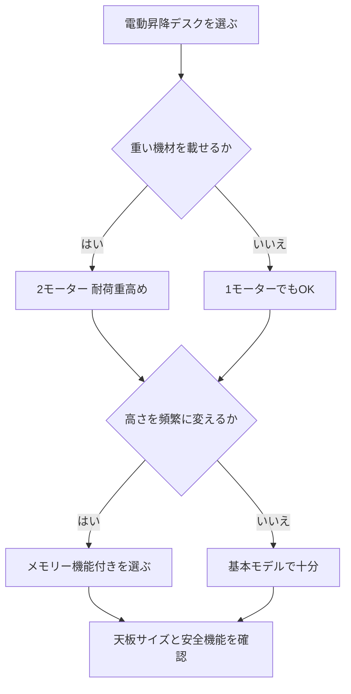

※本記事はアフィリエイト広告(PR)を含みます。

## 電動昇降デスクの選び方2026|まず結論から

「AI作業で1日中パソコンに向かっていると、腰や肩がつらい」「集中力が続かない」——そんな悩みを解決してくれるのが**電動昇降デスク**です。ボタン一つで天板の高さを変えられ、座り作業と立ち作業を切り替えられるデスクのことです。

この記事では、2026年に電動昇降デスクを選ぶときに見るべきポイントを、初心者にもわかりやすく整理します。読み終わるころには、**「自分に合ったモデルはどれか」「どこで価格や仕様を確認すればいいか」**がはっきりわかるようになります。ChatGPTやClaudeを使った長時間のAI作業を、体に負担をかけずに快適に続けたい方はぜひ参考にしてください。

## そもそも電動昇降デスクとは?

電動昇降デスクは、モーターの力で天板の高さを自動で調整できるデスクです。手回しハンドルで上げ下げする「手動式」もありますが、頻繁に高さを変える人にはやはり電動が便利です。

主なメリットは次の通りです。

- **座り姿勢と立ち姿勢を簡単に切り替えられる**(血流が良くなり、集中力の維持に役立つ)
- **ボタンで高さを記憶できる**(自分の最適な高さをワンタッチで再現)
- **家族やパートナーとの共用がしやすい**(身長が違っても各自の高さを保存できる)

座りっぱなしのデメリットや立ち作業の実際の効果については、[スタンディングデスクは効果ある?在宅ワーカーの実践レビュー観点まとめ](/2026/06/14/standing-desk-review/)でも詳しく触れていますので、あわせて読むと理解が深まります。

## 電動昇降デスクを選ぶ7つのポイント

ここからは、失敗しないために必ずチェックしたい項目を順番に見ていきましょう。

### 1. モーターの数(1モーター/2モーター)

モーターは天板を上下させる心臓部です。

- **1モーター**:価格が安いが、昇降スピードがやや遅く、重い機材を載せると弱いことがある
- **2モーター(デュアルモーター)**:左右の脚を別々に駆動し、動きがスムーズで安定。耐荷重も高い

モニターを複数台載せたり、PCや周辺機器が多いAI作業環境なら、**2モーターモデル**が安心です。

### 2. 耐荷重

耐荷重とは、天板に載せられる重さの上限です。デスクトップPC、デュアルモニター、スピーカーなどを置くと、意外に重くなります。

目安として、**70〜100kg程度の耐荷重**があると多くの環境で余裕を持って使えます。ただし数値はモデルによって差が大きいので、購入前に公式サイトで最新のスペックを確認してください。

### 3. 昇降範囲(高さ調整の幅)

座ったときと立ったときの両方で、腕が自然に机に届く高さになるかが重要です。身長が低め・高めの方は、昇降範囲が自分の理想の高さをカバーしているか必ずチェックしましょう。

一般的な目安は次の表の通りです(あくまで参考値です)。

| 身長の目安 | 座り時の推奨高さ | 立ち時の推奨高さ |
|---|---|---|
| 160cm前後 | 約65cm | 約95cm |
| 170cm前後 | 約70cm | 約100cm |
| 180cm前後 | 約73cm | 約110cm |

### 4. 高さメモリー機能

よく使う高さを2〜4個ボタンに登録できる機能です。座り作業と立ち作業を頻繁に切り替える人には必須級の便利機能なので、あると毎日の操作が驚くほどラクになります。

### 5. 天板のサイズと素材

デュアルモニターや資料を広げるなら、**幅120cm以上**あると快適です。奥行きは60〜70cm程度が一般的。天板だけ別売りのモデルもあり、好みのサイズや質感を選べる場合があります。

### 6. 安全機能

昇降中に物や体にぶつかると自動で停止する「衝突検知機能」があると、小さなお子さんやペットがいる家庭でも安心です。

### 7. 静音性と組み立てのしやすさ

昇降時のモーター音が静かだと、オンライン会議中でも気兼ねなく高さを変えられます。また、脚部フレームだけを購入して手持ちの天板と組み合わせるタイプもあり、コストを抑えたい人に向いています。

## 選び方フローチャート

迷ったときは、次の流れで考えると自分に合うタイプが見えてきます。

## タイプ別・おすすめの選び方

### とにかくコスパ重視の人

1モーターのエントリーモデルや、脚フレームのみを購入して天板を自作するスタイルがおすすめです。まずは「立ち作業を試してみたい」という段階なら、無理に高価なモデルを選ぶ必要はありません。

### AI作業でモニターを複数使う人

コーディングや画像生成、動画編集などでデュアル・トリプルモニターを使うなら、耐荷重に余裕のある2モーターモデルが安心です。モニターの配置を工夫するとデスクがさらに広く使えます。デスク上のスペースを最大化したい方は、[モニターアームの選び方\|在宅ワークでデスクを広く使うおすすめ比較2026](/2026/06/19/monitor-arm-guide/)もチェックしてみてください。

### 長時間の作業で体をいたわりたい人

メモリー機能で座り・立ちをこまめに切り替えるのが理想です。さらに座り作業の質を上げたいなら、椅子も重要な要素になります。[ゲーミングチェアの選び方2026\|長時間作業でも疲れない人気モデル比較](/2026/06/18/gaming-chair-guide-2026/)も参考にすると、デスク環境全体を最適化できます。

電動昇降デスクは各社から幅広いモデルが出ています。実際の価格帯やレビューを比べてみたい方は、こちらから探せます。

👉 [Amazonで「電動昇降デスク デュアルモーター」を見る](https://af.moshimo.com/af/c/click?a_id=5632371&p_id=170&pc_id=185&pl_id=38594&url=https%3A%2F%2Fwww.amazon.co.jp%2Fs%3Fk%3D%25E9%259B%25BB%25E5%258B%2595%25E6%2598%2587%25E9%2599%258D%25E3%2583%2587%25E3%2582%25B9%25E3%2582%25AF%2520%25E3%2583%2587%25E3%2583%25A5%25E3%2582%25A2%25E3%2583%25AB%25E3%2583%25A2%25E3%2583%25BC%25E3%2582%25BF%25E3%2583%25BC)

👉 [楽天市場で「電動昇降デスク 幅120」を探す](https://af.moshimo.com/af/c/click?a_id=5632328&p_id=54&pc_id=54&pl_id=616&url=https%3A%2F%2Fsearch.rakuten.co.jp%2Fsearch%2Fmall%2F%25E9%259B%25BB%25E5%258B%2595%25E6%2598%2587%25E9%2599%258D%25E3%2583%2587%25E3%2582%25B9%25E3%2582%25AF%2520%25E5%25B9%2585120%2F)

## よくある疑問(Q&A)

### Q. 電動昇降デスクは電気代がかかる?

A. 昇降するときだけモーターが動くので、消費電力はごくわずかです。1日数回の上げ下げなら電気代を気にする必要はほとんどありません。ただし待機電力が気になる方は、公式サイトで消費電力の記載を確認してみてください。

### Q. 手動式(ガス圧・ハンドル式)ではダメ?

A. 予算を抑えたい人や、たまにしか高さを変えない人には手動式でも十分です。ただし1日に何度も切り替えるなら、電動のほうがストレスがなく続けやすいです。

### Q. デスク以外にそろえるべきものは?

A. 立ち作業ではケーブルが引っ張られやすいので、ケーブルトレーや配線整理グッズがあると安心です。デスク周りを快適にする小物は、[在宅ワークが捗るデスク周りガジェット10選\|快適環境の作り方](/2026/06/11/home-office-gadgets/)でまとめて紹介しています。

## 購入前のチェックリスト

最後に、注文ボタンを押す前に確認したい項目をまとめておきます。

- [ ] モーター数は用途に合っているか(重い機材なら2モーター)
- [ ] 耐荷重は載せる機材の合計重量に余裕があるか
- [ ] 昇降範囲が自分の身長に合っているか
- [ ] メモリー機能の有無
- [ ] 天板のサイズ(幅・奥行き)は十分か
- [ ] 衝突検知などの安全機能があるか
- [ ] 設置スペースと搬入経路は確保できているか

これらは商品ページや公式サイトで最新の仕様を必ず確認しましょう。特に価格や耐荷重の数値はモデルチェンジで変わることがあるため、断定せずに最新情報をチェックするのが失敗しないコツです。

## まとめ

電動昇降デスクは、長時間のAI作業やデスクワークを続ける人にとって、体への負担を減らし集中力を保つための心強い味方です。選ぶときのポイントを改めて整理します。

- **モーター数と耐荷重**で安定性を確保する
- **昇降範囲とメモリー機能**で自分に合った高さを快適に使う
- **天板サイズと安全機能**で日々の使い勝手を高める

まずは自分の作業スタイル(機材の量・高さを変える頻度・予算)を整理し、フローチャートを参考にタイプを絞り込みましょう。デスク単体だけでなく、椅子・モニターアーム・配線整理までまとめて考えると、AI時代の作業環境が一段と快適になります。この記事を出発点に、あなたにぴったりの1台を見つけてください。
