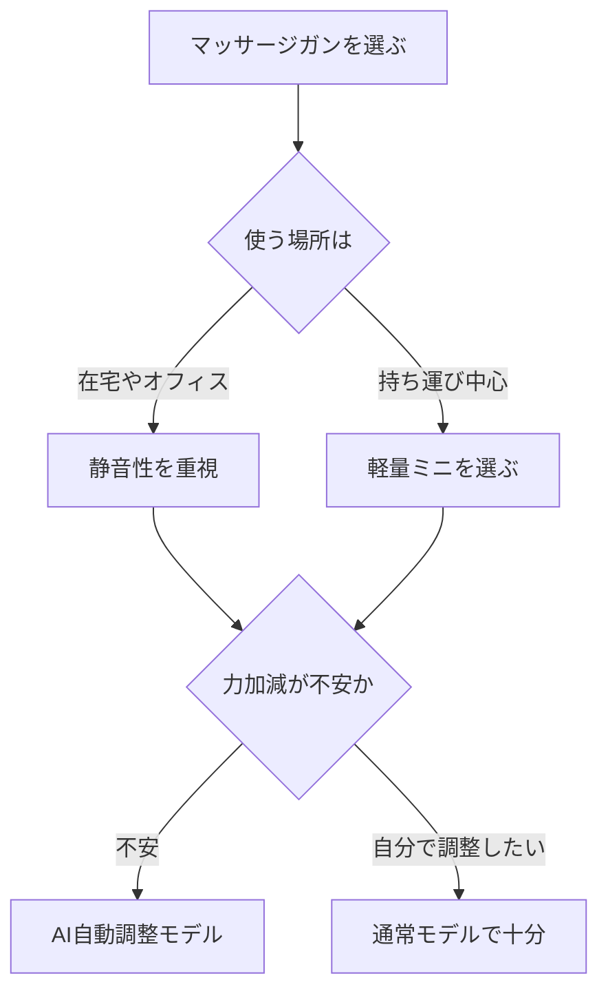

※本記事はアフィリエイト広告(PR)を含みます。

## この記事でわかること

「デスクワークで肩こりや首こりがひどい」「マッサージガンが気になるけど、AI搭載モデルって普通のものと何が違うの?」——そんな疑問を持つ方に向けて、この記事では**AI搭載マッサージガンのおすすめと選び方**を2026年の最新情報でわかりやすく解説します。

マッサージガンとは、先端のアタッチメントが高速で振動して筋肉をほぐす、手持ちサイズのケア機器です。近年はここにAI(人工知能=センサーで状態を判断して自動調整する仕組み)が加わり、押し当てた部位や圧力を検知して自動で強さを調整してくれるモデルが増えてきました。

この記事を読めば、次のことがわかります。

- AI搭載マッサージガンと普通のモデルの違い
- デスクワーカーが選ぶときにチェックすべきポイント
- 価格帯ごとの選び方の目安
- 買う前によくある疑問(安全性・使う頻度など)

## AI搭載マッサージガンとは?普通のモデルとの違い

これまでのマッサージガンは、自分でボタンを押して振動レベル(強さ)を切り替えるのが一般的でした。AI搭載モデルでは、以下のような機能が加わります。

- **圧力センサーによる自動調整**:強く押し付けると自動で出力を上げ、軽く当てると弱める
- **部位の自動認識**:首・肩・腰など当てた場所に合わせておすすめモードを提案
- **アプリ連携**:スマホアプリで使用時間や部位の記録を管理
- **やりすぎ防止アラート**:同じ部位に当てすぎると振動で知らせる

つまり「力加減がわからない初心者でも、ちょうどいい強さで使いやすい」のがAI搭載モデルの魅力です。強く当てすぎて逆に筋肉を痛める失敗を防ぎやすくなります。

## デスクワークの疲れにマッサージガンが向いている理由

長時間パソコンに向かっていると、首・肩・背中の筋肉が固まって血流が悪くなりがちです。マッサージガンは、こうした凝り固まった部位をピンポイントでほぐすのに向いています。

休憩中に数分当てるだけでも気分転換になり、集中力の回復にもつながります。デスク環境そのものを見直したい方は、[在宅ワークが捗るデスク周りガジェット10選\|快適環境の作り方](/2026/06/11/home-office-gadgets/)もあわせてチェックすると、より快適な作業空間を作れます。

## AIマッサージガンの選び方5つのポイント

初心者が失敗しないために、次の5点を押さえておきましょう。

### 1. 静音性

在宅ワークやオフィスで使うなら、動作音の静かさは重要です。Web会議の合間に使うことを考えると、静音設計をうたうモデルが安心です。

### 2. 重さとサイズ

首や肩に自分で当てるなら、軽い方が疲れません。持ち運ぶなら500g前後の軽量モデルやミニサイズが便利です。

### 3. バッテリー持ち

USB充電式が主流です。1回の充電でどのくらい使えるか、公式サイトで確認しましょう。

### 4. アタッチメントの種類

先端の交換パーツ(アタッチメント)が複数あると、首・肩・広い背中など部位ごとに使い分けられます。

### 5. AI機能とアプリの使いやすさ

自動調整の精度やアプリの日本語対応も要チェックです。多機能でも操作が複雑だと続きません。

## 価格帯ごとの選び方の目安

マッサージガンはピンからキリまであります。おおまかな目安を表にまとめました(価格は変動するため、必ず公式サイトや販売ページで最新情報を確認してください)。

| 価格帯 | 特徴 | 向いている人 |
| --- | --- | --- |
| エントリー | 基本的な振動調整のみ | まず試してみたい人 |
| ミドル | 静音性・アタッチメント充実 | 毎日使いたい人 |
| ハイエンド | AI自動調整・アプリ連携 | 機能重視の人 |

初めての1台なら、静音性とアタッチメントのバランスが取れたミドルクラスが扱いやすくおすすめです。より本格的にケアしたい方は、AI自動調整つきのハイエンドを検討するとよいでしょう。

👉 [Amazonで「マッサージガン 静音 AI」を見る](https://af.moshimo.com/af/c/click?a_id=5632371&p_id=170&pc_id=185&pl_id=38594&url=https%3A%2F%2Fwww.amazon.co.jp%2Fs%3Fk%3D%25E3%2583%259E%25E3%2583%2583%25E3%2582%25B5%25E3%2583%25BC%25E3%2582%25B8%25E3%2582%25AC%25E3%2583%25B3%2520%25E9%259D%2599%25E9%259F%25B3%2520AI)

👉 [楽天市場で「マッサージガン ミニ 首 肩」を探す](https://af.moshimo.com/af/c/click?a_id=5632328&p_id=54&pc_id=54&pl_id=616&url=https%3A%2F%2Fsearch.rakuten.co.jp%2Fsearch%2Fmall%2F%25E3%2583%259E%25E3%2583%2583%25E3%2582%25B5%25E3%2583%25BC%25E3%2582%25B8%25E3%2582%25AC%25E3%2583%25B3%2520%25E3%2583%259F%25E3%2583%258B%2520%25E9%25A6%2596%2520%25E8%2582%25A9%2F)

## 健康管理はマッサージガンだけじゃない

デスクワークの疲れは、こまめなケアと同時に「体の状態を知ること」も大切です。最近はAIで睡眠や活動量を分析するデバイスも人気で、疲れのサインを見える化してくれます。

体調管理を総合的に整えたい方は、[AI搭載スマートウォッチおすすめ比較\|健康管理・睡眠分析に最適なのは?](/2026/06/17/ai-smartwatch-comparison/)や、長時間作業の負担を減らす[ゲーミングチェアの選び方2026\|長時間作業でも疲れない人気モデル比較](/2026/06/18/gaming-chair-guide-2026/)も参考になります。マッサージガンと組み合わせれば、根本的な疲れ対策につながります。

## よくある質問(Q&A)

### Q. AI機能は本当に必要?普通のモデルではダメ?

A. 力加減に慣れている方なら通常モデルでも十分です。ただ「どのくらいの強さが正しいのかわからない」という初心者ほど、自動調整のあるAIモデルの恩恵を受けやすいです。

### Q. 毎日使っても大丈夫?

A. 一般的には短時間(1部位あたり数分程度)であれば毎日使っても問題ないとされますが、痛みや違和感がある場合は使用を控えましょう。持病がある方や妊娠中の方は、事前に医師に相談することをおすすめします。

### Q. アプリは無料で使える?

A. 多くのモデルで専用アプリ自体は無料でダウンロードできます。ただし機能や対応OSはメーカーごとに異なるため、購入前に公式サイトで確認しておくと安心です。

### Q. オフィスで使っても音は気にならない?

A. 静音設計のモデルなら比較的静かですが、完全な無音ではありません。周囲への配慮が必要な場所では、休憩スペースなどで使うのがおすすめです。

## まとめ

AI搭載マッサージガンは、圧力や部位を自動で判断して調整してくれるため、**力加減がわからない初心者でも使いやすい**のが最大のメリットです。デスクワークで固まった首・肩・背中を、休憩中に手軽にケアできます。

選ぶときは、

- 静音性
- 重さとサイズ
- バッテリー持ち
- アタッチメントの種類
- AI機能とアプリの使いやすさ

の5点をチェックしましょう。まずはミドルクラスから試し、物足りなければAI自動調整つきにステップアップするのが失敗しない選び方です。価格や仕様は変動するので、購入前には必ず公式サイトや販売ページで最新情報を確認してください。自分に合った1台で、毎日の疲れをこまめにリセットしていきましょう。
