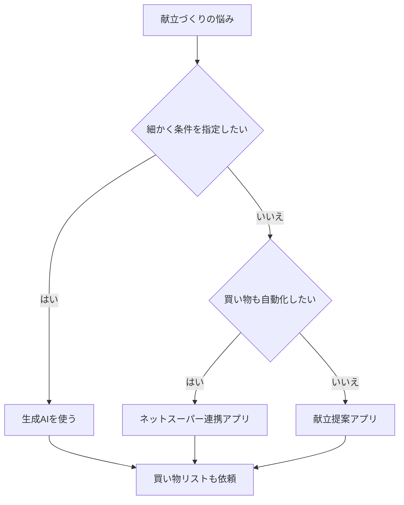

※本記事はアフィリエイト広告(PR)を含みます。

「今日の晩ごはん、何にしよう…」と冷蔵庫の前で毎日悩んでいませんか?この記事では、**AIで献立を自動作成する方法**と、買い物リストまで作れるアプリの比較をわかりやすく紹介します。

この記事を読むと、次のことがわかります。

- ChatGPTなどの生成AIを使って献立を自動で作るコツ
- 買い物リストまで自動で作れる便利なアプリの特徴
- 自分に合った献立作成の方法の選び方
- 「無料で使えるの?」といった疑問への答え

毎日の献立づくりは、地味ですが意外と頭を使う作業です。AIをうまく活用すれば、この「考える手間」を大きく減らせます。さっそく見ていきましょう。

## そもそもAIで献立を作るとは?

ここで言う「AI」とは、**生成AI**(文章や画像を自動で作り出すAIのこと)を指します。代表的なのがChatGPTやGeminiといった対話型のAIです。

これらに「冷蔵庫にある食材」や「家族の人数」「アレルギー」などを伝えると、それをもとに1週間分の献立を提案してくれます。さらに、必要な食材をまとめた**買い物リスト**まで作ってもらうことも可能です。

AIで献立を作るメリットは大きく3つあります。

| メリット | 内容 |
|---|---|
| 時短 | 毎日の「何を作ろう」の悩みが数秒で解決 |
| 栄養バランス | 主菜・副菜・汁物を自動で組み合わせてくれる |
| 節約 | 食材を使い切る献立で食品ロスを減らせる |

## 方法1:ChatGPTなど生成AIで献立を作る

いちばん手軽なのが、ChatGPTやGeminiに直接お願いする方法です。アプリのダウンロードも不要で、ブラウザやスマホアプリからすぐに始められます。

### 実際のプロンプト例

AIに指示する文章を「プロンプト」と呼びます。次のように具体的に伝えるのがコツです。

> 30代夫婦2人分の、平日5日間の夕食献立を考えてください。1食あたり30分以内で作れて、和食中心。冷蔵庫に鶏むね肉、卵、キャベツ、豆腐があります。最後に、必要な食材の買い物リストもまとめてください。

このように「人数」「調理時間」「好みのジャンル」「今ある食材」を伝えると、精度がぐっと上がります。より思い通りの回答を引き出したい方は、[AIプロンプトのコツ\|思い通りの回答を引き出す書き方を初心者向けに解説](/2026/06/22/ai-prompt-tips/)もあわせてご覧ください。

### 買い物リストまで一気に作れる

生成AIの強みは、献立と買い物リストを**まとめて**作れる点です。「リストをスーパーの売り場ごと(野菜・肉・調味料)に分けて」とお願いすれば、買い物中に迷いません。

どの生成AIを選ぶか迷う場合は、[ChatGPTとClaudeとGeminiを徹底比較!初心者におすすめのAIチャットはどれ?](/2026/06/09/ai-chat-comparison/)で自分に合ったものを見つけてみてください。

## 方法2:献立専用アプリを使う

「毎回プロンプトを書くのは面倒」という方には、献立作成に特化したアプリが便利です。ここでは代表的なタイプを比較します。

| タイプ | 特徴 | こんな人に向く |
|---|---|---|
| 献立提案アプリ | 献立を自動生成し買い物リスト化 | 毎日の夕食に悩む人 |
| レシピ×買い物連携アプリ | ネットスーパーと連携し注文まで | 買い物も時短したい人 |
| 汎用生成AI | 自由度が高くカスタマイズ可能 | 細かく条件指定したい人 |

献立専用アプリは、食材の好みや家族構成を登録しておけば、ボタン1つで献立と買い物リストが完成します。中にはネットスーパーと連携し、そのまま注文できるものもあります。

料金体系はアプリによって異なり、無料プランと有料プランが分かれていることが多いです。機能の範囲や価格は変わりやすいので、**最新情報は各アプリの公式サイトで確認してください**。

## 選び方のフローチャート

自分に合った方法を、次の流れで選んでみましょう。

迷ったら、まずは無料で始められる生成AIから試すのがおすすめです。使い勝手がわかってから、専用アプリの有料プランを検討しても遅くありません。

## よくある疑問Q&A

### Q. AIの献立作成は無料で使える?

はい、多くの方法が無料で始められます。ChatGPTやGeminiには無料プランがあり、献立作成程度なら無料版で十分実用的です。ただし、より高性能なモデルや利用回数の上限を増やしたい場合は有料版が便利です。詳しくは[ChatGPT有料版は必要?無料版との違いと元が取れる使い方を解説](/2026/06/20/chatgpt-paid-vs-free/)を参考にしてください。

### Q. アレルギーや持病がある場合は使える?

プロンプトに「卵アレルギーあり」「塩分控えめ」などと明記すれば配慮した献立を作ってくれます。ただしAIの提案が医学的に完璧とは限らないため、重い症状がある場合は必ず医師や栄養士に相談してください。

### Q. 節約にもつながる?

つながります。「1週間の食費を5000円以内で」と条件を付ければ、予算内の献立を提案してくれます。食費の管理をさらに徹底したい方は、[家計簿アプリ×AIで節約\|自動で支出を見える化する方法を初心者向けに解説](/2026/06/15/ai-household-budget-app/)もチェックしてみましょう。

## 献立づくりをもっと快適にする道具

献立と買い物リストが決まったら、調理も効率化したいところです。AIレシピを見ながら料理するなら、キッチンに置けるタブレットやスマートディスプレイがあると両手が空いて便利です。

👉 [楽天市場で「キッチン タブレットスタンド」を探す](https://af.moshimo.com/af/c/click?a_id=5632328&p_id=54&pc_id=54&pl_id=616&url=https%3A%2F%2Fsearch.rakuten.co.jp%2Fsearch%2Fmall%2F%25E3%2582%25AD%25E3%2583%2583%25E3%2583%2581%25E3%2583%25B3%2520%25E3%2582%25BF%25E3%2583%2596%25E3%2583%25AC%25E3%2583%2583%25E3%2583%2588%25E3%2582%25B9%25E3%2582%25BF%25E3%2583%25B3%25E3%2583%2589%2F)

また、下ごしらえを時短できる電気調理鍋があれば、AIが提案した献立をさらにラクに作れます。

👉 [Amazonで「電気圧力鍋 自動調理」を見る](https://af.moshimo.com/af/c/click?a_id=5632371&p_id=170&pc_id=185&pl_id=38594&url=https%3A%2F%2Fwww.amazon.co.jp%2Fs%3Fk%3D%25E9%259B%25BB%25E6%25B0%2597%25E5%259C%25A7%25E5%258A%259B%25E9%258D%258B%2520%25E8%2587%25AA%25E5%258B%2595%25E8%25AA%25BF%25E7%2590%2586)

## まとめ

最後に、AIで献立を自動作成する方法のポイントをまとめます。

- **手軽さ重視ならChatGPTなどの生成AI**。人数・時間・食材を伝えるだけで献立と買い物リストが完成
- **毎日ラクにしたいなら献立専用アプリ**。登録した好みに合わせて自動提案
- **買い物まで自動化したいならネットスーパー連携アプリ**が便利
- 多くの方法は無料で始められるので、まずは気軽に試すのがおすすめ
- 価格や機能は変わりやすいため、最新情報は公式サイトで確認を

毎日の「何を作ろう」という小さな悩みは、AIに任せてしまいましょう。空いた時間と気持ちの余裕を、もっと大切なことに使えるはずです。まずは今晩の献立を、AIに聞いてみることから始めてみてください。
