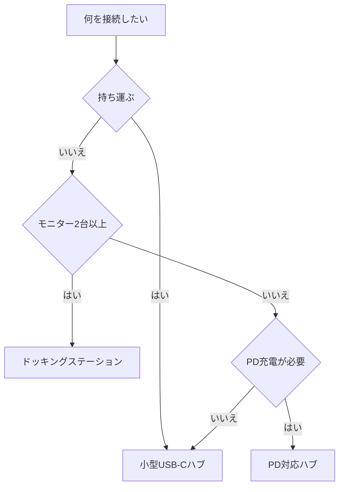

※本記事はアフィリエイト広告(PR)を含みます。

## USB-Cハブの選び方2026|この記事でわかること

「ノートパソコンにケーブルを何本も挿すのが面倒」「モニターや外付けSSDをまとめて接続したい」——そんな在宅ワーカーの悩みを解決してくれるのが**USB-Cハブ・ドッキングステーション**です。

この記事では、2026年最新の視点でUSB-Cハブの選び方を初心者にもわかりやすく解説します。読み終えるころには、「自分に必要なポートは何か」「給電性能はどこを見ればいいか」「ハブとドッキングステーションはどう違うのか」がスッキリ理解でき、迷わず商品を選べるようになります。

まずは結論から。**あなたのノートパソコンのUSB-Cポートに何を接続したいかを整理する**のが最初の一歩です。それさえ決まれば、あとは対応するハブを選ぶだけです。

## USB-Cハブとドッキングステーションの違い

どちらも「1本のUSB-Cケーブルで複数の機器をつなげる」という点は同じですが、規模と役割が異なります。

| 種類 | 特徴 | 向いている人 |
|------|------|--------------|
| USB-Cハブ | 小型・軽量。ポート数は控えめ。電源不要のものが多い | 外出先やカフェでも使いたい人 |
| ドッキングステーション | 据え置き型で大きい。ポート豊富＆電源内蔵 | デスクに固定して本格的に使う人 |

**ハブ**は持ち運びやすさが魅力で、USBメモリや外部モニターを一時的につなぐのに便利です。一方、**ドッキングステーション**（通称ドック）は電源アダプターを内蔵し、パソコンへの充電もしながら多数の機器を安定して接続できます。

在宅ワークでデスクに固定して使うなら、ドッキングステーションのほうが快適な場合が多いです。

## 選び方の5つのポイント

### 1. 必要なポートの種類と数を確認する

まず、自分が接続したい機器をリストアップしましょう。よく使われるポートは以下の通りです。

- **HDMI / DisplayPort**:外部モニター接続用
- **USB-A**:マウス・キーボード・USBメモリなど従来の機器用
- **USB-C**:高速データ転送や充電用
- **LAN(有線LAN)**:安定したネット接続用
- **SDカードスロット**:カメラのデータ読み込み用

「モニターは何台つなぐか」「有線LANは必要か」を明確にすると、必要なハブが絞り込めます。

### 2. PD(パワーデリバリー)対応と給電W数

**PD(パワーデリバリー)**とは、USB-Cを通じてパソコンを充電できる仕組みのことです。ハブ経由でノートパソコンに電力を送れるので、電源ケーブルを別に挿す必要がなくなります。

ノートパソコンによって必要な電力(W数)は異なります。一般的な目安は次の通りです。

- 軽量モバイルノート:45W前後
- 標準的なノート:65W前後
- ハイスペックノート:100W前後

ハブ自体が消費する電力もあるため、**余裕を持ったW数**のものを選ぶと安心です。お使いのパソコンの必要電力は、購入前に[AIノートパソコンの選び方2026](/2026/06/11/ai-laptop-guide-2026/)の記事も参考にしながら確認してみてください。

### 3. 映像出力の解像度とリフレッシュレート

外部モニターを使うなら、対応解像度も重要です。4Kモニターを使いたい場合は「**4K対応**」かどうか、さらに「**4K/60Hz対応**」かを確認しましょう。60Hzに対応していないと画面の動きがカクついて見えることがあります。

デュアルモニター(2画面)を使いたい場合は、2つの映像出力に対応したモデルを選ぶ必要があります。

### 4. データ転送速度

外付けSSDなどで大容量データをやり取りするなら、転送速度もチェックしましょう。「USB 3.2 Gen2(10Gbps)」などの規格が高速です。動画編集などをする方は、[ポータブルSSDの選び方2026](/2026/07/06/portable-ssd-guide-2026/)とあわせて検討すると失敗しません。

### 5. 発熱・サイズ・ケーブル長

ハブは使用中に熱を持ちやすいものです。アルミ製の放熱性が高いボディや、ケーブルが本体に直付けされているタイプは扱いやすくおすすめです。デスク環境にあわせてサイズやケーブルの長さも見ておきましょう。

## タイプ別の選び方フローチャート

迷ったときは、次の流れで考えると自分に合ったタイプが見えてきます。

このように、まず「持ち運ぶかどうか」で大きく分かれ、次に「モニター台数」や「充電の必要性」で絞り込むとスムーズです。

## 在宅ワーク向けのおすすめ構成例

実際の在宅ワークデスクでは、次のような構成がよく使われます。

- **ミニマル派**:USB-Cハブ+外部モニター1台+マウス・キーボード
- **本格派**:ドッキングステーション+デュアルモニター+有線LAN+外付けSSD

本格派の場合、[モニターアームの選び方](/2026/06/19/monitor-arm-guide/)を組み合わせるとデスクが一気に広く使えて作業効率が上がります。ハブとあわせて揃えると、配線もスッキリまとまります。

👉 [Amazonで「USB-C ハブ ドッキングステーション PD対応」を見る](https://af.moshimo.com/af/c/click?a_id=5632371&p_id=170&pc_id=185&pl_id=38594&url=https%3A%2F%2Fwww.amazon.co.jp%2Fs%3Fk%3DUSB-C%2520%25E3%2583%258F%25E3%2583%2596%2520%25E3%2583%2589%25E3%2583%2583%25E3%2582%25AD%25E3%2583%25B3%25E3%2582%25B0%25E3%2582%25B9%25E3%2583%2586%25E3%2583%25BC%25E3%2582%25B7%25E3%2583%25A7%25E3%2583%25B3%2520PD%25E5%25AF%25BE%25E5%25BF%259C)

コンパクトに持ち運びたい方は、軽量タイプを探すのがおすすめです。

👉 [楽天市場で「USB-Cハブ 4K HDMI」を探す](https://af.moshimo.com/af/c/click?a_id=5632328&p_id=54&pc_id=54&pl_id=616&url=https%3A%2F%2Fsearch.rakuten.co.jp%2Fsearch%2Fmall%2FUSB-C%25E3%2583%258F%25E3%2583%2596%25204K%2520HDMI%2F)

デスク周りの環境をトータルで整えたい方は、[在宅ワークが捗るデスク周りガジェット10選](/2026/06/11/home-office-gadgets/)もチェックしてみてください。

## よくある質問(Q&A)

### Q. 安いUSB-Cハブでも問題ない?

価格が安いものでも基本的な使い方はできますが、給電が不安定だったり発熱が大きかったりする場合があります。特にPD充電や4K出力を使うなら、信頼できるメーカーの製品を選ぶほうが安心です。

### Q. どのパソコンでも使える?

USB-Cポートを備えていても、映像出力に対応していない機種があります(「DisplayPort Alt Mode非対応」など)。購入前に、お使いのパソコンがUSB-Cからの映像出力に対応しているかを必ず確認しましょう。

### Q. 具体的な価格はどれくらい?

価格はモデルや機能によって幅があり、変動も頻繁です。正確な金額は各メーカーの公式サイトや販売ページで最新情報を確認してください。

### Q. Thunderboltとどう違う?

Thunderbolt(サンダーボルト)はUSB-Cと同じ形状の端子を使いますが、より高速で高性能な規格です。対応ドックは高価ですが、複数の4Kモニターや高速SSDを使うプロ向けの環境に適しています。

## まとめ

USB-Cハブ・ドッキングステーション選びのポイントを振り返りましょう。

- まずは**接続したい機器を整理**して必要なポートを決める
- 持ち運ぶなら**軽量ハブ**、デスク固定なら**ドッキングステーション**
- ノートパソコンを充電するなら**PD対応・W数に余裕**を持つ
- 4Kモニターを使うなら**4K/60Hz対応**を確認
- パソコン側が**映像出力に対応しているか**を事前チェック

この5つを押さえれば、ハブ選びで失敗することはほとんどありません。1本のケーブルでデスクがスッキリ片付き、作業効率もぐっと上がります。ぜひ自分の環境に合った一台を見つけて、快適な在宅ワーク環境を整えてみてください。
