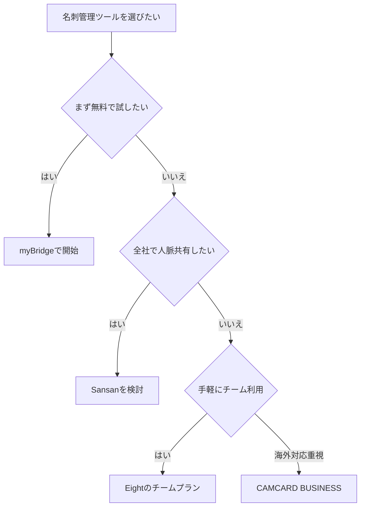

※本記事はアフィリエイト広告(PR)を含みます。

## この記事でわかること

「もらった名刺が机の引き出しに溜まっている」「担当者が退職して人脈が消えた」——営業チームで、こんな悩みはありませんか。この記事では、**AIで名刺管理を効率化する法人向けツール**を比較しながら、営業チームにおすすめのサービスと選び方をわかりやすく解説します。

この記事を読むと、次のことがわかります。

- AI名刺管理ツールで何が自動化できるのか
- 法人向けの主要サービス（Sansan・Eight・myBridgeなど）の違い
- 自社に合ったツールの選び方と導入の流れ
- 「無料で使える?」という疑問への答え

まずは結論から。**「チーム全体で人脈を共有し、営業に活かしたい」なら法人向けのクラウド名刺管理ツールが最適**です。個人利用の延長ではなく、会社の資産として名刺情報を管理できるのが大きな違いです。

## そもそもAI名刺管理ツールとは?

AI名刺管理ツールとは、**名刺をスマホやスキャナーで撮影するだけで、AI（人工知能＝人間の判断を模倣する技術）が文字を自動で読み取り、データベース化してくれるサービス**のことです。

かつては名刺の情報を1枚ずつ手入力していましたが、現在は次の流れが自動化されています。

1. 名刺を撮影・スキャンする
2. AIのOCR（画像から文字を読み取る技術）が氏名・会社名・連絡先を認識する
3. データが自動でクラウド上に整理・保存される
4. チーム全員でいつでも検索・共有できる

個人での名刺整理の基本については、[AIで名刺・書類を整理する方法｜おすすめスキャナーとアプリ活用術](/2026/06/17/ai-business-card-scanner/)でも詳しく紹介しています。まずは全体像をつかみたい方はあわせてご覧ください。

## 法人向けツールと個人向けツールの違い

無料の個人向けアプリでも名刺のデータ化はできますが、営業チームで使うなら法人向けをおすすめします。主な違いは次のとおりです。

| 項目 | 個人向け | 法人向け |
|---|---|---|
| データの所有 | 個人アカウント | 会社の資産として管理 |
| 人脈の共有 | 基本は本人のみ | チーム・全社で共有 |
| 入力精度 | AI自動のみ | AI＋オペレーター確認で高精度 |
| セキュリティ | 標準 | 権限管理・監査ログあり |
| 他システム連携 | 限定的 | CRM・SFAと連携可能 |

※CRMは顧客管理システム、SFAは営業支援システムのことです。

担当者が異動・退職しても人脈が会社に残る点が、法人向けの最大のメリットです。

## 法人向けAI名刺管理ツール比較2026

ここでは、営業チームに人気のある主要サービスを紹介します。料金プランは変更されることが多いため、**最新の正確な金額は必ず公式サイトでご確認ください**。

### Sansan（サンサン）

法人向け名刺管理の代表的なサービスです。AIとオペレーターの二重チェックで**高い入力精度**を実現しているのが特徴で、大企業から中小企業まで幅広く導入されています。

- 名刺情報を全社で共有し、誰がどの企業とつながっているか可視化できる
- 営業支援機能や企業データベースとの連携が充実
- 「あの会社の担当者を知っている社員」を社内で探せる

組織的に営業力を高めたい企業に向いています。

### Eight（エイト）

Sansanが提供する、より手軽に始められるサービスです。個人利用でも人気ですが、**チーム向けのプラン**も用意されています。

- スマホアプリで手軽に名刺をデータ化
- コストを抑えてスモールスタートしたいチームに好適
- ビジネスSNSのように相手とつながれる

### myBridge（マイブリッジ）

LINEが提供する名刺管理アプリです。**基本機能を無料で使える**点が魅力で、まず試してみたい小規模チームに向いています。

- 無料でAIによる名刺データ化ができる
- 複数人での共有機能もある
- LINEと連携して手軽に使える

### CAMCARD BUSINESS（キャムカードビジネス）

多言語の名刺読み取りに強く、海外とのやり取りが多い企業に選ばれています。CRM連携や一括管理機能も備えています。

## 選び方のフローチャート

自社に合ったツールを選ぶ流れを図にまとめました。

## 導入で失敗しないための3つのポイント

### 1. 入力精度を必ず確認する

AIの読み取りだけだと、旧字体や特殊なデザインの名刺で誤認識が起こることがあります。**AI＋人の確認**で精度を担保しているサービスかどうかは重要な判断基準です。

### 2. 既存システムとの連携を確認する

すでにCRMやSFAを使っている場合は、それらと連携できるかを事前に確認しましょう。連携できると、名刺情報をそのまま営業活動やメール配信に活かせます。名刺から得た連絡先へのフォローには、[AIメール作成術｜ビジネスメールを3倍速く書く方法](/2026/06/14/ai-email-writing/)で紹介している時短テクニックも役立ちます。

### 3. セキュリティと権限管理

名刺は個人情報の集まりです。誰がどのデータを見られるかの権限設定や、情報の取り扱いに関する体制が整っているかを確認しましょう。

## スキャナーを併用するとさらに効率化できる

大量の名刺を一気にデータ化したい場合は、スマホ撮影だけでなく**専用スキャナー**の併用がおすすめです。両面を一度に高速で読み取れるモデルなら、過去に溜まった名刺の整理が一気に進みます。

👉 [Amazonで「名刺スキャナー 両面 高速」を見る](https://af.moshimo.com/af/c/click?a_id=5632371&p_id=170&pc_id=185&pl_id=38594&url=https%3A%2F%2Fwww.amazon.co.jp%2Fs%3Fk%3D%25E5%2590%258D%25E5%2588%25BA%25E3%2582%25B9%25E3%2582%25AD%25E3%2583%25A3%25E3%2583%258A%25E3%2583%25BC%2520%25E4%25B8%25A1%25E9%259D%25A2%2520%25E9%25AB%2598%25E9%2580%259F)

👉 [楽天市場で「名刺管理 スキャナー」を探す](https://af.moshimo.com/af/c/click?a_id=5632328&p_id=54&pc_id=54&pl_id=616&url=https%3A%2F%2Fsearch.rakuten.co.jp%2Fsearch%2Fmall%2F%25E5%2590%258D%25E5%2588%25BA%25E7%25AE%25A1%25E7%2590%2586%2520%25E3%2582%25B9%25E3%2582%25AD%25E3%2583%25A3%25E3%2583%258A%25E3%2583%25BC%2F)

デジタル化した名刺データをNotionなどの情報整理ツールとあわせて管理する方法は、[Notion AIの使い方完全ガイド](/2026/06/17/notion-ai-guide/)も参考になります。

## よくある質問（Q&A）

### Q. AI名刺管理は無料で使える?

はい、**myBridgeなど基本機能を無料で使えるサービス**があります。個人や少人数でまず試すなら無料アプリで十分でしょう。ただし、全社での人脈共有や高精度なデータ化、CRM連携などを求める場合は有料の法人向けプランが必要になります。まずは無料で使い勝手を試し、必要になったら法人プランへ移行するのが失敗しない進め方です。

### Q. 手入力していた名刺データは移行できる?

多くの法人向けツールは、既存のデータ（CSVファイルなど）を取り込む機能を備えています。移行方法はサービスによって異なるため、導入前にサポート窓口へ相談すると安心です。

### Q. 精度はどのくらい?

AI＋オペレーターの二重確認を行うサービスでは、非常に高い精度でデータ化されます。とはいえ100%ではないため、重要な取引先の情報は目視での最終確認をおすすめします。

## まとめ

AI名刺管理ツールを使えば、名刺の入力作業から解放され、営業チームの人脈を「会社の資産」として活用できます。最後に選び方のポイントを整理します。

- **まず無料で試したい** → myBridge
- **全社で人脈を共有し営業力を高めたい** → Sansan
- **手軽にチームで始めたい** → Eightのチームプラン
- **海外の名刺も多い** → CAMCARD BUSINESS

大切なのは、自社の規模と目的に合ったツールを選ぶことです。まずは無料プランやトライアルで使い勝手を確かめ、そのうえで法人向けプランを検討してみてください。溜まった名刺をスキャナーで一気にデータ化すれば、そのメリットをすぐに実感できるはずです。

※各サービスの料金・機能は変更される場合があります。導入前に必ず公式サイトで最新情報をご確認ください。
