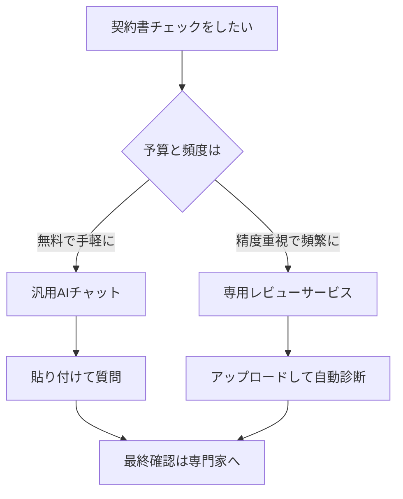

※本記事はアフィリエイト広告(PR)を含みます。

## AIで契約書をチェックする方法とは?この記事でわかること

「クライアントから届いた契約書、内容が難しくてよくわからない…」——フリーランスや個人事業主なら、一度はこんな不安を感じたことがあるのではないでしょうか。専門家に相談するとお金も時間もかかりますし、そのまま署名して後からトラブルになるのも怖いですよね。

そこで注目されているのが、**AIで契約書をチェックする**方法です。この記事では、AIを使った契約書レビューの基本から、フリーランス・個人事業主におすすめのツール比較、実際の使い方の手順、そして「無料で使えるの?」といった疑問まで、初心者にもわかりやすく解説します。読み終えるころには、あなたも自分でリスクを見抜く第一歩を踏み出せるはずです。

## AIで契約書をチェックするとは?何ができるのか

AIによる契約書チェックとは、契約書の文章をAI(人工知能)に読み込ませて、**リスクのある条項や不利な内容、抜け漏れなどを自動で洗い出す**しくみのことです。

具体的には、次のようなことができます。

- 難しい専門用語を、わかりやすい言葉に言い換えて説明してくれる
- 自分にとって不利になりそうな条項(例:一方的な解約権、過度な損害賠償)を指摘してくれる
- 契約書に本来あるべき項目が抜けていないかチェックしてくれる
- 修正したほうがよい箇所や、交渉のポイントを提案してくれる

つまり、法律の専門知識がなくても「どこに注意すればいいか」の当たりをつけられるのが最大のメリットです。

> ⚠️ ただし注意点があります。AIのチェックはあくまで**参考**であり、法律相談の代わりにはなりません。金額の大きい契約や重要な取引では、最終的に弁護士など専門家の確認を受けることを前提にしましょう。

## AI契約書チェックの2つのアプローチ

AIで契約書をチェックする方法は、大きく2種類に分けられます。

### 1. 汎用AIチャットを使う方法

ChatGPTやClaude、Geminiといった一般的なAIチャットに契約書の文面を貼り付けて、「この契約書で私に不利な点を教えて」と質問する方法です。**追加費用がかからず、すぐに試せる**のが魅力です。どのAIチャットを選ぶか迷う方は、[ChatGPTとClaudeとGeminiを徹底比較!初心者におすすめのAIチャットはどれ?](/2026/06/09/ai-chat-comparison/)もあわせて参考にしてください。

### 2. 契約書レビュー専用サービスを使う方法

法務向けに作られた専用ツールで、契約書のひな型データベースと照合しながら、より精度の高いチェックをしてくれます。企業向けが中心ですが、個人でも使えるプランが増えてきています。

## フリーランス向けおすすめツール比較

代表的なツールを、特徴ごとに整理しました。

| ツール種別 | 代表例 | 向いている人 | 費用の目安 |
|---|---|---|---|
| 汎用AIチャット | ChatGPT / Claude / Gemini | まずは無料で試したい人 | 無料〜有料プランあり |
| 契約書要約・分析 | PDF読み込み系AIツール | 長い契約書を素早く把握したい人 | 無料〜 |
| 契約書レビュー専用 | 法務向けAIレビューサービス | 契約が頻繁にある人 | 月額制が中心 |

※料金プランは改定されることがあります。導入前に必ず各サービスの公式サイトで最新情報を確認してください。

まずコストをかけずに始めたいフリーランスの方には、**汎用AIチャット**が現実的な選択肢です。特にClaudeは長文の読み込みに強く、契約書のような長い文書の分析に向いています。

また、契約書がPDFで届くケースは多いので、[AIでPDFを要約・分析する方法｜長文資料を時短で読むツール5選](/2026/06/24/ai-pdf-summary-tools/)で紹介しているようなPDF対応ツールと組み合わせると、より効率的にチェックできます。

## AIで契約書をチェックする具体的な手順

汎用AIチャットを使う場合の、基本的な流れを紹介します。

### ステップ1:契約書をテキスト化する

紙やPDFの契約書は、コピーできるテキスト形式にします。PDFであればそのまま読み込めるAIも増えています。

### ステップ2:目的を伝えて質問する

ただ「チェックして」と頼むより、立場と目的を明確に伝えると精度が上がります。プロンプト(指示文)の例は次のとおりです。

> 私はフリーランスのWebデザイナーです。以下は取引先から提示された業務委託契約書です。私にとって不利な条項、注意すべき点、修正を交渉したほうがよい箇所を、初心者にもわかるように箇条書きで教えてください。

指示文の書き方をもっと工夫したい方は、[AIプロンプトのコツ\|思い通りの回答を引き出す書き方を初心者向けに解説](/2026/06/22/ai-prompt-tips/)が役立ちます。

### ステップ3:気になる条項を深掘りする

指摘された箇所について「この条項はなぜ不利なのですか?」「どう修正を提案すればいいですか?」と追加質問し、理解を深めていきます。

### ステップ4:重要な契約は専門家に確認

報酬額が大きい、長期契約、著作権が絡むなど重要な契約は、AIの結果を持って弁護士や行政書士に相談すると、相談もスムーズです。

## よくある疑問Q&A

### Q. AIの契約書チェックは無料で使える?

はい、ChatGPTやClaude、Geminiには無料プランがあり、契約書チェックを試すことは可能です。ただし無料版は読み込める文章量や処理能力に制限がある場合があります。長い契約書を頻繁にチェックするなら有料版が快適です。有料版を検討している方は[ChatGPT有料版は必要?無料版との違いと元が取れる使い方を解説](/2026/06/20/chatgpt-paid-vs-free/)も参考になります。

### Q. 契約書をAIに入力して情報は大丈夫?

契約書には取引先名や金額など機密情報が含まれます。入力データが学習に使われない設定があるか、ビジネス向けプランかどうかを確認しましょう。心配な場合は、社名や個人名を伏せ字にしてから入力するのも有効です。

### Q. 法律の知識がなくても使える?

使えます。AIが専門用語をかみ砕いて説明してくれるので、むしろ知識が少ない人ほど恩恵が大きいツールです。ただし最終判断を丸投げせず、「自分で理解する補助」として使うのがおすすめです。

## 契約の基礎知識も身につけておくと安心

AIを使いこなすうえでも、契約の基本ルールを知っておくと指摘の意味を理解しやすくなります。フリーランス向けの契約書の解説書を1冊手元に置いておくと、AIの回答と照らし合わせながら学べます。

👉 [Amazonで「フリーランス 契約書 入門書」を見る](https://af.moshimo.com/af/c/click?a_id=5632371&p_id=170&pc_id=185&pl_id=38594&url=https%3A%2F%2Fwww.amazon.co.jp%2Fs%3Fk%3D%25E3%2583%2595%25E3%2583%25AA%25E3%2583%25BC%25E3%2583%25A9%25E3%2583%25B3%25E3%2582%25B9%2520%25E5%25A5%2591%25E7%25B4%2584%25E6%259B%25B8%2520%25E5%2585%25A5%25E9%2596%2580%25E6%259B%25B8)

## まとめ

AIで契約書をチェックする方法について解説してきました。ポイントを振り返りましょう。

- AIチェックは、不利な条項や専門用語をわかりやすく洗い出してくれる強力な味方
- まずはChatGPTやClaudeなどの**汎用AIチャットを無料で試す**のがおすすめ
- 立場と目的を明確に伝えると、チェックの精度が上がる
- 機密情報の扱いに注意し、データが学習に使われない設定を確認する
- 重要な契約は、AIの結果を持って**最終的に専門家へ相談**する

これまで「難しそう」と後回しにしていた契約書チェックも、AIを使えば数分で第一歩を踏み出せます。まずは手元にある契約書を1つ、AIチャットに読み込ませてみるところから始めてみてください。
