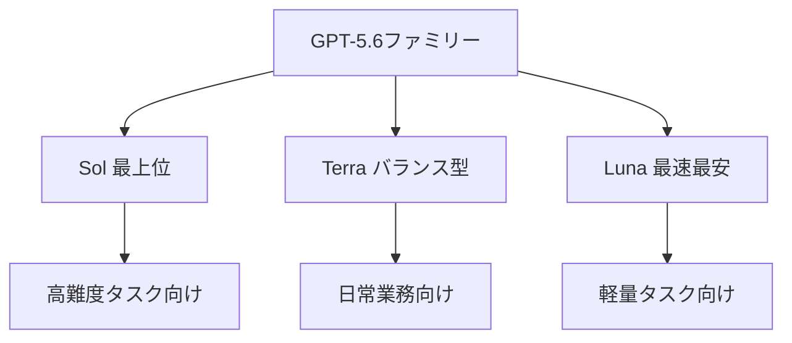

※本記事はアフィリエイト広告(PR)を含みます。

「ChatGPTの新しいモデルが出たらしいけど、Sol・Terra・Lunaって何が違うの?」「結局どれを使えばいいの?」——そんな疑問をお持ちの方に向けた記事です。

2026年7月9日(現地時間)、米OpenAIが次世代の大規模言語モデル(LLM=たくさんの文章を学習して会話や文章生成ができるAI)「GPT-5.6」ファミリーの一般提供を開始しました。この記事を読むと、**GPT-5.6で何が変わったのか、3つのモデルの違いと選び方、そして自分のプランでどう使えるのか**がまるっとわかります。専門用語もひとつずつかみくだいて説明しますので、AIにあまり詳しくない方も安心して読み進めてください。

## 何が起きたのか?GPT-5.6が正式リリース

OpenAIは7月9日、GPT-5.6ファミリーの一般提供(GA=General Availability、誰でも使える正式公開のこと)を開始しました。先月末から一部の承認済みパートナー限定でプレビュー(お試し公開)されていましたが、今回「ChatGPT」「ChatGPT Work」「Codex」「OpenAI API」の4つのチャネルで同時にグローバル展開されることになりました。ロールアウト(段階的な提供拡大)は以降24時間かけて世界中に広がっていきます。

このGPT-5.6シリーズは、OpenAIが2026年6月26日に限定プレビューを公開し、7月9日に一般提供を開始した新しいモデル家族です。プレビュー時点の詳しい内容は[GPT-5.6が限定プレビュー開始\|Sol・Terra・Lunaの特徴](/2026/06/26/gpt-5-6-sol-preview/)でも紹介していますので、あわせてご覧ください。

### 命名ルールが刷新された

今回いちばん大きな変更は、モデルの名前の付け方が新しくなったことです。これまでは「1つのフラグシップ(最上位モデル)＋mini/nanoといった派生」という命名でしたが、GPT-5.6では以下のように整理されました。

- **数字(5.6)** … モデルの世代を表す
- **名前(Sol/Terra/Luna)** … 3つの能力ティア(性能のグレード)を表す

ちなみにSol・Terra・Lunaはそれぞれラテン語で「太陽・地球・月」を意味します。世代と能力を独立させたことで、今後モデルが進化してもわかりやすい名前が保たれる設計になっています。

## 読者にとって何が嬉しいのか?

今回の目玉は、ずばり**「コストが下がって性能が上がる」**という点です。順番に見ていきましょう。

### 1. より少ないコストで高性能

GPT-5.6ファミリーの強みは、より少ないトークン(AIが文章を処理する際の単位)でより高い性能を発揮することです。最上位のSolは、長時間のワークフロー(作業の流れ)を評価する「Agents' Last Exam」というテストで53.6を記録し、AnthropicのClaude Fable 5を13.1ポイント上回りました。さらに下位のTerra・Lunaも、約16分の1のコストでFable 5を上回るとしています。比較対象のFable 5については[Claude Fable 5とは?Opus 4.8との違いと何がすごいのか](/2026/06/11/claude-fable-5-guide/)で詳しく解説しています。

### 2. 用途と予算で選べるようになった

GPT-5.6では、目的に応じて3つのモデルから選べるようになりました。

| モデル | 位置づけ | 得意なこと |
|--------|----------|-----------|
| **Sol** | フラッグシップ(最上位) | コーディング・科学など高難度タスクでSOTA(最高水準)を達成 |
| **Terra** | バランス型 | GPT-5.5に匹敵する性能を半額で提供、日常業務向け |
| **Luna** | 最速・最安 | 軽量なタスクを高速・低コストで処理 |

### 3. 既存ユーザーはコスト削減の恩恵も

とくに注目したいのが、TerraがGPT-5.5と同等の性能を持ちながら、料金が約半額に設定されている点です。つまり、これまでGPT-5.5を使っていた方がTerraに移行すれば、性能はそのままにコストを大きく抑えられる可能性があります。AIの料金動向については[AIサブスク料金比較2026年6月\|ChatGPT・Claude・Geminiが世代交代&値下げ](/2026/06/16/ai-subscription-pricing-2026/)もチェックしてみてください。

### 4. 新しい高速処理モード「ultra」

GPT-5.6には「ultra」という新しい動作モードが加わりました。これは4つのエージェント(自律的に作業をこなすAI)を並列で動かすことで、高難度タスクの処理を高速化するものです。ChatGPT WorkではPro/Enterprise、CodexではPlus以上のプランで提供されます。

## 使い方・料金・注意点

### API料金(100万トークンあたり)

API(外部のアプリからAIを呼び出す仕組み)経由で使う場合の料金は次のとおりです。

| モデル | 入力 | 出力 |
|--------|------|------|
| Sol | 5米ドル | 30米ドル |
| Terra | 2.5米ドル | 15米ドル |
| Luna | 1米ドル | 6米ドル |

Solはコーディング・ナレッジワーク・サイバーセキュリティ・科学の分野でSOTA(最高水準)を達成、Terraは日常業務向けの高コスパ、Lunaはもっとも高速・低コストで軽量タスク向けという位置づけです。

### プラン別の使えるモデル

- **ChatGPT** … Plus・Pro・Business・Enterpriseユーザーが中程度以上の推論設定でSolを利用可能。Pro・Enterpriseユーザーはより複雑なタスク向けの「Sol Pro」も選べます。
- **ChatGPT Work/Codex** … 無料・GoユーザーはTerraを利用可能。Plus以上のユーザーはSol・Terra・Lunaから選べ、推論レベルも指定できます。「max」は設定でオンにすれば全ユーザーが利用可能。「ultra」はChatGPT WorkではPro・Enterprise、CodexではPlus以上で利用できます。
- **OpenAI API** … Sol・Terra・Lunaの3モデルを提供。

どのプランを選ぶか迷っている方は、[ChatGPT有料版は必要?無料版との違いと元が取れる使い方](/2026/06/20/chatgpt-paid-vs-free/)を参考にすると判断しやすくなります。

### 選び方の目安

初心者の方が迷ったときの、おおまかな目安は次のとおりです。

- **とにかく難しい作業(複雑なコード生成や専門的な分析)** … Sol
- **普段使いでバランスよく、コストも抑えたい** … Terra
- **簡単な質問や大量処理を素早く・安く** … Luna

### 注意点

一部の日本語解説記事では「一般提供は7月中旬見込み」「7月10日開始」など日付にばらつきがありますが、これはプレビューから一般提供への移行過程で情報が更新されたためです。公式および主要な英語報道が示す正式な一般提供日は**2026年7月9日(現地時間)**です。

また、上位モデルの詳細な料金や「ultra」「Sol Pro」の追加料金など、一部の情報は執筆時点で流動的な部分もあります。実際に使い始める前には、必ずOpenAI公式ページで最新情報を確認してください。

## まとめ

今回のGPT-5.6一般提供のポイントを振り返りましょう。

- OpenAIが2026年7月9日にGPT-5.6ファミリーを一般提供開始
- 命名ルールが刷新され、世代番号(5.6)と能力ティア名(Sol/Terra/Luna)を分離
- **Sol=最上位、Terra=バランス型で半額級、Luna=最速最安**の3本立て
- 「より少ないコストで高性能」が最大の魅力で、既存ユーザーはコスト削減のチャンス
- プランによって使えるモデルやモードが異なるので、自分の用途に合わせて選ぶのがコツ

価格が下がりつつ、普段使っているChatGPTがそのまま強くなる——これはAIをまだ有料で使っていない方にとっても、乗り換えを検討する良いタイミングかもしれません。まずは自分のプランで使えるモデルを確認し、TerraやLunaで気軽に試してみてはいかがでしょうか。

## 参考リンク

- [OpenAI「Previewing GPT‑5.6 Sol: a next-generation model」](https://openai.com/index/previewing-gpt-5-6-sol/)
- [OpenAI「GPT-5.6」製品ページ](https://openai.com/index/gpt-5-6/)
- [窓の杜「OpenAI、『GPT-5.6』の一般提供を開始」](https://forest.watch.impress.co.jp/docs/news/2124016.html)
- [TechCrunch「OpenAI launches its new family of models with GPT-5.6」](https://techcrunch.com/2026/07/09/openai-launches-its-new-family-of-models-with-gpt-5-6/)
