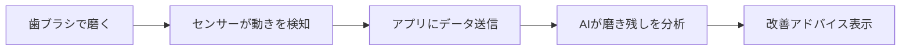

※本記事はアフィリエイト広告(PR)を含みます。

## AI搭載電動歯ブラシとは?磨き残しを検知するスマートモデルの基本

「毎日ちゃんと磨いているのに、なぜか虫歯や歯石ができてしまう」——そんな悩みを持つ方に、いま注目されているのが**AI搭載電動歯ブラシ**です。この記事を読むと、AI電動歯ブラシがどんな仕組みで磨き残しを検知するのか、2026年に選ぶときの比較ポイント、そして自分に合ったモデルの見つけ方までがまとめてわかります。

AI搭載電動歯ブラシとは、簡単に言うと「センサーとアプリの力で、あなたの磨き方をチェックしてくれる歯ブラシ」のことです。歯ブラシ本体に内蔵されたセンサーが動きや角度を読み取り、スマホアプリと連携して「どこが磨けていないか」を可視化してくれます。従来の電動歯ブラシが「振動して磨く」だけだったのに対し、AIモデルは「磨き方の質」までサポートしてくれるのが大きな違いです。

## AI電動歯ブラシが磨き残しを検知する仕組み

「AIで磨き残しがわかる」と言われても、少しイメージしづらいかもしれません。仕組みはおおまかに次の3つの技術で成り立っています。

- **モーションセンサー**:歯ブラシがどの向きに、どのくらいの速さで動いているかを感知します。
- **位置検出**:口の中のどのエリア(前歯・奥歯・裏側など)を磨いているかを推定します。
- **AIによる分析**:集めたデータをアプリ側のAIが解析し、「右下の奥歯が磨けていません」といった具体的なアドバイスを出します。

つまり、人間には気づきにくい「いつも同じ場所を磨き忘れるクセ」を、データから見つけ出してくれるわけです。歯科医院で指導を受けるような体験を、毎日の歯磨きで得られるのが魅力です。

## AI電動歯ブラシの選び方7つのポイント

AIモデルと一口に言っても、機能や価格はさまざまです。購入前にチェックしたいポイントを整理しました。

### 1. 磨き残し検知の精度

最も重要なのが、位置検出の精度です。前歯・奥歯・裏側まで細かくエリア分けして表示してくれるモデルほど、実用的なアドバイスが得られます。

### 2. アプリの使いやすさ

AI機能はアプリありきです。毎日使うものなので、画面が見やすく、記録が自動で残るタイプがおすすめです。日本語に完全対応しているかも確認しましょう。

### 3. 清掃モードの種類

「クリーニング」「歯ぐきケア」「ホワイトニング」など、目的別のモードがあると便利です。歯や歯ぐきが敏感な方は、やさしいモードの有無をチェックしてください。

### 4. バッテリーの持ち

1回の充電で何日使えるかは、日々の使い勝手を左右します。出張や旅行が多い方は、長持ちするモデルや持ち運びケース付きが安心です。

### 5. 替えブラシのコストと入手性

本体が安くても、替えブラシが高かったり手に入りにくかったりすると長期的には割高になります。ランニングコストも含めて考えましょう。

### 6. 過圧防止センサー

強く押し当てすぎると歯ぐきを傷めます。押し付けすぎを光や振動で知らせてくれる機能があると、力の入れすぎを防げます。

### 7. 価格と保証

AI搭載モデルは通常の電動歯ブラシよりやや高めの傾向があります。予算とのバランスを見つつ、保証期間もチェックしておくと安心です。

> 具体的な価格や最新スペックはモデルによって頻繁に変わります。購入前に必ず各メーカーの公式サイトで最新情報を確認してください。

## タイプ別・おすすめの選び方

迷ったときは、自分の使い方に合わせて選ぶのが失敗しないコツです。

| こんな人におすすめ | 重視すべきポイント |
|---|---|
| 磨き残しをしっかり減らしたい | 位置検出の精度・アプリの詳細さ |
| 家族みんなで使いたい | 複数プロフィール対応・替えブラシの色分け |
| コストを抑えたい | 本体価格＋替えブラシの合計コスト |
| 出張・旅行が多い | バッテリー持続時間・携帯ケース |
| 歯ぐきが敏感 | 過圧防止センサー・やさしいモード |

主要メーカーの最新モデルは、家電量販店や通販サイトで比較しながら選べます。実際のラインナップを見てみたい方は、下記から探してみてください。

👉 [Amazonで「AI 電動歯ブラシ スマート」を見る](https://af.moshimo.com/af/c/click?a_id=5632371&p_id=170&pc_id=185&pl_id=38594&url=https%3A%2F%2Fwww.amazon.co.jp%2Fs%3Fk%3DAI%2520%25E9%259B%25BB%25E5%258B%2595%25E6%25AD%25AF%25E3%2583%2596%25E3%2583%25A9%25E3%2582%25B7%2520%25E3%2582%25B9%25E3%2583%259E%25E3%2583%25BC%25E3%2583%2588)

👉 [楽天市場で「電動歯ブラシ アプリ連携」を探す](https://af.moshimo.com/af/c/click?a_id=5632328&p_id=54&pc_id=54&pl_id=616&url=https%3A%2F%2Fsearch.rakuten.co.jp%2Fsearch%2Fmall%2F%25E9%259B%25BB%25E5%258B%2595%25E6%25AD%25AF%25E3%2583%2596%25E3%2583%25A9%25E3%2582%25B7%2520%25E3%2582%25A2%25E3%2583%2597%25E3%2583%25AA%25E9%2580%25A3%25E6%2590%25BA%2F)

## よくある疑問(Q&A)

### Q. AI機能は無料で使える?

ほとんどのモデルで、専用アプリのAI分析機能は**無料**で使えます。歯ブラシ本体を購入すれば、追加の月額料金なしで磨き残し検知や記録機能を利用できるケースが一般的です。ただし一部の高度な機能はサブスク型になっている場合もあるため、購入前にアプリの料金体系を確認しておくと安心です。

### Q. スマホがないと使えない?

AI分析にはスマホアプリが必要ですが、多くのモデルは**歯ブラシ単体でも電動歯ブラシとして問題なく使えます**。アプリは「より上手に磨くための補助」と考えるとよいでしょう。

### Q. 子どもや高齢者でも使える?

使えます。むしろ、磨き方のクセを可視化できるAIモデルは、歯磨き指導が難しい子どもや、磨き残しが気になる高齢者にも向いています。ゲーム感覚で磨けるキッズ向けアプリを備えたモデルもあります。

## 健康管理を「見える化」するガジェットと組み合わせる

AI電動歯ブラシは、日々の健康を数値やデータで管理する「見える化ガジェット」の一つです。同じように毎日のデータを蓄積してくれる機器と組み合わせると、体調管理がぐっと楽になります。

たとえば睡眠や運動を記録したいなら[AI搭載スマートウォッチおすすめ比較\|健康管理・睡眠分析に最適なのは?](/2026/06/17/ai-smartwatch-comparison/)が参考になりますし、体重や体脂肪を自動で記録したい方は[AI体組成計おすすめ比較2026\|スマート体重計で健康管理を自動化](/2026/06/28/ai-body-composition-scale/)もあわせてチェックしてみてください。掃除まで自動化して生活全体を効率化したい方には[ロボット掃除機の選び方2026\|AI搭載モデルを価格・機能で徹底比較](/2026/06/16/robot-vacuum-guide-2026/)もおすすめです。

## まとめ

AI搭載電動歯ブラシは、「磨いているつもり」を「ちゃんと磨けている」に変えてくれる頼もしいガジェットです。最後にポイントを振り返りましょう。

- AIモデルはセンサーとアプリで**磨き残しを可視化**してくれる
- 選ぶときは**検知精度・アプリの使いやすさ・ランニングコスト**を重視
- **AI分析は基本無料**で使え、歯ブラシ単体でも動作するモデルが多い
- 子どもから高齢者まで、磨き方のクセ改善に役立つ
- 具体的な価格・スペックは変動するので**公式サイトで最新情報を確認**

まずは自分の使い方に合ったタイプをイメージして、通販サイトで実際のモデルを比べてみるのがおすすめです。毎日の歯磨きをアップデートして、将来の歯の健康に投資してみてはいかがでしょうか。
