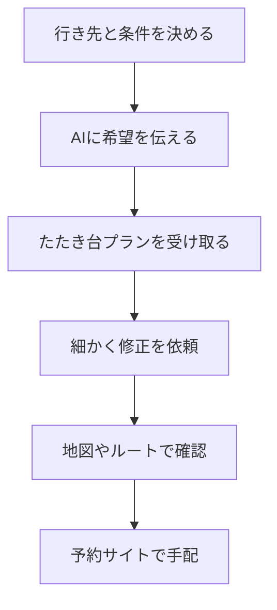

※本記事はアフィリエイト広告(PR)を含みます。

## AIで旅行プランを自動作成するとは?

「行き先は決まっているけれど、日程や回る順番を考えるのが面倒…」――そんな悩みを一気に解決してくれるのが、**AIによる旅行プランの自動作成**です。この記事を読むと、次のことがわかります。

- AIで旅行プランを自動作成する具体的な手順
- 日程やルートを最適化してくれるおすすめツールの比較
- 思い通りのプランを引き出すプロンプト(AIへの指示文)のコツ
- 「無料で使えるの?」といった素朴な疑問への答え

AI(人工知能)を使えば、「3泊4日で京都と大阪、子連れでのんびり」といったざっくりした希望を伝えるだけで、時間帯ごとの行動プランや移動ルートまで数十秒で提案してくれます。旅行初心者の方でも、この記事を読めばすぐに試せるようになりますよ。

## なぜ旅行プラン作成にAIが向いているのか

旅行の計画には、実は多くの「面倒な作業」が含まれています。

- 観光スポットを調べて取捨選択する
- 営業時間や定休日を確認する
- 効率のよい回る順番(ルート)を考える
- 移動時間や食事の時間を組み込む

これらをすべて手作業でやると、半日かかることも珍しくありません。AIは大量の情報を整理し、条件に合わせて瞬時にプランを組み立てるのが得意です。しかも「もっとゆっくりにして」「予算を抑えて」といった修正も、会話するだけで何度でも調整できます。

## AIで旅行プランを作る基本の流れ

まずは全体像をつかんでおきましょう。基本的な手順は次のとおりです。

### ステップ1:条件を整理する

AIに丸投げする前に、最低限これだけは決めておきましょう。

- **行き先**(例:金沢)
- **日数・日程**(例:2泊3日)
- **同行者**(例:夫婦、子連れ、友人)
- **重視すること**(例:グルメ、温泉、写真映え)
- **予算感**(ざっくりでOK)

### ステップ2:AIに希望を伝える

条件をまとめて文章で入力します。たとえば次のような指示が有効です。

> 金沢へ2泊3日で旅行します。夫婦2人、車なし、公共交通機関で移動。ひがし茶屋街と兼六園は必ず入れて、海鮮グルメも楽しみたいです。1日目は午後着です。時間帯ごとの行動プランと、移動ルートを表にして提案してください。

このように**具体的に条件を伝えるほど精度が上がります**。プロンプトの書き方をもっと知りたい方は、[AIプロンプトのコツ\|思い通りの回答を引き出す書き方を初心者向けに解説](/2026/06/22/ai-prompt-tips/)もあわせて読むと理解が深まります。

### ステップ3:修正しながら完成させる

最初の提案が完璧でなくても大丈夫。「2日目をもっとゆっくりに」「雨の日プランも追加して」と会話するだけで調整できます。

## 旅行プラン作成におすすめのAIツール比較

代表的なツールを目的別にまとめました。料金や機能は変わりやすいため、必ず各公式サイトで最新情報を確認してください。

| ツール | 得意なこと | こんな人におすすめ |
| --- | --- | --- |
| ChatGPT | 柔軟な会話でプラン調整 | 細かく相談しながら作りたい |
| Gemini | Googleマップ連携で地図に強い | ルートや距離感を重視する |
| Perplexity | 出典付きで最新情報を検索 | 営業時間など正確さ重視 |
| 専用旅行アプリ | 予約まで一気通貫 | 手配までまとめて済ませたい |

### ChatGPT:会話しながら作り込める万能型

自由度が高く、細かい要望にも柔軟に対応してくれます。表形式での出力も得意なので、時間割のようなプランが作りやすいのが魅力です。

### Gemini:地図・ルート最適化に強い

Googleのサービスと連携しやすく、移動ルートや所要時間のイメージがつかみやすいのが特長です。

### Perplexity:最新情報の正確性を重視するなら

AI検索エンジンの一種で、情報の出典を示してくれるため、営業時間やイベント日程の確認に向いています。各ツールの違いは[AI検索エンジンおすすめ徹底比較\|Perplexity・Genspark・Feloはどれが最強?](/2026/06/23/ai-search-engine-comparison/)で詳しく解説しています。

どのチャットAIを選ぶか迷う方は、[ChatGPTとClaudeとGeminiを徹底比較!初心者におすすめのAIチャットはどれ?](/2026/06/09/ai-chat-comparison/)も参考にしてみてください。

## AI旅行プランは無料で使える?

結論から言うと、**基本的な使い方なら無料でも十分試せます**。ChatGPTやGeminiには無料プランがあり、旅行プランのたたき台作りには問題なく使えます。

ただし、より高性能なモデルや、長い会話・複雑な条件を扱いたい場合は有料版が快適です。頻繁に使うなら有料版を検討してもよいでしょう。有料版の元が取れるかどうかは[ChatGPT有料版は必要?無料版との違いと元が取れる使い方を解説](/2026/06/20/chatgpt-paid-vs-free/)で判断のヒントが見つかります。

## AIプランを使うときの注意点

便利なAIですが、鵜呑みにするのは禁物です。次の点に気をつけましょう。

- **営業時間・定休日は必ず公式で再確認**(AIの情報が古い場合あり)
- **移動時間は余裕をもって設定**(乗り換えや渋滞を考慮)
- **予約はAIではなく正規サイトで**(AIはあくまで提案役)

AIは「たたき台を作る優秀な相棒」と考え、最終確認は自分でおこなうのが失敗しないコツです。

## 旅先で役立つガジェットも準備しよう

プランが決まったら、旅を快適にする準備も忘れずに。スマホでルート確認やAIとのやり取りを繰り返すと、バッテリーの消耗が意外と早いものです。大容量のモバイルバッテリーが1つあると安心です。

👉 [楽天市場で「モバイルバッテリー 大容量」を探す](https://af.moshimo.com/af/c/click?a_id=5632328&p_id=54&pc_id=54&pl_id=616&url=https%3A%2F%2Fsearch.rakuten.co.jp%2Fsearch%2Fmall%2F%25E3%2583%25A2%25E3%2583%2590%25E3%2582%25A4%25E3%2583%25AB%25E3%2583%2590%25E3%2583%2583%25E3%2583%2586%25E3%2583%25AA%25E3%2583%25BC%2520%25E5%25A4%25A7%25E5%25AE%25B9%25E9%2587%258F%2F)

バッテリー選びのポイントは[モバイルバッテリーの選び方2026\|容量・速度・安全性で失敗しない比較](/2026/06/13/mobile-battery-guide-2026/)にまとめています。

また、海外旅行なら現地での会話をサポートしてくれるAI翻訳イヤホンも人気です。

👉 [Amazonで「AI翻訳イヤホン」を見る](https://af.moshimo.com/af/c/click?a_id=5632371&p_id=170&pc_id=185&pl_id=38594&url=https%3A%2F%2Fwww.amazon.co.jp%2Fs%3Fk%3DAI%25E7%25BF%25BB%25E8%25A8%25B3%25E3%2582%25A4%25E3%2583%25A4%25E3%2583%259B%25E3%2583%25B3)

海外旅行向けの翻訳ガジェットは[AI翻訳イヤホンおすすめ比較2026\|海外旅行の会話に最適なのは?](/2026/06/24/ai-translation-earphones-2026/)で詳しく比較しています。

## まとめ

AIを使えば、面倒だった旅行プランの作成が驚くほどラクになります。最後にポイントを振り返りましょう。

- **条件を具体的に伝えるほど精度が上がる**
- ChatGPTは柔軟な調整、Geminiは地図、Perplexityは正確性に強い
- **基本的な使い方なら無料でも十分**試せる
- 営業時間や移動時間は必ず自分で再確認する
- モバイルバッテリーや翻訳イヤホンで旅をより快適に

まずは無料のAIチャットに、次の旅行の希望を入力してみてください。数十秒で、あなただけの旅程のたたき台ができあがるはずです。ぜひ気軽に試して、計画にかける時間を旅そのものを楽しむ時間に変えてみましょう。
