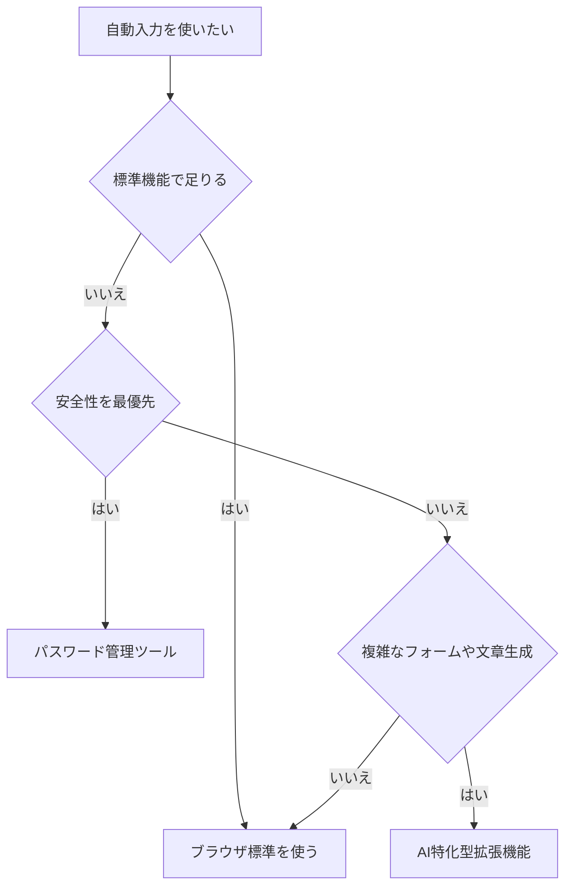

※本記事はアフィリエイト広告(PR)を含みます。

## フォーム自動入力とは?この記事でわかること

「通販の会員登録」「セミナー申し込み」「アンケート回答」など、Webサイトで名前や住所を何度も入力するのは地味に面倒ですよね。そんなときに役立つのが**フォーム自動入力**の拡張機能です。ブラウザに登録した情報をワンクリックで呼び出し、名前・住所・メールアドレスなどをまとめて埋めてくれます。

この記事では、AIを活用した**フォーム自動入力**の仕組みから、代表的な拡張機能の比較、選び方、そして「無料で使えるの?」という疑問まで、初心者にもわかりやすく解説します。読み終わるころには、あなたに合ったツールを選んで、面倒な入力作業から解放される準備が整うはずです。

※拡張機能とは、ChromeやEdgeなどのブラウザに追加して機能を拡張する小さなプログラムのことです。

## なぜAIでの自動入力が便利なのか

これまでの自動入力は「あらかじめ登録した情報を、決まった欄にそのまま入れる」だけのものでした。しかし最近のツールはAI(人工知能)を組み合わせることで、次のような賢い動きができるようになっています。

- **入力欄の意味を推測する**:欄の名前が「氏名」でも「お名前」でも「Name」でも、AIが「これは名前を入れる欄だ」と判断してくれる
- **表記ゆれに対応する**:「郵便番号」と「〒」など、書き方が違っても正しく振り分ける
- **自由記述欄をAIが下書きする**:問い合わせ内容などの文章欄に、要点を入れると自然な文章に整えてくれるツールもある

つまり、単なる「コピペの自動化」から一歩進んで、**フォームの構造を理解して埋めてくれる**のが今どきの自動入力です。

## 自動入力できる主な情報

一般的な拡張機能では、次のような情報を登録して使い回せます。

| 項目 | 具体例 |
|------|--------|
| 基本情報 | 氏名(漢字・ふりがな)、生年月日 |
| 連絡先 | メールアドレス、電話番号 |
| 住所 | 郵便番号、都道府県、市区町村、番地 |
| 会社情報 | 会社名、部署、役職 |
| その他 | よく使う定型文、SNSアカウントなど |

複数のプロフィール(自宅用・会社用など)を切り替えられるツールも多く、用途に応じて使い分けられます。

## 代表的なフォーム自動入力ツールの比較

ここでは、多くの人が使っている代表的なタイプを整理します。具体的な価格や無料枠は変わりやすいため、導入前に必ず**公式サイトで最新情報を確認してください**。

### 1. ブラウザ標準の自動入力機能

ChromeやEdge、Safariには、もともと住所やクレジットカード情報を保存して自動入力する機能が備わっています。

- **メリット**:追加インストール不要、無料、安全性が高い
- **デメリット**:複雑なフォームや表記ゆれには弱いことがある

まずはこの標準機能を試して、物足りなければ拡張機能を検討する、という順番がおすすめです。

### 2. パスワード管理ツール付属の自動入力

パスワード管理アプリの多くには、住所や個人情報を安全に保存して自動入力する機能が付いています。

- **メリット**:暗号化されて安全、複数デバイスで同期できる
- **デメリット**:高度な機能は有料プランになることが多い

セキュリティを重視したい人に向いています。

### 3. AI搭載のフォーム入力特化型拡張機能

入力欄をAIが解析して、多少レイアウトが変わっても正しく埋めてくれるタイプです。長文の問い合わせ欄をAIが下書きしてくれる機能を持つものもあります。

- **メリット**:複雑・不規則なフォームに強い、文章生成もできる
- **デメリット**:個人情報を扱うため、提供元の信頼性の見極めが必要

文章の自動生成に興味がある方は、[AIプロンプトのコツ\|思い通りの回答を引き出す書き方を初心者向けに解説](/2026/06/22/ai-prompt-tips/)も合わせて読むと、より精度の高い下書きを作れるようになります。

## 自分に合ったツールの選び方

どれを選べばいいか迷ったときは、次のフローチャートを参考にしてみてください。

選ぶときのチェックポイントは次の3つです。

1. **対応ブラウザ**:自分が普段使うブラウザに対応しているか
2. **セキュリティ**:個人情報がどこに保存され、暗号化されるか
3. **料金体系**:無料でどこまで使えて、どこから有料か

## よくある疑問Q&A

### Q. フォーム自動入力の拡張機能は無料で使える?

多くのツールは基本的な自動入力を無料で提供しています。ただし、複数プロフィールの管理やAIによる文章生成、デバイス間同期などの高度な機能は有料プランになっているケースが一般的です。まずは無料で試し、必要になったら有料版を検討するのがおすすめです。最新の料金は公式サイトで確認しましょう。

### Q. 個人情報を登録しても安全?

自動入力は氏名や住所といった大切な情報を扱うため、**信頼できる提供元かどうか**の確認が欠かせません。次の点をチェックしましょう。

- 情報が暗号化されて保存されるか
- 提供元の会社やプライバシーポリシーが明記されているか
- 共有パソコンでは自動入力を使わない

特にクレジットカード情報などは、安易に多くのツールへ登録しないよう注意してください。

### Q. スマホでも使える?

スマホのブラウザやOSにも自動入力機能があります。iPhoneやAndroidの設定から住所を登録しておけば、アプリやサイトのフォームで呼び出せます。パソコンとスマホの両方で使いたい場合は、同期に対応したツールを選ぶと便利です。

## さらに入力作業を効率化するには

フォーム入力だけでなく、日々のタイピング全体を見直すと、作業時間はさらに短くなります。誤字修正や定型文の入力を自動化したい方は、[AIキーボード入力支援ツール比較2026\|誤字修正を自動化する5選](/2026/06/23/ai-keyboard-typing-tools/)が参考になります。

また、申し込み後にたまる書類やデータの整理も、AIを使えば効率化できます。[AIで名刺・書類を整理する方法\|おすすめスキャナーとアプリ活用術](/2026/06/17/ai-business-card-scanner/)も、あわせてチェックしてみてください。

## まとめ

フォームの名前・住所の自動入力は、慣れると「なぜ今までやっていなかったのか」と思うほど作業がラクになる時短術です。最後にポイントを整理します。

- まずは**ブラウザ標準の自動入力**を試すのが手軽で安全
- 安全性重視なら**パスワード管理ツール**の自動入力機能
- 複雑なフォームや文章生成まで求めるなら**AI特化型の拡張機能**
- 選ぶときは「対応ブラウザ・セキュリティ・料金」の3点を確認
- 個人情報を扱うため、提供元の信頼性チェックは必須

価格や無料枠は変わりやすいので、導入前に公式サイトで最新情報を確認してください。まずは無料でできる範囲から試して、面倒な入力作業から解放される快適さをぜひ体感してみましょう。
