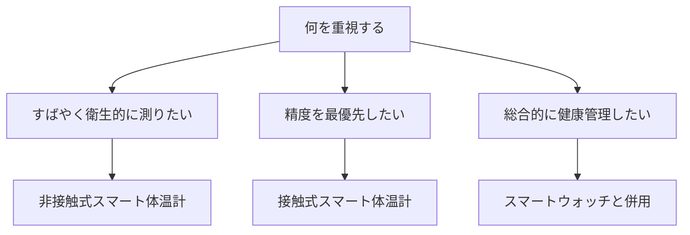

※本記事はアフィリエイト広告(PR)を含みます。

## AI搭載体温計・スマート健康デバイスとは?この記事でわかること

「家族の体調をもっと手軽に管理したい」「毎日の健康データをスマホで見られたら便利なのに」——そんな思いから **AI搭載体温計** や **スマート健康デバイス** を検討している方は多いのではないでしょうか。

この記事では、2026年最新のAI搭載体温計・スマート健康デバイスを比較しながら、次のことがわかるように解説します。

- そもそもAI搭載体温計・スマート健康デバイスとは何か
- 家庭で使うときの選び方のポイント
- タイプ別のおすすめと比較のコツ
- よくある疑問(アプリは無料?精度は大丈夫?)への回答

専門用語にはできるだけ簡単な説明を添えていますので、ガジェットに詳しくない方も安心して読み進めてください。

## そもそも「AI搭載」の健康デバイスとは?

ここでいう「AI搭載」とは、測定したデータをただ表示するだけでなく、**過去の記録やパターンをもとに傾向を分析・アドバイスしてくれる機能**を指します。たとえば次のようなイメージです。

- 体温の推移をグラフ化し、平熱からのズレを自動でお知らせ
- 家族ごとにデータを分けて管理し、体調変化を通知
- 睡眠や活動量など、他のデータと組み合わせて健康傾向を提示

つまり、「測る道具」から「気づきを与えてくれるパートナー」へと進化しているのが、最近のスマート健康デバイスの特徴です。

### 主なデバイスの種類

家庭で使われる代表的なスマート健康デバイスには、次のようなものがあります。

| 種類 | 主な役割 | こんな人におすすめ |
|------|----------|----------------------|
| スマート体温計 | 体温測定・記録・傾向分析 | 小さな子どもや家族の体調管理をしたい人 |
| スマートウォッチ | 心拍・睡眠・活動量の測定 | 日常的に体の状態を把握したい人 |
| スマート体組成計 | 体重・体脂肪率などの記録 | ダイエットや体づくりをしたい人 |
| 血圧計・パルスオキシメーター | 血圧や血中酸素の測定 | 生活習慣が気になる中高年 |

体温計だけでなく、複数のデバイスを組み合わせることで、家庭の健康管理がぐっと立体的になります。

## AI搭載体温計の選び方7つのポイント

はじめて選ぶ方に向けて、失敗しないためのチェックポイントを整理しました。

### 1. 測定方式(接触式か非接触式か)

- **接触式**:わきや口で測るタイプ。精度が安定しやすい。
- **非接触式**:おでこにかざして測るタイプ。すばやく測れて衛生的。

小さなお子さんがいる家庭では、寝ている間でも測りやすい非接触式が人気です。

### 2. 測定スピード

数秒で測れるモデルが増えています。忙しい朝や、じっとしていられない子どもの検温では、スピードは大きなメリットになります。

### 3. アプリ連携とデータ管理

スマホアプリと連携できると、体温を自動で記録・グラフ化できます。**家族ごとにアカウントを分けられるか**もチェックしましょう。

### 4. AI分析・通知機能

平熱からのズレを知らせたり、発熱の傾向を教えてくれたりする機能があると安心です。

### 5. 使いやすさ(表示・バックライト)

夜間でも見やすいバックライト付きや、大きな液晶表示のモデルは、家族みんなで使うときに便利です。

### 6. 電池・充電方式

ボタン電池式か充電式かで、ランニングコストや手間が変わります。

### 7. 精度と信頼性

医療機器としての認証(管理医療機器の届出など)があるかは重要な目安です。購入前に、必ず公式サイトや製品ページで最新の仕様を確認してください。

## 選び方フローチャート

迷ったときは、次のフローチャートを参考にしてみてください。

## タイプ別おすすめの選び方

### 子育て家庭には「非接触式スマート体温計」

寝ている子どもを起こさずに測れる非接触式は、子育て世代の強い味方です。アプリと連携すれば、通院時に体温の推移を医師に見せることもできます。

👉 [Amazonで「非接触式 体温計 スマホ連携」を見る](https://af.moshimo.com/af/c/click?a_id=5632371&p_id=170&pc_id=185&pl_id=38594&url=https%3A%2F%2Fwww.amazon.co.jp%2Fs%3Fk%3D%25E9%259D%259E%25E6%258E%25A5%25E8%25A7%25A6%25E5%25BC%258F%2520%25E4%25BD%2593%25E6%25B8%25A9%25E8%25A8%2588%2520%25E3%2582%25B9%25E3%2583%259E%25E3%2583%259B%25E9%2580%25A3%25E6%2590%25BA)

### 日常の健康管理には「スマートウォッチ」との組み合わせ

体温だけでなく、心拍や睡眠、活動量まで把握したいなら、スマートウォッチとの併用がおすすめです。デバイス選びの詳細は、[AI搭載スマートウォッチおすすめ比較\|健康管理・睡眠分析に最適なのは?](/2026/06/17/ai-smartwatch-comparison/)もあわせてご覧ください。

### 体づくり・ダイエットには「スマート体組成計」

体重や体脂肪率を毎日自動で記録したい方は、スマート体組成計が便利です。詳しくは[AI体組成計おすすめ比較2026\|スマート体重計で健康管理を自動化](/2026/06/28/ai-body-composition-scale/)で紹介しています。

👉 [楽天市場で「体組成計 スマホ連携 アプリ」を探す](https://af.moshimo.com/af/c/click?a_id=5632328&p_id=54&pc_id=54&pl_id=616&url=https%3A%2F%2Fsearch.rakuten.co.jp%2Fsearch%2Fmall%2F%25E4%25BD%2593%25E7%25B5%2584%25E6%2588%2590%25E8%25A8%2588%2520%25E3%2582%25B9%25E3%2583%259E%25E3%2583%259B%25E9%2580%25A3%25E6%2590%25BA%2520%25E3%2582%25A2%25E3%2583%2597%25E3%2583%25AA%2F)

## 家庭でのスマート健康管理術

デバイスを買っただけでは、健康管理は続きません。ここでは無理なく続けるコツを紹介します。

### 1. 「測るタイミング」を固定する

体温は測る時間帯によって変動します。**毎朝起きたとき**など、タイミングを固定すると比較しやすくなります。

### 2. 家族全員のデータを一元管理する

アプリで家族ごとにデータを分けておくと、「いつもと違う」変化に早く気づけます。

### 3. 他のデバイスと組み合わせて全体像を把握する

体温・睡眠・活動量などを合わせて見ることで、体調のサインをより正確につかめます。高齢の家族がいる場合は、[AI見守りセンサー比較2026\|高齢者・一人暮らしの安心対策ガイド](/2026/06/26/ai-monitoring-sensor-2026/)も参考になります。

## よくある疑問Q&A

### Q. 連携アプリは無料で使える?

ほとんどのメーカーは、基本的なデータ記録やグラフ表示を無料アプリで提供しています。ただし、より高度な分析やクラウドバックアップは有料プランになる場合もあります。購入前に、対応アプリの機能範囲を公式サイトで確認しておくと安心です。

### Q. スマート体温計は普通の体温計より精度が高い?

「スマートだから精度が高い」とは限りません。精度は測定方式や製品の品質によります。医療機器としての認証があるか、口コミでの評価はどうかをチェックしましょう。

### Q. 価格はどれくらい?

非接触式のスマート体温計は手頃なものから高機能モデルまで幅があります。価格は時期やセールによって変動するため、最新情報は各販売ページや公式サイトでご確認ください。

### Q. プライバシーは大丈夫?

健康データはデリケートな情報です。データがどこに保存され、どう使われるかを、プライバシーポリシーで確認しておきましょう。

## まとめ

2026年のAI搭載体温計・スマート健康デバイスは、「測るだけ」から「気づきを与える」段階へと進化しています。家庭で選ぶときのポイントを、最後におさらいしましょう。

- **測定方式・スピード・アプリ連携**を軸に選ぶ
- **AI分析や通知機能**で体調変化に早く気づける
- **医療機器認証や口コミ**で精度・信頼性を確認する
- 体温計だけでなく、**スマートウォッチや体組成計と組み合わせる**と健康管理が立体的になる

まずは、家庭のニーズ(子育て・日常管理・体づくり)に合ったタイプを1つ選び、毎日の記録から始めてみてください。無理なく続けられる仕組みをつくることが、家族の健康を守る一番の近道です。価格や仕様は変動しますので、購入前には必ず公式サイトや販売ページで最新情報を確認しましょう。
