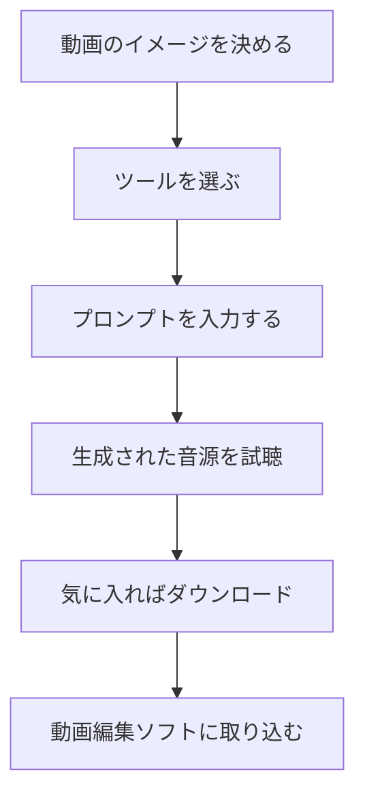

※本記事はアフィリエイト広告(PR)を含みます。

「動画にぴったりのBGMが見つからない」「効果音を探すのに時間がかかる」——動画制作で多くの人がぶつかる悩みですよね。そんなときに便利なのが、**AIで動画のBGM・効果音を自動生成する方法**です。この記事では、AIを使って著作権フリーの音源を作る手順や、初心者におすすめのツール比較、使う前に知っておきたい注意点までをわかりやすく解説します。

この記事を読むと、次のことがわかります。

- AIでBGMや効果音を作る仕組みと基本の流れ
- 目的別のおすすめツールと比較ポイント
- 「無料で使える?」「商用利用は大丈夫?」といった疑問への答え

専門知識がなくても、読み終えたその日から自分の動画にオリジナル音源を取り入れられるようになります。

## そもそもAIで音源を生成するとは?

AI音源生成とは、テキストで「明るいポップなBGM」「森の環境音」のように指示(プロンプトといいます。AIへの命令文のことです)を入力すると、AIがそれに合わせた音楽や効果音を自動で作ってくれる仕組みです。

従来はフリー音源サイトから探して選ぶのが一般的でしたが、それだと「他の動画と被る」「イメージに合う曲がない」といった問題がありました。AI生成なら、あなたの動画のためだけの音源をゼロから作れるのが大きな魅力です。

### BGMと効果音、それぞれ得意なツールが違う

AI音源ツールは大きく2種類に分けられます。

- **BGM(音楽)生成**:曲全体をメロディ・リズム付きで作る
- **効果音(SE)生成**:足音・爆発音・通知音などの短い音を作る

どちらも作れる万能型もありますが、目的に合ったツールを選ぶと満足度が上がります。

## AIでBGM・効果音を作る基本の流れ

難しそうに聞こえますが、手順はとてもシンプルです。

### 手順1:動画の雰囲気を言葉にする

まずは「どんな音が欲しいか」を言葉にします。たとえば「落ち着いたカフェ風のピアノBGM」「緊張感のあるオープニング音楽」など、ジャンル・テンポ・楽器・シーンを組み合わせると精度が上がります。

### 手順2:プロンプトを入力して生成する

ツールに指示を入力すれば、数十秒〜数分で候補が出てきます。イメージと違えば言葉を変えて何度も作り直せるのがAIの強みです。プロンプトのコツは[AIプロンプトのコツ\|思い通りの回答を引き出す書き方](/2026/06/22/ai-prompt-tips/)も参考になります。

### 手順3:ダウンロードして動画に取り込む

気に入った音源をダウンロードし、動画編集ソフトに読み込めば完成です。音源の長さやループのしやすさもチェックしておきましょう。

## 著作権フリー音源が作れるAIツール比較

ここでは代表的なツールをタイプ別に整理しました。料金やプランは変更されることがあるため、必ず公式サイトで最新情報を確認してください。

| ツール種別 | 得意分野 | 向いている人 |
|---|---|---|
| BGM特化型AI | メロディのある音楽づくり | YouTube・Vlogの背景音楽が欲しい人 |
| 効果音特化型AI | 短い環境音・SE | ゲーム実況・ショート動画を作る人 |
| オールインワン型 | BGMとSEの両方 | まず1つで試したい初心者 |
| 動画編集ソフト内蔵型 | 編集と同時に音源選び | 作業をまとめて時短したい人 |

BGMを本格的に作りたい方は、AI作曲サービスを掘り下げた[AI音楽生成ツールおすすめ比較\|BGM・作曲を無料で始める方法](/2026/06/18/ai-music-generation-tools/)もあわせてご覧ください。より具体的なサービス選びの参考になります。

### 選び方の3つのポイント

1. **商用利用の可否**:収益化動画に使えるか必ず確認
2. **生成回数・書き出し形式**:無料枠の上限やファイル形式(MP3・WAVなど)
3. **音質とバリエーション**:試聴して自分の動画に合うか

## AI音源はより良いモニター環境で仕上げよう

AIが作った音源をそのまま使うと、スマホの内蔵スピーカーでは気づかない「音の粗さ」や「音量バランスのズレ」を見落としがちです。編集時にはモニターヘッドホンやスピーカーで確認すると、視聴者にとって聴きやすい動画に仕上がります。

👉 [Amazonで「モニターヘッドホン 音楽制作」を見る](https://af.moshimo.com/af/c/click?a_id=5632371&p_id=170&pc_id=185&pl_id=38594&url=https%3A%2F%2Fwww.amazon.co.jp%2Fs%3Fk%3D%25E3%2583%25A2%25E3%2583%258B%25E3%2582%25BF%25E3%2583%25BC%25E3%2583%2598%25E3%2583%2583%25E3%2583%2589%25E3%2583%259B%25E3%2583%25B3%2520%25E9%259F%25B3%25E6%25A5%25BD%25E5%2588%25B6%25E4%25BD%259C)

長時間の編集作業では、耳が疲れにくいノイズキャンセリング機能付きのイヤホンも快適です。作業環境を整えたい方は[テレワーク向けワイヤレスイヤホンの選び方](/2026/06/13/wireless-earphones-telework/)も参考になります。

## よくある疑問Q&A

### Q. AI音源は無料で使える?

多くのツールに無料プランがありますが、「1日の生成回数に上限がある」「無料だと商用利用できない」といった制限が付くことが一般的です。趣味の動画なら無料でも十分ですが、収益化を考えるなら有料プランや商用ライセンスの確認が必要です。

### Q. AIで作った音源は本当に著作権フリー?

「著作権フリー」の範囲はツールごとに異なります。多くの場合、有料プランなら生成した音源を自分の動画で自由に使えますが、「音源そのものの再販は禁止」など細かな規約があります。必ず利用規約と公式サイトの最新情報を確認しましょう。

### Q. 動画編集も一緒に効率化できる?

できます。最近はAI編集ソフトにBGM提案機能が付いているものも増えています。編集全体を時短したい方は[AI動画編集ツール比較\|YouTube初心者におすすめの自動編集ソフト5選](/2026/06/16/ai-video-editing-tools/)を読むと、音源選びから編集までの流れがつかめます。

## AI音源を上手に使うコツ

- **シーンごとに音量を調整する**:ナレーションが入る場面はBGMを下げる
- **効果音は入れすぎない**:多用すると安っぽくなりがち
- **同じ雰囲気で統一する**:動画全体のトーンをそろえると視聴者が集中しやすい

こうした細かな調整をするだけで、AI音源でもプロっぽい仕上がりに近づきます。

## まとめ

AIを使えば、動画のBGMや効果音を著作権フリーで、しかも自分だけのオリジナルとして作れる時代になりました。最後にポイントを振り返ります。

- AI音源生成はプロンプトを入力するだけの簡単な仕組み
- BGM特化型・効果音特化型・オールインワン型など目的別に選ぶ
- 無料で始められるが、**商用利用は必ず規約を確認**
- モニター環境を整えると仕上がりの質が上がる

まずは無料プランで気軽に試してみて、自分の動画に合うツールを見つけてください。音楽の知識がなくても、AIがあなたの作品づくりを力強く後押ししてくれますよ。
