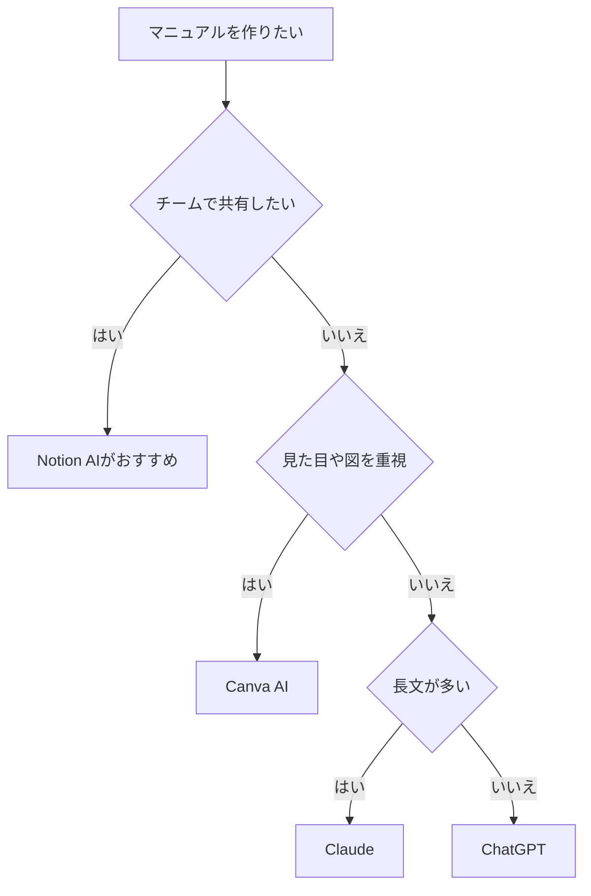

※本記事はアフィリエイト広告(PR)を含みます。

## AIで社内マニュアルを作る方法とは？この記事でわかること

「社内マニュアルを作りたいけれど、時間がなくて後回しになっている」「業務手順書が古いまま更新されていない」——そんな悩みを抱えている方は多いのではないでしょうか。

この記事では、**AIで社内マニュアルを作る方法**を初心者にもわかりやすく解説します。具体的には、次のことがわかります。

- AIを使うとマニュアル作成がどう変わるのか
- 業務手順書を自動化するおすすめツールの比較
- 実際の作成手順(5ステップ)
- 無料で使えるのか、注意点は何か

「マニュアル作成に丸2日かかっていた作業が数時間で終わった」という声もあるほど、AIは相性のよい分野です。まずは全体像から見ていきましょう。

## AIで社内マニュアルを作るメリット

そもそも、なぜAIがマニュアル作成に向いているのでしょうか。おもなメリットは次のとおりです。

- **ゼロから書く負担が減る**：箇条書きのメモを渡すだけで、読みやすい文章に整えてくれます
- **表現が統一される**：文体や言い回しがバラバラになりがちなマニュアルを、AIが一定のトーンにそろえます
- **更新がラク**：業務が変わったときも、変更点を伝えるだけで書き直してくれます
- **多言語化しやすい**：外国人スタッフ向けに翻訳版を作るのも簡単です

とくに「頭の中では手順がわかっているのに、文章にするのが苦手」という方にとって、AIは強力な味方になります。会話形式のプロンプト(AIへの指示文)のコツについては、[AIプロンプトのコツ\|思い通りの回答を引き出す書き方](/2026/06/22/ai-prompt-tips/)もあわせて読むと、より精度の高いマニュアルが作れるようになります。

## マニュアル作成に使えるAIツールの種類

AIでマニュアルを作る方法は、大きく分けて2つあります。

### 1. 汎用チャットAIで文章を作る

ChatGPTやClaude、Geminiといった対話型AIに、手順のメモを渡して文章化してもらう方法です。もっとも手軽で、無料でも始められます。どのチャットAIを選べばよいか迷ったら、[ChatGPTとClaudeとGeminiを徹底比較!初心者におすすめのAIチャットはどれ?](/2026/06/09/ai-chat-comparison/)が参考になります。

### 2. マニュアル専用・情報整理ツールを使う

Notion AIのように、ドキュメント管理とAI機能が一体化したツールもあります。作った手順書をそのままチームで共有・検索できるのが強みです。Notion AIの詳しい使い方は[Notion AIの使い方完全ガイド](/2026/06/17/notion-ai-guide/)でも解説しています。

## おすすめツール比較表

主要なツールを、マニュアル作成の観点で比較しました。料金は変動するため、最新の正確な金額は各公式サイトで確認してください。

| ツール | 特徴 | 向いている用途 | 無料プラン |
|---|---|---|---|
| ChatGPT | 文章生成が得意で操作も簡単 | 手順書の文章化・清書 | あり |
| Claude | 長文の整理や丁寧な言い換えが強み | ボリュームの多いマニュアル | あり |
| Gemini | Googleドキュメントと連携しやすい | 既存資料の下書き活用 | あり |
| Notion AI | 作成・共有・検索が一体化 | チームで運用する手順書 | 一部無料 |
| Canva AI | 図やレイアウトも作れる | 見た目重視の説明資料 | 一部無料 |

図解を多く入れたい場合は、デザイン機能を持つツールが便利です。チラシやレイアウト作成については[Canva AIでチラシ・デザインを作る方法](/2026/07/10/canva-ai-flyer-design/)も参考になります。

## 自分に合ったツールの選び方

どのツールを選べばよいか、フローチャートで整理しました。

まずは無料で使える汎用AIから試し、運用が軌道に乗ったらチーム向けツールへ移行する、という流れがおすすめです。

## AIで社内マニュアルを作る5ステップ

ここからは、実際の作成手順を紹介します。ChatGPTを例に説明しますが、他のツールでもほぼ同じ流れです。

### ステップ1：作業内容をメモにする

まずは手順を思いつくままに箇条書きにします。順番や言い回しが多少バラバラでも問題ありません。「誰が・何を・どうする」を意識してメモしましょう。

### ステップ2：AIに役割と条件を伝える

プロンプトで「あなたは社内マニュアル作成の専門家です」と役割を与え、次の条件を伝えます。

- 対象読者(例：新入社員、パート従業員)
- 文体(です・ます調など)
- 分量や見出しの有無

### ステップ3：メモを渡して文章化させる

ステップ1のメモを貼り付け、「この内容を手順書としてまとめてください」と指示します。番号付きの手順に整えてもらうと読みやすくなります。

### ステップ4：抜けや注意点を補ってもらう

「初心者がつまずきそうなポイントや、注意書きを追加してください」と依頼すると、自分では気づかなかった補足を入れてくれます。これがAI活用の大きな利点です。

### ステップ5：人の目で確認して仕上げる

最後は必ず人が確認します。AIは事実と異なる内容(ハルシネーションと呼ばれる、もっともらしい嘘)を書くことがあるため、社内ルールや数値が正しいかを必ずチェックしてください。

## よくある疑問Q&A

### Q. AIでのマニュアル作成は無料でできる？

はい、多くのツールに無料プランがあり、基本的なマニュアル作成なら無料でも十分試せます。ただし、無料版は1日の利用回数や使えるモデルに制限がある場合があります。本格的に量産するなら有料版が快適です。ChatGPTの有料版が必要かどうかは[ChatGPT有料版は必要?無料版との違いと元が取れる使い方](/2026/06/20/chatgpt-paid-vs-free/)で詳しく解説しています。

### Q. 機密情報を入力しても大丈夫？

顧客情報や社外秘のデータをそのまま入力するのは避けるのが基本です。入力した内容がAIの学習に使われる設定になっている場合があるため、社内の情報管理ルールを確認し、必要に応じて仮の情報に置き換えて使いましょう。

### Q. 音声で説明した内容もマニュアルにできる？

できます。作業しながら口頭で説明した音声を文字起こしAIで文章化し、それをチャットAIで整えるという流れも効率的です。文字起こしツールは[AI文字起こしツールおすすめ比較](/2026/06/12/ai-transcription-comparison/)を参考にしてください。

## 快適に作業するための環境も大切

マニュアル作成を効率化するなら、作業環境を整えることも意外と重要です。音声入力を活用するなら、クリアに声を拾えるマイクがあると文字起こしの精度が上がります。オンライン会議用の機材選びは[Webカメラ・マイクのおすすめ](/2026/06/15/webcam-mic-online-meeting/)も参考になります。

👉 [Amazonで「USBマイク PC 会議用」を見る](https://af.moshimo.com/af/c/click?a_id=5632371&p_id=170&pc_id=185&pl_id=38594&url=https%3A%2F%2Fwww.amazon.co.jp%2Fs%3Fk%3DUSB%25E3%2583%259E%25E3%2582%25A4%25E3%2582%25AF%2520PC%2520%25E4%25BC%259A%25E8%25AD%25B0%25E7%2594%25A8)

長時間の資料作成では、姿勢をラクに保てる環境づくりも生産性に直結します。

👉 [楽天市場で「ゲーミングチェア 疲れにくい」を探す](https://af.moshimo.com/af/c/click?a_id=5632328&p_id=54&pc_id=54&pl_id=616&url=https%3A%2F%2Fsearch.rakuten.co.jp%2Fsearch%2Fmall%2F%25E3%2582%25B2%25E3%2583%25BC%25E3%2583%259F%25E3%2583%25B3%25E3%2582%25B0%25E3%2583%2581%25E3%2582%25A7%25E3%2582%25A2%2520%25E7%2596%25B2%25E3%2582%258C%25E3%2581%25AB%25E3%2581%258F%25E3%2581%2584%2F)

## まとめ

AIを使えば、これまで負担の大きかった社内マニュアル作成が驚くほどラクになります。最後に要点を振り返りましょう。

- **AIはマニュアル作成と相性が良い**：文章化・統一・更新・翻訳がまとめて時短できる
- **まずは無料の汎用AIから**：ChatGPTなどで気軽に試せる
- **チーム運用ならNotion AIが便利**：作成から共有まで一体化
- **5ステップで作れる**：メモ→役割指定→文章化→補足→人の確認
- **最終チェックは必ず人が行う**：事実誤りや機密情報に注意

まずは、身近な業務を1つ選んで、手順のメモをAIに渡すところから始めてみてください。一度コツをつかめば、社内のさまざまな手順書をどんどん自動化できるようになります。今日から気軽に試してみましょう。
