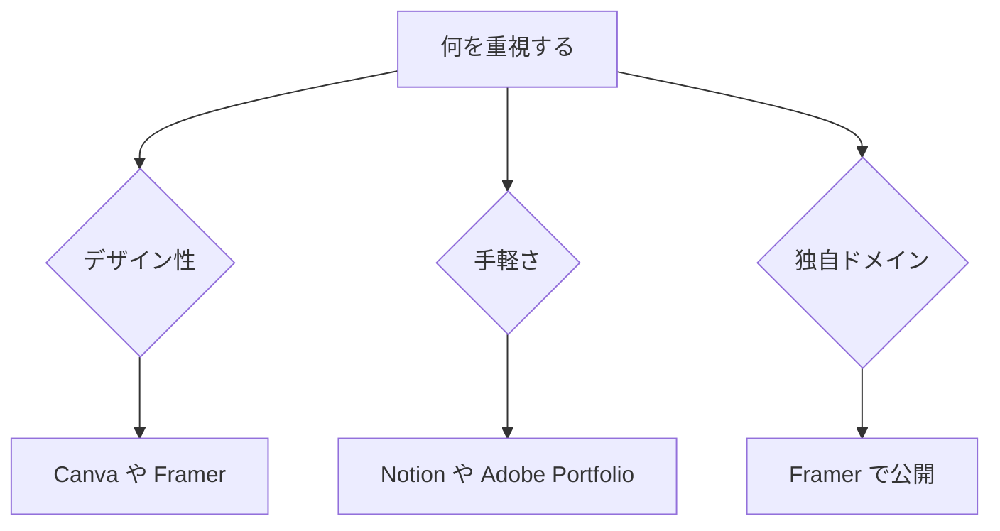

※本記事はアフィリエイト広告(PR)を含みます。

## AIポートフォリオ作成とは?この記事でわかること

「作品はたくさんあるのに、ポートフォリオがなかなか完成しない」——クリエイターやデザイナーの方なら、一度は感じたことがあるのではないでしょうか。デザインの構成を考え、文章を書き、レイアウトを整えて公開する。この一連の作業は想像以上に時間がかかります。

そこで役立つのが、**AIポートフォリオ作成**を助けてくれるツールたちです。この記事では、作品を魅力的に見せるためのAIツール5選を、初心者にもわかりやすく紹介します。読み終えるころには、「どのツールを使えば、自分のポートフォリオを最短で作れるか」がはっきりイメージできるはずです。

> ポートフォリオとは、自分の作品や実績をまとめて相手に見せるための「作品集」のことです。転職・案件獲得・SNS発信など、あらゆる場面で自己アピールの武器になります。

## AIでポートフォリオを作るメリット

まずは、なぜAIを使うと便利なのかを整理しておきましょう。

- **時短になる**:レイアウトや文章の下書きをAIが数秒で提案してくれます。
- **文章が苦手でも書ける**:作品の説明文やプロフィールをAIがサポートします。
- **デザインの統一感が出る**:テンプレートやカラー提案で、初心者でもプロっぽく仕上がります。
- **多言語対応がしやすい**:海外案件を狙う場合、翻訳もスムーズです。

特に「作品はあるのに言葉にできない」という悩みは、多くのクリエイターに共通するものです。AIは、その言語化の壁を大きく下げてくれます。

## 自分に合ったツールの選び方

ツールは目的によって向き不向きがあります。まずは下のフローチャートで、自分に合うタイプを確認してみましょう。

ざっくり言うと、**見た目の自由度を求めるならデザイン特化型**、**とにかく早く公開したいなら手軽型**を選ぶのがおすすめです。

## クリエイター・デザイナー向けおすすめAIツール5選

### 1. Canva(キャンバ)

テンプレートが豊富で、デザイン初心者でも直感的に使えるオールインワンツールです。AI機能「Magic Design」を使えば、キーワードを入れるだけでレイアウト案を自動生成してくれます。作品画像を並べるだけで、見栄えの良いポートフォリオページやPDFが完成します。

チラシやSNS投稿づくりにも応用できるので、Canvaの活用法をもっと知りたい方は[Canva AIでチラシ・デザインを作る方法](/2026/07/10/canva-ai-flyer-design/)もあわせてご覧ください。

### 2. Notion(ノーション)

ドキュメント・データベース・ページ公開が一体になったツールです。Notion AIを使えば、作品の説明文やプロフィール文を自動で下書きしてくれます。無料でWebページとして公開できる手軽さも魅力です。使い方の基本は[Notion AIの使い方完全ガイド](/2026/06/17/notion-ai-guide/)で詳しく解説しています。

### 3. Framer(フレイマー)

コードを書かずに本格的なWebサイトが作れるツールです。AIがテキストからサイトの骨組みを生成してくれるため、独自ドメインでかっこいいポートフォリオサイトを持ちたいデザイナーに向いています。アニメーションや細かい調整もでき、完成度の高い仕上がりを目指せます。

### 4. Adobe Portfolio

Adobe Creative Cloudの契約者が使えるポートフォリオ作成サービスです。PhotoshopやIllustratorで作った作品との連携がスムーズで、洗練されたテンプレートが揃っています。すでにAdobe製品を使っているクリエイターなら、追加負担なく始めやすいのが利点です。

### 5. ChatGPT / Claude(文章づくりの相棒)

作品説明・自己PR・強みの整理には、対話型AIが頼りになります。「この作品の制作意図を100文字で説明して」と頼めば、たたき台をすぐに出してくれます。AIチャットの選び方に迷う方は[ChatGPTとClaudeとGeminiを徹底比較](/2026/06/09/ai-chat-comparison/)を参考にしてみてください。

### ツール比較まとめ

| ツール | 得意なこと | こんな人に |
|---|---|---|
| Canva | テンプレートで時短 | デザイン初心者 |
| Notion | 手軽な公開・管理 | 情報整理したい人 |
| Framer | 本格的なWebサイト | こだわり派 |
| Adobe Portfolio | Adobe連携 | 既存ユーザー |
| ChatGPT/Claude | 文章づくり | 言語化が苦手な人 |

※各ツールの料金プランは変更される場合があります。最新の価格や無料枠については、必ず公式サイトで最新情報を確認してください。

## AIポートフォリオ作成の基本ステップ

実際の流れは、以下の3ステップで進めるとスムーズです。

1. **作品を選ぶ**:数を詰め込むより、自信のある作品を厳選します。
2. **説明文をAIで作る**:各作品の制作意図・使用ツール・工夫した点をAIに下書きさせ、自分の言葉に整えます。
3. **レイアウトして公開する**:CanvaやFramerで並べ、公開設定を行います。

この順番で進めれば、「途中で手が止まる」ことが減り、完成まで一気に走り切れます。

## AIポートフォリオ作成ツールは無料で使える?

読者の多くが気になるのが料金だと思います。結論から言うと、**多くのツールに無料プランがあります**。

- Canva:無料プランでも十分に作れます(一部素材・機能は有料)。
- Notion:個人利用の基本機能は無料で公開まで可能です。
- Framer:無料プランでは公開ページ数などに制限があります。
- Adobe Portfolio:Creative Cloud契約が前提です。

まずは無料プランで作ってみて、物足りなさを感じたら有料へ切り替えるのが賢い進め方です。無料の範囲や制限は変わりやすいので、こちらも公式サイトでの確認をおすすめします。

## 作品づくりの環境も整えよう

ポートフォリオの質を上げるには、作品制作の環境も大切です。イラストや写真加工を扱うクリエイターなら、色再現性の高い液晶タブレットや大画面モニターがあると作業効率が大きく変わります。

👉 [Amazonで「液晶タブレット 液タブ」を見る](https://af.moshimo.com/af/c/click?a_id=5632371&p_id=170&pc_id=185&pl_id=38594&url=https%3A%2F%2Fwww.amazon.co.jp%2Fs%3Fk%3D%25E6%25B6%25B2%25E6%2599%25B6%25E3%2582%25BF%25E3%2583%2596%25E3%2583%25AC%25E3%2583%2583%25E3%2583%2588%2520%25E6%25B6%25B2%25E3%2582%25BF%25E3%2583%2596)

また、外出先で作品データを持ち歩くなら、大容量のポータブルSSDも安心です。

👉 [楽天市場で「ポータブルSSD 1TB」を探す](https://af.moshimo.com/af/c/click?a_id=5632328&p_id=54&pc_id=54&pl_id=616&url=https%3A%2F%2Fsearch.rakuten.co.jp%2Fsearch%2Fmall%2F%25E3%2583%259D%25E3%2583%25BC%25E3%2582%25BF%25E3%2583%2596%25E3%2583%25ABSSD%25201TB%2F)

作品に使う画像素材そのものをAIで作りたい方は、[無料で使える画像生成AIおすすめ5選](/2026/06/11/free-image-ai-tools/)も役立ちます。

## まとめ

今回は、**AIポートフォリオ作成**に役立つおすすめツール5選と、作り方のコツを紹介しました。ポイントを振り返っておきましょう。

- デザイン重視なら**Canva・Framer**、手軽さ重視なら**Notion**が使いやすい。
- 文章の言語化は**ChatGPTやClaude**に任せると効率的。
- 多くのツールに**無料プラン**があり、気軽に試せる。
- 「作品を厳選 → 説明文をAIで作成 → 公開」の3ステップが基本。

ポートフォリオは、完璧を目指すよりまず公開してみることが大切です。AIを味方につければ、これまで数日かかっていた作業が数時間で終わることも珍しくありません。まずは気になったツールを1つ、今日から無料で触ってみてください。
