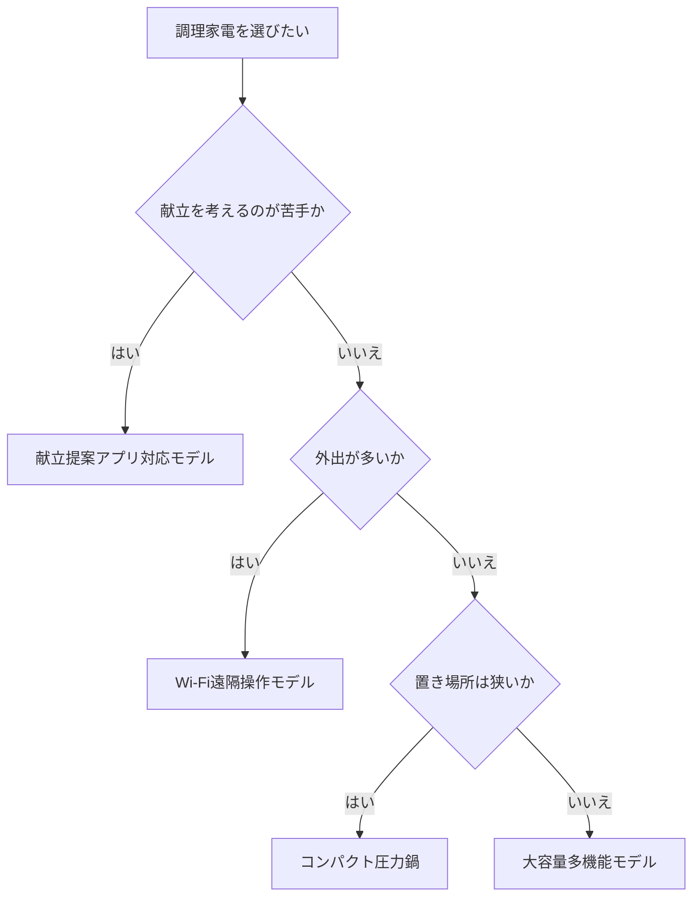

※本記事はアフィリエイト広告(PR)を含みます。

## AI電気圧力鍋とは?この記事でわかること

「毎日の献立を考えるのが面倒」「仕事から帰ってすぐにご飯を食べたい」——そんな悩みを解決してくれるのが、**AI電気圧力鍋(AI搭載の自動調理家電)**です。材料を入れてボタンを押すだけで調理してくれるだけでなく、最近のモデルは冷蔵庫にある食材から献立を提案したり、スマホアプリと連携してレシピを自動でダウンロードしたりできます。

この記事では、2026年時点でのAI電気圧力鍋・調理家電の選び方を、初心者の方にもわかりやすく解説します。読み終えるころには、次のことがわかります。

- AI搭載の調理家電で何ができるのか
- 失敗しないための選び方のポイント
- 自分のライフスタイルに合うタイプの見つけ方
- よくある疑問(スマホ連携は必要?など)への答え

まずは結論から言うと、**「献立提案・自動調理・お手入れのしやすさ」の3点を軸に選ぶ**のが、時短につながる家電選びの近道です。

## AI搭載調理家電でできること

従来の電気圧力鍋は「材料を入れて加圧するだけ」でしたが、AIを搭載したモデルは一歩進んでいます。ここでいう「AI」とは、調理の温度や時間を自動で最適化したり、アプリ上で献立を提案してくれる機能のことを指します。

### 1. 献立の自動提案

「今日は何を作ろう」という悩みを減らしてくれるのが献立提案機能です。冷蔵庫にある食材や、家族の人数・好みを入力すると、アプリがレシピを提案してくれます。買い物リストまで作ってくれるモデルもあります。

なお、家電に頼らずスマホアプリだけで献立を作りたい方は、[AIで献立を自動作成する方法\|買い物リストまで作れるアプリ比較](/2026/07/12/ai-meal-menu-planner/)もあわせて読むと選択肢が広がります。

### 2. 自動調理・火加減の最適化

食材や料理の種類に合わせて、圧力・温度・時間を自動でコントロールします。カレー、煮込み、炊飯、蒸し料理、無水調理(食材の水分だけで調理する方法)など、1台で幅広くこなせるのが魅力です。

### 3. 予約・遠隔操作

Wi-Fi対応モデルなら、外出先からスマホで調理をスタートできます。「帰宅時間に合わせて煮込みが完成」といった使い方が可能です。

## 失敗しない選び方の5つのポイント

AI調理家電を選ぶときは、次の5点を確認しましょう。

| ポイント | チェック内容 |
| --- | --- |
| 容量 | 一人暮らしは2〜3L、家族なら3〜4L以上が目安 |
| 調理モード数 | 圧力・無水・低温・炊飯など多いほど便利 |
| 献立提案 | アプリ連携でレシピが自動更新されるか |
| お手入れ | 内釜・パッキンが取り外して洗えるか |
| 設置場所 | 蒸気の抜ける場所と本体サイズを事前確認 |

### 容量は「人数+1」で考える

作り置きをする家庭なら、少し大きめを選ぶと便利です。逆に一人暮らしで置き場所が限られるなら、コンパクトモデルがおすすめです。

### お手入れのしやすさは長く使うカギ

どんなに高機能でも、洗うのが面倒だと使わなくなります。内釜がフッ素加工で汚れが落ちやすいか、パッキンが簡単に外せるかは必ずチェックしましょう。

実際の商品を見比べたい方は、こちらから探せます。

👉 [Amazonで「電気圧力鍋 自動調理 アプリ連携」を見る](https://af.moshimo.com/af/c/click?a_id=5632371&p_id=170&pc_id=185&pl_id=38594&url=https%3A%2F%2Fwww.amazon.co.jp%2Fs%3Fk%3D%25E9%259B%25BB%25E6%25B0%2597%25E5%259C%25A7%25E5%258A%259B%25E9%258D%258B%2520%25E8%2587%25AA%25E5%258B%2595%25E8%25AA%25BF%25E7%2590%2586%2520%25E3%2582%25A2%25E3%2583%2597%25E3%2583%25AA%25E9%2580%25A3%25E6%2590%25BA)

👉 [楽天市場で「電気圧力鍋 スマート調理家電」を探す](https://af.moshimo.com/af/c/click?a_id=5632328&p_id=54&pc_id=54&pl_id=616&url=https%3A%2F%2Fsearch.rakuten.co.jp%2Fsearch%2Fmall%2F%25E9%259B%25BB%25E6%25B0%2597%25E5%259C%25A7%25E5%258A%259B%25E9%258D%258B%2520%25E3%2582%25B9%25E3%2583%259E%25E3%2583%25BC%25E3%2583%2588%25E8%25AA%25BF%25E7%2590%2586%25E5%25AE%25B6%25E9%259B%25BB%2F)

## タイプ別・あなたに合うのはどれ?

下のフローチャートで、自分に合うタイプを確認してみましょう。

- **献立提案アプリ対応モデル**:何を作るか迷いがちな人向け
- **Wi-Fi遠隔操作モデル**:共働き・帰宅時間が読めない人向け
- **コンパクト圧力鍋**:一人暮らし・キッチンが狭い人向け
- **大容量多機能モデル**:家族が多く作り置きをする人向け

## よくある疑問Q&A

### Q. スマホ連携やアプリは本当に必要?

必須ではありません。基本的な自動調理だけなら、アプリなしのモデルでも十分便利です。ただし「献立を考える手間を減らしたい」「レシピを増やしたい」という目的があるなら、アプリ連携モデルの価値は高いです。

### Q. 音声で操作できる?

一部のモデルはスマートスピーカーと連携して音声操作に対応しています。家の中の家電をまとめて声で操作したい方は、[スマートスピーカーはどれを買うべき?Alexa・Google Home徹底比較](/2026/06/12/smart-speaker-comparison/)も参考になります。

### Q. 電気代は高くならない?

電気圧力鍋は短時間で調理を終えられるため、長時間ガスで煮込むよりも効率的な場合があります。家計全体の光熱費が気になる方は、[AIで固定費を見直す方法2026](/2026/07/03/ai-fixed-cost-saving/)で節約のヒントを確認してみてください。

### Q. 価格の目安は?

モデルや機能によって幅がありますが、機能が増えるほど価格も上がる傾向があります。セール時期に安くなることもあるため、**具体的な価格や最新の機能は公式サイトや販売ページで最新情報を確認してください**。

## 購入前に確認したいチェックリスト

最後に、買う前の最終チェックをまとめます。

- [ ] 家族の人数に合った容量か
- [ ] よく作る料理の調理モードがあるか
- [ ] アプリの日本語対応・レシピ数は十分か
- [ ] 内釜やパッキンが洗いやすいか
- [ ] 設置スペースと蒸気の逃げ道を確保できるか

この5項目をクリアしていれば、購入後の「思っていたのと違った」という失敗はかなり減らせます。

## まとめ

AI電気圧力鍋・調理家電は、単なる時短だけでなく「毎日の献立を考えるストレス」まで軽くしてくれる頼もしい存在です。選ぶときは、次の3点を意識しましょう。

1. **献立提案があるか**——考える手間を減らせる
2. **自動調理・遠隔操作**——生活リズムに合わせて使えるか
3. **お手入れのしやすさ**——長く使い続けられるか

まずは自分のライフスタイル(人数・帰宅時間・置き場所)を整理し、フローチャートで合うタイプを絞り込むのがおすすめです。気になるモデルが見つかったら、販売ページで最新の価格・機能・レビューをチェックして、あなたの食卓を楽にしてくれる一台を選んでみてください。
