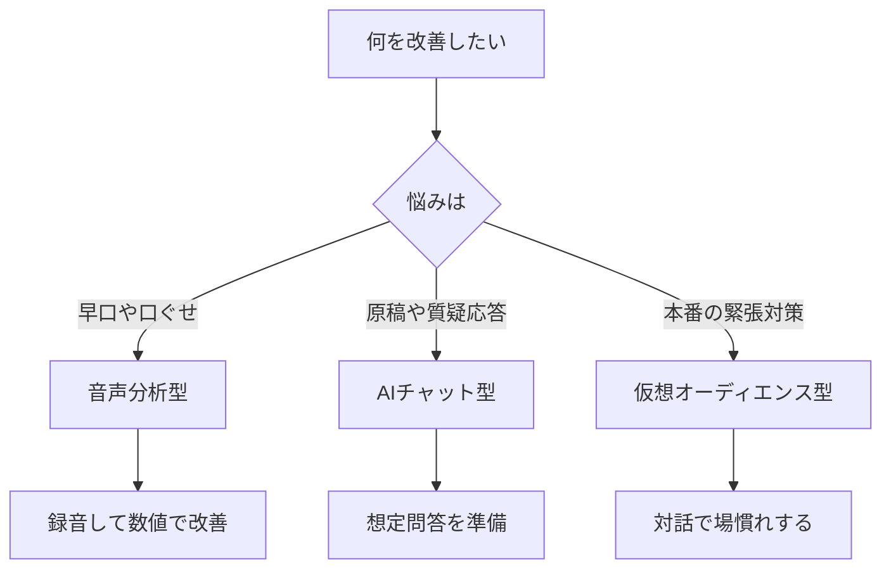

※本記事はアフィリエイト広告(PR)を含みます。

「明日のプレゼン、うまく話せるか不安…」「早口だと言われるけど直し方がわからない」——そんな悩みを持つ方に向けて、この記事では **AIでプレゼン発表練習をする方法** をわかりやすく解説します。

この記事を読むと、AIが話し方やスピード(発話の速さ)をどう分析してくれるのか、どんなアプリやツールがあるのか、そして自分に合ったものの選び方までがわかります。人前で話すのが苦手な初心者の方でも、今日から一人でこっそり練習できるようになりますので、ぜひ最後までご覧ください。

## AIでプレゼン練習をするとは?何ができるの?

これまでプレゼンの練習といえば、家族に聞いてもらったり、鏡の前で話したり、スマホで自分を録画して見返したりするのが定番でした。しかし「どこをどう直せばいいか」まで教えてくれるわけではありません。

そこで登場するのが **AIを使った発表練習** です。AI(人工知能)がマイクやカメラを通してあなたの話し方を分析し、次のような点を数値やフィードバックで教えてくれます。

- **話すスピード**(1分あたりの文字数・語数が速すぎ/遅すぎないか)
- **フィラー(えー、あのー等のつなぎ言葉)** の回数
- **間(ま)の取り方** や沈黙の長さ
- **声の大きさ・抑揚(声の高低)**
- **視線やうなずき**(カメラ対応の場合)
- **原稿との一致度** や言い間違い

こうした「自分では気づきにくいクセ」を客観的に見える化できるのが、AI練習の最大のメリットです。

## AIプレゼン練習の主な3つのタイプ

AIを使った練習方法は、大きく3つのタイプに分けられます。まずは全体像をつかみましょう。

### 1. 音声分析型(話し方・スピード改善)

あなたの発話を録音・分析して、スピードやフィラー、間の取り方を採点してくれるタイプです。「早口を直したい」「えー、を減らしたい」という人に最適です。

### 2. AIチャット型(質疑応答・原稿ブラッシュアップ)

ChatGPTやClaudeなどのAIチャットに原稿を読ませ、「聴衆から出そうな質問を10個ください」「もっと簡潔に直して」と依頼する方法です。想定問答の準備に強力です。

### 3. 仮想オーディエンス型(本番シミュレーション)

AIが仮想の聴衆や面接官になりきり、対話形式で本番さながらの練習ができるタイプです。就活の面接練習や商談の練習に向いています。

## タイプの選び方フローチャート

自分に合うタイプがわからない方は、下の図で確認してみてください。

## 話し方・スピード改善に使えるツール比較2026

ここでは、初心者でも始めやすい代表的なアプローチを比較します。料金やプランは変更されることが多いため、必ず各サービスの公式サイトで最新情報を確認してください。

| タイプ | 主な用途 | 手軽さ | こんな人におすすめ |
|---|---|---|---|
| 専用スピーチ分析アプリ | スピード・フィラー分析 | ◎ スマホで完結 | 話し方のクセを直したい人 |
| ChatGPT・Claude等のAIチャット | 原稿改善・想定問答 | ◎ 無料でも可 | 内容を磨きたい人 |
| AI英会話・発話アプリ | 発音・流暢さ | ○ | 英語プレゼンをする人 |
| 録画+AI文字起こし | 全体の見直し | ○ | じっくり振り返りたい人 |

### 手軽に始めるならAIチャットの活用がおすすめ

特別なアプリを入れなくても、まずは手持ちのAIチャットで十分練習が始められます。原稿をAIに貼り付けて「小学生でもわかるように直して」「1分で読める長さに要約して」と頼むだけでも、伝わりやすさが大きく変わります。

どのAIチャットを使えばいいか迷う方は、[ChatGPTとClaudeとGeminiを徹底比較!初心者におすすめのAIチャットはどれ?](/2026/06/09/ai-chat-comparison/)を参考に、自分に合ったものを選ぶとよいでしょう。

## AIプレゼン練習の具体的な手順

初めての方は、次の流れで進めるとスムーズです。

1. **原稿をAIチャットで整える**(長さ・わかりやすさを調整)
2. **想定質問を作ってもらう**(「聴衆が疑問に思う点を5つ」)
3. **声に出して録音・録画する**(スマホでOK)
4. **AIに文字起こし・分析させる**(スピードやフィラーを確認)
5. **改善点を1つに絞って再挑戦**(欲張らず1回1テーマ)

この「録音→分析→改善」を数回繰り返すだけで、本番での安心感がまったく違ってきます。

なお、原稿づくりそのものをもっと時短したい方は[AIプレゼン台本作成術\|スピーチ原稿を3分で作るおすすめツールと使い方](/2026/06/30/ai-presentation-script/)、スライド作成には[AIプレゼン資料作成ツール比較\|パワポ作業を時短する5つの方法](/2026/06/13/ai-presentation-tools/)もあわせてどうぞ。

## 練習の質を上げる機材選び

AIによる分析の精度は、実は「入力される音声のきれいさ」に大きく左右されます。周りの雑音が多いと、AIが声を正しく聞き取れず、フィードバックがブレてしまうことがあるのです。

そこでおすすめなのが、クリアに声を拾える外付けマイクや、映りも確認できるWebカメラの導入です。カメラ付きで練習すれば、視線や姿勢まで振り返れます。

👉 [Amazonで「USBマイク コンデンサー」を見る](https://af.moshimo.com/af/c/click?a_id=5632371&p_id=170&pc_id=185&pl_id=38594&url=https%3A%2F%2Fwww.amazon.co.jp%2Fs%3Fk%3DUSB%25E3%2583%259E%25E3%2582%25A4%25E3%2582%25AF%2520%25E3%2582%25B3%25E3%2583%25B3%25E3%2583%2587%25E3%2583%25B3%25E3%2582%25B5%25E3%2583%25BC)

どんな機材を選べばいいか迷う方は、[Webカメラ・マイクのおすすめ｜オンライン会議の印象を良くする機材選び](/2026/06/15/webcam-mic-online-meeting/)で選び方のポイントを解説しているので参考にしてください。集中して練習したいときは、周囲の音を遮るヘッドセットも便利です。

👉 [楽天市場で「ヘッドセット マイク付き」を探す](https://af.moshimo.com/af/c/click?a_id=5632328&p_id=54&pc_id=54&pl_id=616&url=https%3A%2F%2Fsearch.rakuten.co.jp%2Fsearch%2Fmall%2F%25E3%2583%2598%25E3%2583%2583%25E3%2583%2589%25E3%2582%25BB%25E3%2583%2583%25E3%2583%2588%2520%25E3%2583%259E%25E3%2582%25A4%25E3%2582%25AF%25E4%25BB%2598%25E3%2581%258D%2F)

## よくある質問(Q&A)

### Q. AIプレゼン練習アプリは無料で使えますか?

A. 多くのサービスに **無料プランや無料お試し期間** が用意されています。ChatGPTやClaudeなどのAIチャットは無料版でも原稿改善や想定問答づくりに十分使えますし、専用の音声分析アプリも基本機能を無料で試せるものが少なくありません。ただし、詳細な分析レポートや回数無制限などは有料プランになることが多いです。まずは無料で試し、物足りなければ課金を検討するのがおすすめです。最新の料金は必ず公式サイトで確認してください。

### Q. 英語プレゼンの練習にも使えますか?

A. 使えます。発音や流暢さを鍛えたい場合は、[AI英会話アプリおすすめ5選\|独学で話せるようになる使い方](/2026/06/14/ai-english-apps/)で紹介しているようなアプリと組み合わせると効果的です。

### Q. 分析結果はどこまで信じていいですか?

A. AIの分析はあくまで「目安」です。スピードやフィラーの回数など数値化できる部分は非常に参考になりますが、話の熱意や場の空気の読み方まではAIには判断しきれません。数値で客観的なクセを直しつつ、最終的には人に聞いてもらうと万全です。

## まとめ

今回は、AIでプレゼン発表練習をする方法と、話し方・スピード改善に使えるツールを紹介しました。ポイントを振り返りましょう。

- AIは **スピード・フィラー・間・声の抑揚** など自分では気づけないクセを見える化してくれる
- 練習方法は **音声分析型・AIチャット型・仮想オーディエンス型** の3タイプ
- まずは手持ちの **AIチャットで原稿改善+想定問答** から始めるのが手軽
- 「録音→分析→改善点を1つ直す」を繰り返すのが上達の近道
- 分析精度を上げるには **クリアなマイク環境** も大切

プレゼンは、才能ではなく準備と練習で確実に上達します。AIという心強い練習相手を味方につけて、次の発表を自信を持って乗り切りましょう。まずは無料で使えるツールから、今日の原稿を1つ読ませてみることから始めてみてください。
