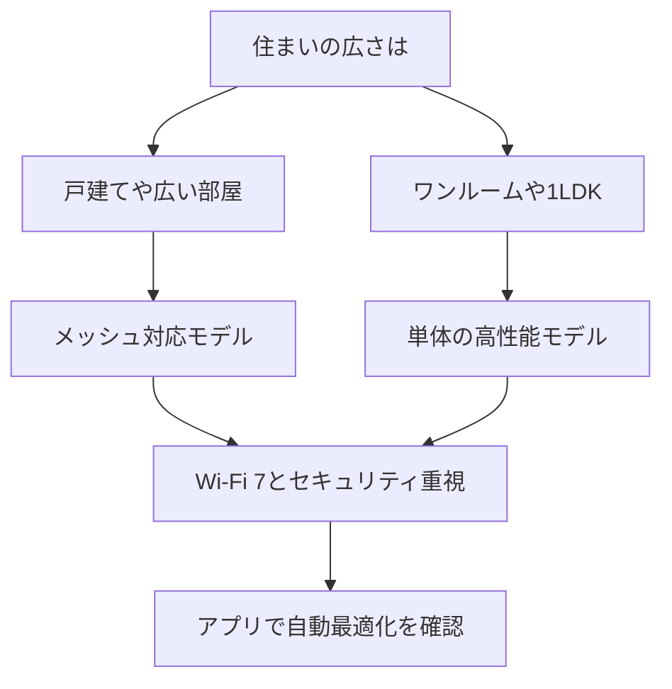

※本記事はアフィリエイト広告(PR)を含みます。

## AI搭載Wi-Fiルーターとは?選び方の前に知っておきたいこと

「動画がよく止まる」「家の奥の部屋だけ電波が弱い」——そんな悩みを、AIが自動で解決してくれるのが**AI搭載Wi-Fiルーター**です。この記事では、2026年最新のAI Wi-Fiルーターの選び方を、初心者の方にもわかりやすく解説します。読み終わるころには、**自動最適化・セキュリティ・Wi-Fi規格**という3つの軸で、自分に合った1台を選べるようになります。

AI搭載ルーターとは、接続している機器の数や電波の混雑状況をAIが常に分析し、**電波の強さやチャンネル(電波の通り道)を自動で調整してくれるルーター**のことです。従来は手動で設定が必要だった項目を、AIが裏側で最適化してくれるため、専門知識がなくても快適なネット環境を保てます。

## AI Wi-Fiルーターが選ばれる3つの理由

### 1. 自動最適化で「つながりにくい」を減らせる

家の中では、スマホ・PC・テレビ・スマート家電など、たくさんの機器が同時にWi-Fiにつながっています。AIルーターは、**どの機器がいま多くの通信を必要としているか**を判断し、電波を優先的に割り振ってくれます。オンライン会議中に映像が乱れる、といったトラブルが起きにくくなります。

在宅ワークの通信環境を整えたい方は、[在宅ワークが捗るデスク周りガジェット10選](/2026/06/11/home-office-gadgets/)もあわせて読むと、快適な環境づくりの全体像がつかめます。

### 2. AIによるセキュリティ保護

最近のAIルーターは、**不審な通信を自動で検知してブロックする**セキュリティ機能を備えています。家族が知らないうちに危険なサイトにアクセスしても、AIが警告・遮断してくれるモデルもあります。スマートロックやペットカメラなど、ネットにつながる家電が増えるほど、この機能の重要性は高まります。

### 3. メッシュWi-Fiで家中どこでも快適

メッシュWi-Fiとは、**複数の機器を連携させて家全体を1つの大きな電波でカバーする仕組み**です。AIが機器同士の役割分担を自動調整するため、部屋を移動しても電波が途切れにくくなります。戸建てや広めの間取りの家に特におすすめです。

## 選び方の5つのチェックポイント

以下の表を参考に、自分の使い方に合ったポイントを確認しましょう。

| チェック項目 | 見るべきポイント |
|---|---|
| Wi-Fi規格 | Wi-Fi 6/6E/7のどれに対応しているか |
| 対応台数 | 家の機器の数に対して余裕があるか |
| メッシュ対応 | 広い家なら必須。増設できるか |
| セキュリティ | 自動検知・遮断機能があるか |
| 自動最適化 | アプリで電波状況を確認できるか |

### Wi-Fi規格は「7」を選べば長く使える

Wi-Fi 7は、2026年時点で最も新しい規格で、**速度と安定性が大きく向上**しています。ただし対応機器(スマホやPC)がまだ限られるため、コスト重視ならWi-Fi 6/6Eでも十分快適です。数年先を見据えるならWi-Fi 7対応モデルが安心です。

### 対応台数は「実際の数＋余裕」で考える

スマート家電が増えると、接続台数は想像以上に多くなります。スマートリモコンやスマート電球などを検討している方は、[スマートリモコンの選び方2026](/2026/07/08/smart-remote-guide-2026/)や[AI搭載スマートロックおすすめ比較2026](/2026/06/29/ai-smart-lock-2026/)も参考に、家全体の機器数を見積もっておきましょう。

## あなたに合うルーターの選び方フローチャート

まずは住まいの広さで大きく分け、次にWi-Fi規格とセキュリティを確認し、最後にアプリの使いやすさで絞り込むのがおすすめです。

## 価格の目安と購入時の注意点

AI Wi-Fiルーターの価格は、機能やメーカーによって幅があります。エントリーモデルとハイエンドモデルでは大きく差があるため、**具体的な価格や在庫は公式サイトや販売ページで最新情報を確認してください**。セール時期を狙うとお得に購入できることもあります。

購入時は、**保証期間**と**ファームウェア(本体を動かすソフト)の更新頻度**もチェックしましょう。セキュリティ面では、更新が長く続くメーカーほど安心して使えます。

実際の製品ラインナップを見比べたい方は、以下から探してみてください。

👉 [Amazonで「AI Wi-Fiルーター メッシュ」を見る](https://af.moshimo.com/af/c/click?a_id=5632371&p_id=170&pc_id=185&pl_id=38594&url=https%3A%2F%2Fwww.amazon.co.jp%2Fs%3Fk%3DAI%2520Wi-Fi%25E3%2583%25AB%25E3%2583%25BC%25E3%2582%25BF%25E3%2583%25BC%2520%25E3%2583%25A1%25E3%2583%2583%25E3%2582%25B7%25E3%2583%25A5)

👉 [楽天市場で「Wi-Fi7 ルーター メッシュ」を探す](https://af.moshimo.com/af/c/click?a_id=5632328&p_id=54&pc_id=54&pl_id=616&url=https%3A%2F%2Fsearch.rakuten.co.jp%2Fsearch%2Fmall%2FWi-Fi7%2520%25E3%2583%25AB%25E3%2583%25BC%25E3%2582%25BF%25E3%2583%25BC%2520%25E3%2583%25A1%25E3%2583%2583%25E3%2582%25B7%25E3%2583%25A5%2F)

## よくある質問

### Q. AI機能は無料で使えますか?

A. 多くのモデルで、**自動最適化などの基本的なAI機能は本体購入だけで追加料金なく使えます**。ただし、高度なセキュリティ保護(ウイルス対策や見守り機能など)は月額または年額のサブスクリプションが必要な場合があります。購入前に「どこまで無料か」を必ず確認しましょう。

### Q. 今使っているルーターから買い替える価値はありますか?

A. 使用中のルーターが**Wi-Fi 5(11ac)以前**なら、買い替えで体感速度と安定性が向上する可能性が高いです。特に接続機器が多い家庭や、電波の届きにくい部屋がある場合は効果を実感しやすいでしょう。

### Q. 設定は難しくないですか?

A. 最近のモデルは**スマホアプリの案内に従うだけ**で初期設定が完了します。QRコードを読み取り、画面の指示通り進めれば10分ほどで使い始められる製品が多く、専門知識は不要です。

## まとめ

AI搭載Wi-Fiルーターは、面倒な設定をAIに任せながら、**快適さとセキュリティを両立できる**便利なガジェットです。選ぶときは次の3点を意識しましょう。

- **住まいの広さ**で単体かメッシュかを決める
- **Wi-Fi規格**は長く使うなら7、コスト重視なら6/6E
- **セキュリティと自動最適化**がアプリで管理できるか確認する

スマート家電が増えるこれからの時代、ルーターは家のネット環境の「土台」です。まずは自宅の機器数と間取りを見直し、この記事のフローチャートを参考に、自分に合った1台を選んでみてください。価格や最新スペックは公式サイトで確認しながら、納得のいく買い替えを進めましょう。
