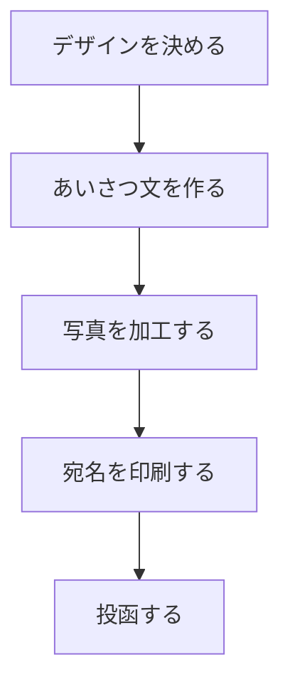

※本記事はアフィリエイト広告(PR)を含みます。

「毎年、年賀状づくりに追われて年末がバタバタ……」という方は多いのではないでしょうか。デザインを考えて、写真を選んで、一言添えて、最後に宛名を印刷して——と、意外と工程が多いのが年賀状や挨拶状の悩みどころです。

そこでこの記事では、**AIで年賀状・挨拶状を作る方法**を初心者向けにやさしく解説します。デザイン作成から宛名印刷までを時短できるツールを比較し、「無料で使えるの?」といった疑問にも先回りしてお答えします。読み終えるころには、あなたに合ったツールと作成の流れがイメージできるはずです。

## AIで年賀状を作るとどう変わる?

これまでの年賀状づくりは、テンプレートを選んで手作業で文字を差し替える、というのが一般的でした。AIを使うと、次のような作業がぐっとラクになります。

- **デザイン案の自動生成**:干支や季節のモチーフを指定するだけで、複数のデザイン候補を作ってくれる
- **あいさつ文の作成**:相手や関係性に合わせた一言メッセージをAIが提案
- **写真の加工**:古い写真の高画質化や背景の切り抜きも自動
- **宛名の印刷**:住所録を読み込んで一括で宛名を印刷

つまり「考える手間」と「手を動かす手間」の両方を減らせるのが、AI活用の最大のメリットです。

## 年賀状づくりの全体の流れ

まずは全体像をつかんでおきましょう。AIを使った年賀状づくりは、大きく次の4ステップで進みます。

それぞれのステップで役立つAIツールが異なります。以下で具体的に見ていきましょう。

## ステップ別・おすすめAIツール比較

### ①デザイン作成に使えるツール

デザインの土台づくりには、**Canva(キャンバ)**が定番です。Canvaは無料でも使えるオンラインデザインツールで、AI機能を使えば「和風の年賀状 梅の花 赤基調」のように指示するだけでデザイン案を出してくれます。

Canvaの具体的な使い方は[Canva AIでチラシ・デザインを作る方法](/2026/07/10/canva-ai-flyer-design/)でも詳しく解説しているので、あわせてご覧ください。

オリジナルのイラストや背景を一から作りたい場合は、画像生成AIも選択肢になります。無料で試せるものは[無料で使える画像生成AIおすすめ5選](/2026/06/11/free-image-ai-tools/)にまとめていますので、参考にしてください。

| ツール種別 | 得意なこと | 向いている人 |
|---|---|---|
| Canvaなどのデザインツール | テンプレ+AIで手早く仕上げる | とにかく時短したい人 |
| 画像生成AI | 唯一無二のデザインを作る | オリジナリティ重視の人 |
| 年賀状専用アプリ | 印刷・投函まで一括 | 手軽さ最優先の人 |

### ②あいさつ文の作成に使えるツール

「新年のごあいさつをどう書けばいいか毎年悩む」という方には、ChatGPTなどの生成AIチャットが便利です。たとえば次のように頼むだけで、複数パターンの文面を提案してくれます。

> 上司に送る年賀状の一言メッセージを、丁寧で温かみのある文章で3案作ってください。

相手ごとに「友人向け」「取引先向け」と使い分けられるのも便利なポイントです。どのAIチャットを使うか迷う方は[ChatGPTとClaudeとGeminiを徹底比較](/2026/06/09/ai-chat-comparison/)を参考に、自分に合ったものを選ぶとよいでしょう。

### ③写真の加工に使えるツール

家族写真やペットの写真を使う場合、AIで明るさを整えたり背景を差し替えたりできます。古いプリント写真をスキャンして使いたいときは、[古い写真をAIで高画質化・復元する方法](/2026/07/09/ai-photo-restoration/)で紹介しているツールが役立ちます。ぼやけた昔の写真もくっきりよみがえります。

### ④宛名印刷に使えるツール

意外と時間がかかるのが宛名印刷です。エクセルなどで作った住所録を読み込ませれば、一括で宛名面を印刷できます。年賀状専用アプリの多くは宛名印刷機能を備えているので、デザインから宛名まで1つのアプリで完結させることも可能です。

印刷する際は、はがきに対応したプリンターと専用用紙があると仕上がりがきれいです。手持ちのプリンターで印刷する場合は、インクジェット対応の用紙を選びましょう。

👉 [Amazonで「年賀状 用紙 インクジェット」を見る](https://af.moshimo.com/af/c/click?a_id=5632371&p_id=170&pc_id=185&pl_id=38594&url=https%3A%2F%2Fwww.amazon.co.jp%2Fs%3Fk%3D%25E5%25B9%25B4%25E8%25B3%2580%25E7%258A%25B6%2520%25E7%2594%25A8%25E7%25B4%2599%2520%25E3%2582%25A4%25E3%2583%25B3%25E3%2582%25AF%25E3%2582%25B8%25E3%2582%25A7%25E3%2583%2583%25E3%2583%2588)

枚数が多い方や毎年印刷する方は、はがき印刷に強い家庭用プリンターの導入も検討する価値があります。

👉 [楽天市場で「はがきプリンター 年賀状」を探す](https://af.moshimo.com/af/c/click?a_id=5632328&p_id=54&pc_id=54&pl_id=616&url=https%3A%2F%2Fsearch.rakuten.co.jp%2Fsearch%2Fmall%2F%25E3%2581%25AF%25E3%2581%258C%25E3%2581%258D%25E3%2583%2597%25E3%2583%25AA%25E3%2583%25B3%25E3%2582%25BF%25E3%2583%25BC%2520%25E5%25B9%25B4%25E8%25B3%2580%25E7%258A%25B6%2F)

## AIツールの選び方フローチャート

「結局どれを使えばいいの?」という方は、次の基準で選んでみてください。

- **とにかく手軽に済ませたい** → 年賀状専用アプリ(デザイン〜投函まで一括)
- **デザインにこだわりたい** → Canva+画像生成AI
- **文章づくりが苦手** → ChatGPTなどのAIチャットを併用
- **写真をきれいに使いたい** → 写真高画質化AIを追加

複数のツールを組み合わせても、それぞれ操作はシンプルなので初心者でも十分対応できます。

## Q&A:よくある疑問に先回り

### Q. AI年賀状ツールは無料で使えるの?

Canvaや多くのAIチャットには無料プランがあり、基本的なデザインや文章作成は無料の範囲でも十分可能です。ただし、高機能なテンプレートや商用利用、印刷サービスなどは有料になる場合があります。**料金は変動しやすいため、必ず各サービスの公式サイトで最新情報を確認してください。**

### Q. AIが作ったデザインをそのまま使って大丈夫?

個人的な年賀状であれば基本的に問題ありませんが、画像生成AIで作った素材は商用利用の可否がツールごとに異なります。念のため利用規約を確認しておくと安心です。

### Q. どのくらい時短になる?

作業内容によりますが、デザインとあいさつ文の作成だけでも、従来より大幅に手間を減らせます。特に「毎年ゼロから考えていた」という方ほど効果を実感しやすいでしょう。

## まとめ

最後に、AIで年賀状・挨拶状を作るポイントを整理します。

- 年賀状づくりは「デザイン→文章→写真→宛名」の4ステップで進める
- デザインはCanva、文章はAIチャット、写真は高画質化AIと使い分けると効率的
- 宛名印刷は住所録を読み込ませて一括で時短
- 無料でも十分作れるが、印刷や商用利用は公式サイトで料金を確認する

AIを使えば、これまで何時間もかかっていた年賀状づくりが、驚くほどスムーズになります。今年はぜひ、気になるツールをひとつ試すところから始めてみてください。早めに準備すれば、年末をゆったり過ごせますよ。
