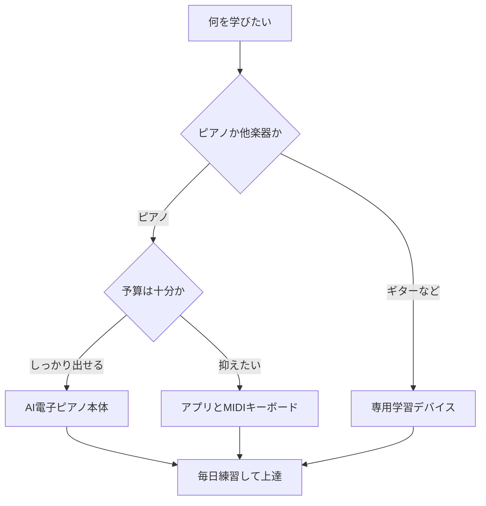

※本記事はアフィリエイト広告(PR)を含みます。

「大人になってからピアノを始めたいけど、教室に通う時間がない」「独学で楽器を上達させたい」——そんな方に注目されているのが、**AI搭載の電子ピアノや楽器学習ガジェット**です。演奏をリアルタイムで採点したり、あなたのレベルに合わせて練習曲を提案してくれたりと、まるで先生が横にいるかのようにサポートしてくれます。

この記事では、2026年時点で選べるAI電子ピアノ・楽器学習ガジェットの種類と選び方、独学に本当に向いているのはどれなのかを、初心者にもわかりやすく比較していきます。読み終わるころには、自分に合った1台を選ぶ基準がはっきりわかるはずです。

## AI搭載楽器学習ガジェットとは?

AI搭載の楽器学習ガジェットとは、演奏データを分析して**「どこを間違えたか」「どう直せばいいか」を自動でフィードバックしてくれる機器やアプリ**のことです。従来の電子ピアノは「音を出すだけ」でしたが、AI機能が加わることで学習の質が大きく変わりました。

主な機能は次のとおりです。

- **演奏採点**:弾いた音程・リズムの正確さを点数化
- **自動レベル調整**:苦手な箇所を検知して反復練習を提案
- **光ガイド**:次に押す鍵盤やフレットを光や画面で案内
- **アプリ連携**:スマホやタブレットと接続して曲を追加

こうした機能により、**先生がいなくても自分の弱点を客観的に把握できる**のが最大のメリットです。

## タイプ別に見る学習ガジェットの選び方

楽器学習ガジェットは、大きく3つのタイプに分けられます。

### 1. AI搭載電子ピアノ本体

鍵盤とAI機能が一体になったタイプです。光ガイド機能や採点機能を内蔵し、専用アプリと連携するモデルが増えています。**しっかり本格的に鍵盤演奏を学びたい方**に向いています。

### 2. 学習アプリ+MIDIキーボード

手持ちのタブレットやスマホに学習アプリを入れ、MIDIキーボード(パソコンなどと接続できる電子鍵盤)をつなぐ方法です。**コストを抑えつつAI採点を使いたい方**におすすめです。

### 3. ギター・管楽器向け学習デバイス

ギターのフレット位置をLEDで示すスマートギターや、演奏を解析する専用アプリなどもあります。ピアノ以外の楽器を独学したい方はこちらをチェックしましょう。

## タイプ別の特徴を比較

| タイプ | 費用の目安 | 手軽さ | 本格度 | 向いている人 |
|---|---|---|---|---|
| AI電子ピアノ本体 | 高め | △ | ◎ | じっくり続けたい人 |
| アプリ+MIDIキーボード | 中程度 | ○ | ○ | コスパ重視の人 |
| ギター等の学習デバイス | 中程度 | ○ | ○ | ピアノ以外を学ぶ人 |

※価格は変動します。購入前に必ず公式サイトやショップで最新情報を確認してください。

## 自分に合ったタイプの選び方フローチャート

迷ったときは、次の流れで考えると選びやすくなります。

まずは「何をどのくらい本気で学びたいか」を決めることが、失敗しない選び方の第一歩です。

## AI楽器ガジェットで独学するメリット

独学というと「途中で挫折しそう」と不安に思う方も多いでしょう。しかしAI機能を活用すれば、以下のように続けやすくなります。

- **客観的なフィードバック**で自己流の悪いクセを防げる
- **ゲーム感覚**で楽しく続けられ、モチベーションが保ちやすい
- **自分のペース**で好きな時間に練習できる
- **費用が教室より安い**ことが多い

AIを活用した独学の考え方は、他の分野でも共通しています。たとえば語学学習でも同じアプローチが有効で、[AI英会話アプリおすすめ5選\|独学で話せるようになる使い方](/2026/06/14/ai-english-apps/)では、AIを使った独学のコツが詳しく紹介されています。楽器学習と合わせて参考になるはずです。

## AI楽器学習ガジェットはどこで買える?

電子ピアノやMIDIキーボードは、家電量販店のほか通販でも手軽に探せます。実際のモデルやレビューをチェックしてみましょう。

👉 [Amazonで「電子ピアノ 88鍵 光ガイド」を見る](https://af.moshimo.com/af/c/click?a_id=5632371&p_id=170&pc_id=185&pl_id=38594&url=https%3A%2F%2Fwww.amazon.co.jp%2Fs%3Fk%3D%25E9%259B%25BB%25E5%25AD%2590%25E3%2583%2594%25E3%2582%25A2%25E3%2583%258E%252088%25E9%258D%25B5%2520%25E5%2585%2589%25E3%2582%25AC%25E3%2582%25A4%25E3%2583%2589)

手持ちのタブレットと組み合わせたい方は、コンパクトなMIDIキーボードも選択肢になります。

👉 [楽天市場で「MIDIキーボード 61鍵」を探す](https://af.moshimo.com/af/c/click?a_id=5632328&p_id=54&pc_id=54&pl_id=616&url=https%3A%2F%2Fsearch.rakuten.co.jp%2Fsearch%2Fmall%2FMIDI%25E3%2582%25AD%25E3%2583%25BC%25E3%2583%259C%25E3%2583%25BC%25E3%2583%2589%252061%25E9%258D%25B5%2F)

## よくある質問

### 学習アプリは無料で使える?

多くの楽器学習アプリには**無料プランや無料体験**が用意されています。基本的な採点機能やお試し曲は無料で使えることが多いですが、曲数の追加や詳しい分析機能は有料になるケースが一般的です。まずは無料版で操作感を試し、続けられそうなら有料プランを検討するのがおすすめです。料金は変わりやすいので、各アプリの公式ページで最新情報を確認してください。

### AIで作曲やBGM作りにも挑戦できる?

はい、演奏の練習だけでなく、AIで曲を作ることも今は手軽にできます。オリジナル曲を作ってみたい方は[AI音楽生成ツールおすすめ比較\|BGM・作曲を無料で始める方法](/2026/06/18/ai-music-generation-tools/)も合わせて読むと、演奏と創作の両方を楽しめるようになります。

### まったくの初心者でも続けられる?

続けられます。AI搭載ガジェットは初心者ほどメリットが大きく、光ガイドや自動レベル調整のおかげで「何から練習すればいいか分からない」という悩みを解消してくれます。1日10分でも継続することが上達の近道です。

## まとめ

AI搭載の電子ピアノ・楽器学習ガジェットは、教室に通わなくても独学で楽器を上達させたい方の強い味方です。ポイントを整理します。

- **本格的にピアノを続けたい**なら → AI電子ピアノ本体
- **コスパ重視**なら → 学習アプリ+MIDIキーボード
- **ピアノ以外を学びたい**なら → 専用の学習デバイス
- まずは**無料アプリで体験**してから機器を選ぶと失敗しにくい

AIによる客観的なフィードバックは、独学の最大の弱点である「自己流のクセ」を防いでくれます。気になるモデルを見つけたら、まずは無料体験や店頭で触れてみて、自分に合うものを選んでください。楽しく続けられる1台があれば、大人からの楽器デビューもきっと実現できます。
