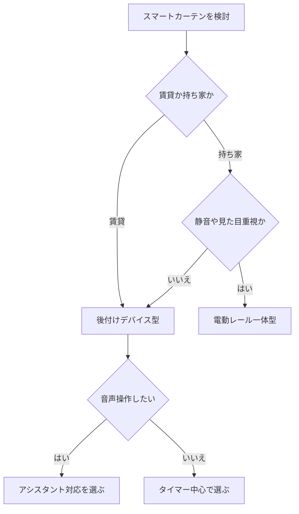

※本記事はアフィリエイト広告(PR)を含みます。

## AIスマートカーテンとは?自動開閉で朝が変わる理由

「毎朝アラームで無理やり起きるのがつらい」「日中の暑さ対策や防犯のためにカーテンを自動で動かしたい」——そんな悩みを解決してくれるのが、**AI搭載スマートカーテン**です。

この記事では、スマートカーテンの基本の仕組みから、2026年に選ぶときのポイント、後付けできるタイプと一体型の違い、そして「無料で使えるの?」といった素朴な疑問まで、初心者の方にもわかりやすく解説します。読み終えるころには、あなたの部屋に合った1台を選べるようになるはずです。

スマートカーテンとは、スマホアプリや音声、そしてタイマー・センサーの情報をもとに、**カーテンの開閉を自動でおこなう装置**のことです。最近のモデルは「AI搭載」をうたうものが増え、生活リズムや日照・室温を学習して最適なタイミングで動いてくれるものも登場しています。

## スマートカーテンでできること

まずは、スマートカーテンを導入すると具体的に何が便利になるのかを整理しましょう。

- **決まった時刻に自動で開閉**:朝は日光を取り込んで自然に目覚め、夜は自動で閉じてプライバシーを確保
- **日の出・日の入り連動**:季節で変わる時刻に合わせて自動調整
- **音声操作**:「カーテンを開けて」と話すだけで開閉
- **外出中の防犯対策**:留守中も自動で開閉させ、在宅を装える
- **室温・光センサー連動**:暑い日は日差しを遮ってエアコン効率アップ

特に「朝の目覚め」は効果を実感しやすいポイントです。太陽光を浴びると体内時計が整いやすいと言われており、目覚まし音より穏やかに起きられたという声も多くあります。

## タイプ別の違い|後付け型と一体型

スマートカーテンには大きく分けて2つのタイプがあります。それぞれの特徴を表で比べてみましょう。

| タイプ | 特徴 | 向いている人 |
| --- | --- | --- |
| 後付けデバイス型 | 既存のカーテンレールに取り付ける小型ロボット | 賃貸・手軽に始めたい人 |
| 一体型(電動レール) | レールごと交換する本格タイプ | 新築・リフォーム時に導入する人 |

初心者や賃貸住まいの方には、まず**後付けデバイス型**がおすすめです。工事不要で、レールに挟み込む・取り付けるだけで使えるモデルが多く、引っ越し時にも持ち運べます。

一方、静音性や見た目の一体感を重視するなら電動レール型が優れていますが、設置に手間と費用がかかる点は理解しておきましょう。

👉 [Amazonで「スマートカーテン 自動開閉」を見る](https://af.moshimo.com/af/c/click?a_id=5632371&p_id=170&pc_id=185&pl_id=38594&url=https%3A%2F%2Fwww.amazon.co.jp%2Fs%3Fk%3D%25E3%2582%25B9%25E3%2583%259E%25E3%2583%25BC%25E3%2583%2588%25E3%2582%25AB%25E3%2583%25BC%25E3%2583%2586%25E3%2583%25B3%2520%25E8%2587%25AA%25E5%258B%2595%25E9%2596%258B%25E9%2596%2589)

## 失敗しない選び方7つのポイント

スマートカーテンを選ぶときは、次の7点をチェックすると失敗しにくくなります。

### 1. カーテンレールの種類に対応しているか

「開き戸のように左右に開くカーテン」か「上下に動くロールスクリーン」かで、対応する製品が異なります。まずご自宅のレール形状を確認しましょう。

### 2. カーテンの重さに耐えられるか

厚手の遮光カーテンは意外と重く、モーターの力が弱いと途中で止まることがあります。製品ごとの対応重量を必ず確認してください。

### 3. 電源方式(電池・充電・コンセント)

充電式なら配線がすっきりしますが、定期的な充電が必要です。ソーラーパネル付属で充電の手間を減らせるモデルもあります。

### 4. 音声アシスタント対応

AlexaやGoogleアシスタントに対応していれば、スマートスピーカーから声で操作できます。どのアシスタントを使うかは、[スマートスピーカーはどれを買うべき?Alexa・Google Home徹底比較](/2026/06/12/smart-speaker-comparison/)も参考にすると選びやすくなります。

### 5. センサー・自動化機能

光センサーや室温連動、日の出・日の入り連動があると「AIらしい自動化」を体感できます。

### 6. 静音性

寝室で使うなら開閉音の静かさは重要です。レビューで動作音をチェックしましょう。

### 7. 他のスマート家電と連携できるか

照明やエアコンと組み合わせると、朝の一連の動作をまとめて自動化できます。

## 選び方フローチャート

迷ったときは、次の流れで考えると自分に合ったタイプが見つかります。

## 他のスマート家電と組み合わせて朝を自動化

スマートカーテン単体でも便利ですが、真価を発揮するのは**他のスマート家電との連携**です。たとえば次のようなルーティンが作れます。

- 7時になったらカーテンが開く
- 同時に照明がやわらかく点灯する
- エアコンが快適な温度で動き出す

こうした「シーン」をまとめて動かすには、スマートリモコンやスマート電球との併用が効果的です。照明の自動化については[AI搭載スマート電球の選び方｜音声操作で快適な部屋を作る方法](/2026/06/23/smart-bulb-guide/)、家電をまとめて操作する方法は[スマートリモコンの選び方2026｜AI音声で家電をまとめて操作するおすすめ比較](/2026/07/08/smart-remote-guide-2026/)で詳しく紹介しています。

👉 [楽天市場で「スマートカーテン ロボット」を探す](https://af.moshimo.com/af/c/click?a_id=5632328&p_id=54&pc_id=54&pl_id=616&url=https%3A%2F%2Fsearch.rakuten.co.jp%2Fsearch%2Fmall%2F%25E3%2582%25B9%25E3%2583%259E%25E3%2583%25BC%25E3%2583%2588%25E3%2582%25AB%25E3%2583%25BC%25E3%2583%2586%25E3%2583%25B3%2520%25E3%2583%25AD%25E3%2583%259C%25E3%2583%2583%25E3%2583%2588%2F)

## よくある質問(Q&A)

### Q. スマートカーテンは無料で使えるの?

本体は購入が必要ですが、**操作アプリの基本機能はほとんどが無料**です。タイマー設定や音声操作、自動化ルールの作成なども追加料金なしで使えるモデルが一般的です。ただし一部の高度なクラウド連携で有料オプションがある場合もあるため、購入前に公式サイトで確認しましょう。

### Q. 電気代はどれくらいかかる?

モーターの消費電力はごくわずかで、1日数回の開閉なら電気代はほとんど気になりません。むしろ日差しの遮断でエアコン効率が上がり、光熱費の節約につながるケースもあります。

### Q. 停電やWi-Fiが切れたら動かない?

多くのモデルは手動でも開閉でき、本体ボタンやリモコンで操作できます。Wi-Fiが不安定な環境では、事前に対応範囲や接続方式を確認しておくと安心です。

### Q. 取り付けは難しい?

後付け型なら、レールに取り付けてアプリで初期設定するだけの製品がほとんどです。工具不要のモデルも多く、10〜20分程度で設置できるものが一般的です。

## 価格の目安と購入前の注意点

後付けデバイス型は比較的手が届きやすい価格帯、電動レール一体型は本格的なぶん高価になる傾向があります。ただし価格は為替やセール、モデルによって大きく変動するため、**具体的な金額は各メーカーの公式サイトや販売ページで最新情報を確認してください**。

購入前には、次の点を必ずチェックしておきましょう。

- 自宅のカーテンレールに対応しているか
- カーテンの重さに耐えられるか
- 使いたい音声アシスタントに対応しているか
- 返品・保証の条件

同じく暮らしを自動化するガジェットとして、[ロボット掃除機の選び方2026\|AI搭載モデルを価格・機能で徹底比較](/2026/06/16/robot-vacuum-guide-2026/)もあわせて読むと、スマートホーム全体の計画が立てやすくなります。

## まとめ

AIスマートカーテンは、「朝を快適にする」「防犯対策になる」「冷暖房効率を上げる」といった多くのメリットを、比較的手軽に導入できるスマートホームアイテムです。

選ぶときのポイントを最後にもう一度おさらいします。

- **賃貸なら後付けデバイス型**、こだわるなら電動レール型
- **レール形状・カーテンの重さ**への対応を必ず確認
- **音声アシスタント対応**なら操作がぐっと便利に
- **スマート電球・スマートリモコンと連携**すれば朝の自動化が完成

まずは寝室やリビングなど、いちばん効果を感じやすい1部屋から試してみるのがおすすめです。自動で開くカーテンとともに迎える朝は、想像以上に快適ですよ。具体的な価格や対応機種は公式サイトで最新情報を確認しながら、あなたにぴったりの1台を選んでみてください。
